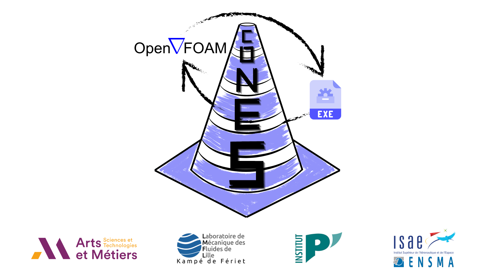
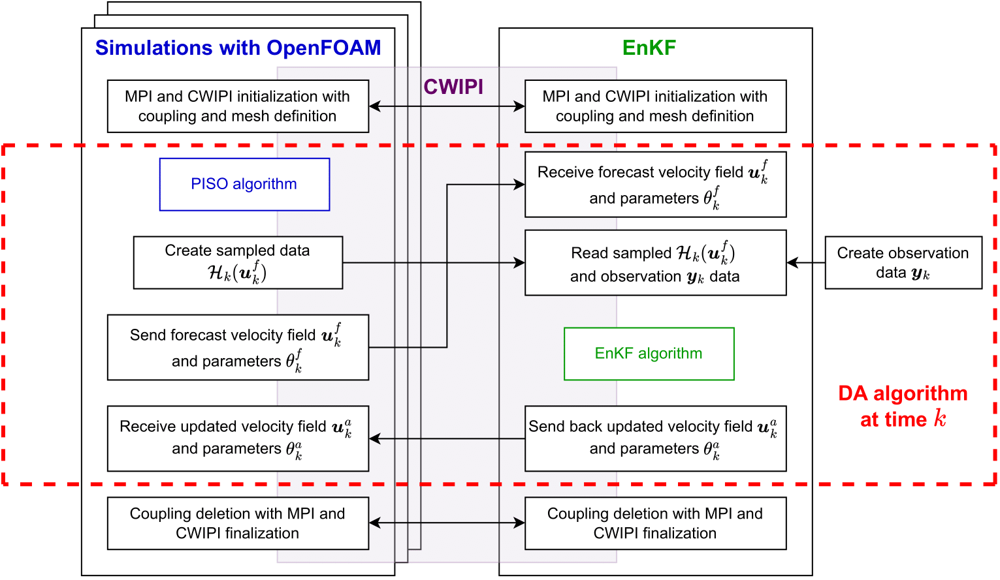
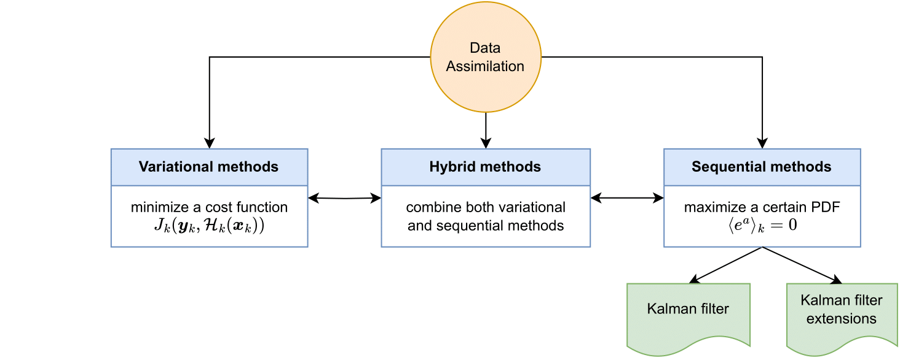
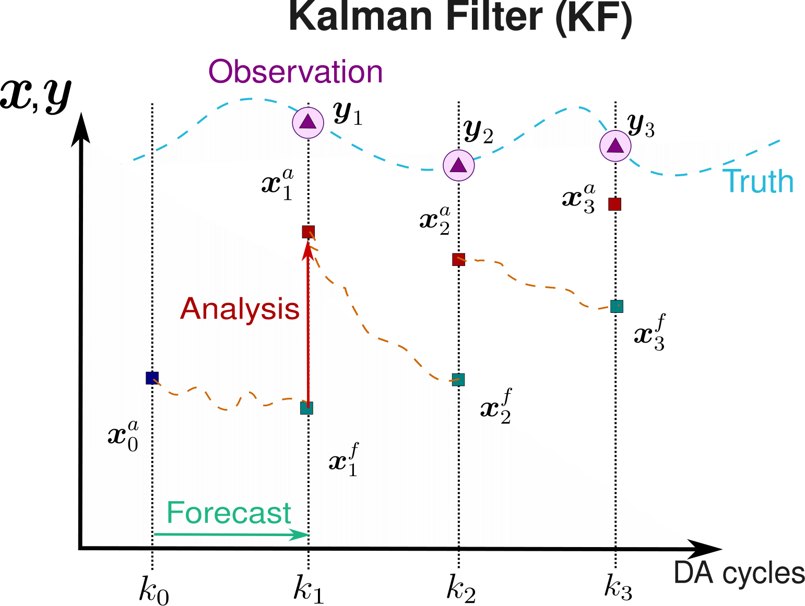
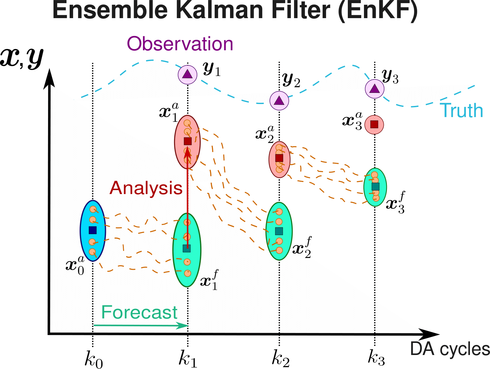

# CONES (Coupling OpenFOAM with Numerical EnvironmentS)

<!--  -->
<p align="center">
    
</p>

[CONES (Coupling OpenFOAM with Numerical EnvironmentS)](#cones-coupling-openfoam-with-numerical-environments)
- [CONES (Coupling OpenFOAM with Numerical EnvironmentS)](#cones-coupling-openfoam-with-numerical-environments)
  - [Introduction](#introduction)
  - [Data Assimilation](#data-assimilation)
    - [What is Data Assimilation ?](#what-is-data-assimilation-)
    - [Sequential Data Assimilation : Kalman Filter](#sequential-data-assimilation--kalman-filter)
    - [Ensemble Kalman Filter with extended state](#ensemble-kalman-filter-with-extended-state)
  - [Procedure to run a case (e.g., cavity test case)](#procedure-to-run-a-case-eg-cavity-test-case)
  - [References](#references)


## Introduction

CONES is an application aiming to couple the CFD software OpenFOAM with any other open-source code. It is currently employed to carry out sequential Data Assimilation techniques based on the Ensemble Kalman Filter (EnKF), in particular the application allows for implementing multiple Hyper-Localized EnKF (HLEnKF).

Three main elements constitute CONES:

1. Ensemble of  $m$ simulations in OpenFOAM.
2. Code with the Data Assimilation (DA) algorithm.
3. Open source coupler *CWIPI*.

<!-- \image html EnKF_Cones-1.png width=75% -->
<p align="center">
    
</p>

## Data Assimilation

### What is Data Assimilation ?
Data Assimilation is an approach/method for combining **high-fidelity observations** with **low-fidelity model output** to improve the latter.

We want to predict the state of the system and its future in the **best possible way**.

<!--  -->
<p align="center">
    
</p>

### Sequential Data Assimilation : Kalman Filter

**Initialization** : initial estimate for $\mathbf{x}_0^a$

At every $k$ DA cycle,

1. **Prediction / Forecast step** : the forecast state $\mathbf{x}_k^f$ is given by the forward model $\mathcal{M}_{k:k-1}$ of our system.

2. **Correction / analysis step** : we perform a correction of the state $\mathbf{x}_k^a$ based on the forecast state $\mathbf{x}_k^f$ and some high-fidelity observation $\mathbf{y}_k$ through the estimation of the so-called *Kalman gain* matrix $\mathbf{K}_k$ that minimizes the error covariance matrix of the updated state $\mathbf{P}_k^a$.

<!-- \image html ./img/KF_algorithm-1.png  width=50% -->
<p align="center">
    
</p>

The inconveniences of the Kalman Filter are:
1. The Kalman Filter - also the Extended Kalman Filter (EKF) - only works for moderate deviations from linearity and Gaussianity:

$$\begin{equation*}
    \mathcal{M}_{k:k-1} \longrightarrow \textrm{Navier-Stokes equations (non-linear)}  
\end{equation*}$$

2. **High dimensionality** of the error covariance matrix $\mathbf{P}_k$, with a number of degree of freedom equal to $3 \times n_\textrm{cells}$:

$$\begin{equation*}
    \left[ \mathbf{P}_k \right]_{3 \times n_\textrm{cells}, \, 3 \times n_\textrm{cells}}  
\end{equation*}$$

The possible alternatives to the KF are :
1. Particle filter: cannot yet to be applied to very high dimensional systems ($m$ = size of the ensembles)
2. Ensemble Kalman Filter (EnKF):

    a. High dimensional systems  $\rightarrow$ we avoid the explicit definition of $\mathbf{P}_k$.

    b. Non-linear models  $\rightarrow$ Monte-Carlo realisations.

    c. But underestimation of $\mathbf{P}_k^a \rightarrow$ inflation & localisation.

### Ensemble Kalman Filter with extended state

The system state  $\mathbf{x}_k$ is as follows:

$$\begin{bmatrix}
    \mathbf{u}_k \\
    \theta_k
\end{bmatrix}_{3 \times n_\textrm{cells}+n_\theta,m}$$
where

-  $\mathbf{u}_k$ is the velocity field of the whole domain at the instant $k$.
-  $\theta_k$ are the coefficients from the model we want to infer at the instant $k$.

The observation data $\mathbf{y}_k$:

$$\begin{equation*}
    \left[ \mathbf{y}_k \right]_{n_o,m} \rightarrow \mathcal{N}\left( y_k,\mathbf{R}_k \right)
\end{equation*}$$

1. Set of probes with local velocity $\mathbf{u}$ and pressure  $p $ values.
2. Instantaneous global force coeffcients $C_D $, $C_L $, $C_f $, ...

<!-- \image html ./img/EnKF_algorithm-1.png  width=50% -->
<p align="center">
    
</p>

The following different matrices are needed:
1. Observation covariance matrix $\mathbf{R}_k$ : we assume Gaussian, non-correlated uncertainty for the observation ($\sigma_{i,k}$ is the standard deviation for the variable $i$ and the instant $k$)

$$\begin{equation*}
    \left[ \mathbf{R}_k \right]_{n_o,\, n_o} = \sigma^2_{i,k} \left[ I \right]_{n_o, \, n_o}
\end{equation*}$$

2. Samplig matrix $\mathcal{H} \left( \mathbf{x}_k^f \right)$ : it is the projection of the model into the position of the observations.

$$\begin{equation*}
    \left[ \mathcal{H} \left( \mathbf{x}_k^f \right) \right]_{n_o, \, m}
\end{equation*}$$

3. Anomaly matrices for the system's state $\mathbf{X}_k^f$ and sampling $\mathbf{S}_k^f$ : they measure the deviation of each realisations with respect to the mean.

$$\begin{equation*}
    \left[ \mathbf{X}_k^f \right]_{3 \times n_\textrm{cells}+n_\theta,m} , \qquad \left[ \mathbf{S}_k^f \right]_{n_o,\,m}
\end{equation*}$$

4. Kalman gain $\mathbf{K}_k$ and covariance localisation $\mathbf{L}$.

$$\begin{equation*}
    \left[ \mathbf{K}_k \right]_{3 \times n_\textrm{cells}+n_\theta,n_o} , \qquad \left[ \mathbf{L} \right]_{3 \times n_\textrm{cells}+n_\theta,n_o} 
\end{equation*}$$

## Some requirements

In order to use CONES, you need to have OpenFOAM-v9 and cwipi-1.1.0 already compiled and installed. Follow the indications from their official sites. Other versions of these two softwares have not been tested.

**1) OpenFOAM-v9:** https://openfoam.org/download/9-ubuntu/

**2) cwipi-1.1.0:** you can compile and install it from the source files located in /libs/cwipi-1.1.0. To compile CWIPI go to the folder and follow the indications of the corresponding README.md file. You can also follow the instructions that you will find here below (be careful, -DCWP_ENABLE_FORTRAN should only be switched on when employing Ubuntu 22.04 version or higher):
```
mkdir build && cd build
cmake -DCWP_ENABLE_Fortran=ON -DCMAKE_C_COMPILER=mpicc -DCMAKE_CXX_COMPILER=mpicxx -DCMAKE_Fortran_COMPILER=mpif90 -DMPI_C_COMPILER=mpicc -DMPI_CXX_COMPILER=mpicxx -DMPI_Fortran_COMPILER=mpif90 -DCMAKE_INSTALL_PREFIX=/complete_path/cwipi-1.1.0/build ..
make
make install
```

**3) Eigen:** (version 3.3.7 or higher)
```
sudo apt install libeigen3-dev
```

**4) Python3:** (version 3.8.10 or higher) https://phoenixnap.com/kb/how-to-install-python-3-ubuntu

It is possible that some specific testcases require additional libraries. Contact the developers in case of further problems.


## Procedure to run a case (e.g., cavity test case)

In the cavity case of OpenFOAM the parameter to be optimized is the velocity at the top wall (initially with a **U**(1 0 0)), and the observations correspond to a simulation where the velocity is equal to **U**(5 0 0) m/s at the top wall. Here we include all the steps to make CWIPI work.

Firstly, clone the directory:
```
git clone https://github.com/MiguelMValero/CONES.git
```

Then, you need to create the .so executable with all CWIPI functions. In order to do that, go to the folder "libs/cwipiPstreamPar" and compile it by doing (change the path of the headers and libraries of CWIPI inside the "libs/cwipiPstreamPar/Make/options" file in advance):
```
wclean
wmake
```

Then, it is required to compile the cwipiHLIcoFoamPar solver. Go to the folder "solvers/HLEnKF/cwipiHLIcoFoamPar" and compile them by doing (change the path of the headers of "cwipiPstreamPar" inside the "solvers/HLEnKF/cwipiHLIcoFoamPar/Make/options" file in advance):
```
wclean
wmake
```

Next, the HLEnKF algorithm has to be compiled. Go to the folder "lib/CONES_interface/HLEnKF" and run:
```
make allclean
make all
```

To finish with, run the "cavity_test" case with the HLEnKF code. Go to "tests/cavity_test" folder and run the bash file by doing:
```
./initCwipiIco
```

NOTE: even though the case in OpenFOAM is launched with 1 processor, it is necessary to specify the option "-parallel"

For any doubts regarding the code you can contact Sarp ER: sarp.er@ensam_eu, Paolo ERRANTE: paolo.errante@ensam.eu, Miguel MARTINEZ VALERO: miguel.martinez_valero@ensam.eu, Tom MOUSSIE: tom.moussie@ensam.eu or Lucas VILLANUEVA: lucas.villanueva@ensma.fr.

## References

[1] L. Villanueva, M. Valero, A. Šarkić Glumac, M. Meldi, Augmented state estimation of urban settings using on-the-fly sequential data assimilation, Computers Fluids 269 (2024) 106118. URL: https://www.sciencedirect.com/science/article/pii/S0045793023003432. doi:https://doi.org/10.1016/j.compfluid.2023.106118.


