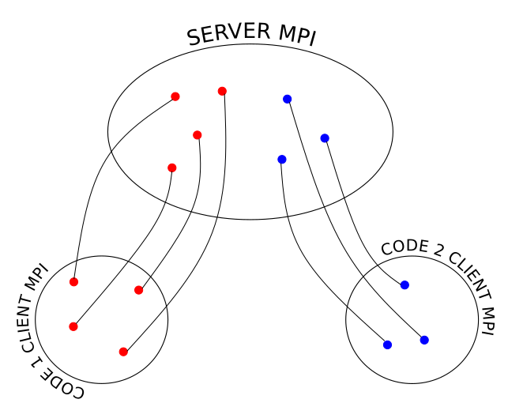

.. _client_server_cwipi:

Client-Server
#############

Since version 1.0, CWIPI offers a client-server mode that enables coupling between
closed-source software that might have different MPI implementations.
Communications between client and server are based on TCP/IP sockets.
The servers communicate using MPI protocol running the classical implementation of the library.
Note that this mode might degrade severely CWIPI's performance.
For now, this mode has a separate C/C++ and Python API, albeit very similar to the full MPI mode ; in fact these two APIs may be fused in future versions.
A Fortran interface might be developed upon request.

.. **Maybe ne pas commencer par dire que c'est naze, non? ^^**
.. Client-Server CWIPI is a degenerate mode of the new version of CWIPI in terms of performance.
.. It has been developed upon user request to couple closed-source software with specific MPI implementations hindering compatibility to other software. Communications between client and server are based on TCP/IP sockets.
.. The servers communicate using MPI protocol running the classical implementation of the library.
.. The API of this mode and the new CWIPI version are broadly similar.
.. There is a also Python interface for this mode. A Fortran might be developed upon request.

One can enable the verbose mode with ``export CWP_TCP_IP_VERBOSE=1`` to get more information about the client-server exchanges, which proves useful for debugging.

Example
=======

The aim is to couple *code 1* and *code 2*. The client-server mode is used because the MPI version of those codes is different.
Let *code 1* will be running on 4 MPI ranks and *code 2* on 3 MPI ranks. As shown on the figure below, user written code is the **client**.
CWIPI itself will be running on the **server** side. Therefore each server needs to be launched on the same number of MPI ranks as its client counterpart.

If *code 1* sends an interpolated field to *code 2*, the client of *code 1* send a TCP-IP message to its server counterpart to operate the field exchange.
At the same moment the client of *code 2* asks its server to retrieve the field sent by *code 1*. The server of *code 2* will then send the field in a TCP-IP message to the client of *code 2*.

Server
======

This section shows how to launch the server.
Once CWIPI builds with ``CWP_ENABLE_CLIENT_SERVER=ON``, an executable file ``cwp_server`` is generated and placed in the ``bin`` folder.
This is the executable that needs to be launched to start a server.
It is up to the user to choose the TCP port range on which the server will listen to the client using ``-p`` (default 49100 to 49150).
The code name for which this server is launched has to be given using ``-cn``.
This data is used by ``cwp_server`` to write a configuration file containing the ``hostname/port``.
The client executables should be able to access this file.
Indeed, it will read it to know on which server port to connect.
The path and name of this configuration file is set using ``-c``.
Here is how the servers for the example above should be launched:

.. code:: bash

  mpiexec -n 4 ../bin/cwp_server -cn code1 -p 49100 49103 -c \"code1/cwp_config_srv.txt\" : -n 3  ../bin/cwp_server -cn code2 -p 49104 49106 -c \"code2/cwp_config_srv.txt\" &

Once the servers have been properly launched, the following message will be printed:

.. code:: bash

  ----------------------------------------------------------------------------
  All servers listening and cwipi config file created. You may connect clients
  ----------------------------------------------------------------------------

Client
======

.. This is the file that is written by the user with the functions in the ``src/new/client_server/client.h`` file. **???**

Users must call the client :ref:`C/C++ <Doxygen documentation>` or :ref:`Python <Python API documentation : pycwpclt>` API which are listed below.
The connection to the server is performed in the ``CWP_client_Init`` function.
The servers are shut down in ``CWP_client_Finalize``.
The client code needs to have access to the path to the server configuration file.
Once the above message is printed the client executable can be launched.

C API documentation
=====================

.. doxygenfile:: client.h
   :project: cwipi

Python API documentation (:mod:`pycwpclt`)
================================================

.. note::
   All enumerators from the :ref:`C API <C API documentation>` are available in the Python API, except that the "`CWP_`" prefix is omitted (eg ``CWP_STATUS_ON`` becomes ``STATUS_ON``).

.. currentmodule:: pycwpclt

.. automodule:: pycwpclt
   :imported-members:
   :members:
   :undoc-members:
   :show-inheritance:
