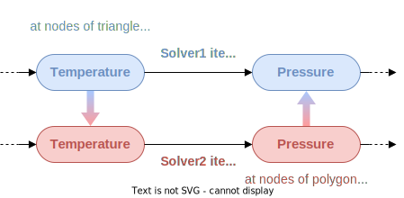

.. _concepts:

This section aims to underline the structure of a coupling set up in this new version of CWIPI.
The concepts will be detailed working with the following coupling scheme:

Coupling
--------

To set up the coupling between `Solver1` and `Solver2` one needs to create a Coupling instance to which general information such as the dimension of the coupling interface will be associated.

Mesh
----

Then the coupling interface needs to be specified (see :ref:`Define mesh`).
In this case, we set a 2D triangle and quadrangle mesh for `Solver1` and a polygon mesh for `Solver2`.
After setting the mesh coordinates, a so called block of the mesh elements should be added.
This means that in the mesh instance a block for the given type of elements will be added.
After creating this block, the mesh element data can be given using the add function for standard elements (``CWP_Mesh_interf_block_std_set`` in C) for `Solver1` and for polygons (``CWP_Mesh_interf_f_poly_block_set`` in C) for `Solver2`.

For CWIPI to be able to do the internal geometric computations on the mesh, it must be "finalized" (``CWP_Mesh_interf_finalize`` in C).

Convention for standard elements
~~~~~~~~~~~~~~~~~~~~~~~~~~~~~~~~

.. list-table:: Numbering convention used in CWIPI for standard elements
  :widths: 50 50

  * - .. tikz:: CWP_BLOCK_NODE

        \tikzset{
          x = 4cm, y = 4cm,
          every node/.style={inner sep=0pt},
          label/.style = {},
          vertex/.style={fill=black, circle, scale=1.8},
          edge/.style = {line width=0.8pt, black},
          face/.style = {}
        }
        \coordinate (v0) at (0, 0);
        \fill[black] (v0) circle (1.6pt);
        \node[label, xshift=4pt, yshift=4pt] at (v0) {1};

    - .. tikz:: CWP_BLOCK_EDGE2

        \tikzset{
          x = 4cm, y = 4cm,
          every node/.style={inner sep=0pt},
          label/.style = {},
          vertex/.style={fill=black, circle, scale=1.8},
          edge/.style = {line width=0.8pt, black},
          face/.style = {}
        }
        \coordinate (v0) at (0.0898298,0.508655);
        \coordinate (v1) at (0.818768,0.631518);
        \draw[edge] (v0) -- (v1);
        \fill[black] (v0) circle (1.6pt);
        \node[label, xshift=-6.90264pt, yshift=-1.16344pt] at (v0) {1};
        \fill[black] (v1) circle (1.6pt);
        \node[label, xshift=6.90264pt, yshift=1.16344pt] at (v1) {2};

  * - .. tikz:: CWP_BLOCK_FACE_TRIA3

        \tikzset{
          x = 4cm, y = 4cm,
          every node/.style={inner sep=0pt},
          label/.style = {},
          vertex/.style={fill=black, circle, scale=1.8},
          edge/.style = {line width=0.8pt, black},
          face/.style = {}
        }
        \coordinate (v0) at (0.108451,0.115716);
        \coordinate (v1) at (0.901406,0.203449);
        \coordinate (v2) at (0.410196,0.880984);
        \fill[face, white!92!black](v0) -- (v1) -- (v2) -- cycle;
        \draw[edge] (v2) -- (v0);
        \draw[edge] (v0) -- (v1);
        \draw[edge] (v1) -- (v2);
        \fill[black] (v0) circle (1.6pt);
        \node[label, xshift=-5.56112pt, yshift=-4.25135pt] at (v0) {1};
        \fill[black] (v1) circle (1.6pt);
        \node[label, xshift=6.40115pt, yshift=-2.83289pt] at (v1) {2};
        \fill[black] (v2) circle (1.6pt);
        \node[label, xshift=-0.878705pt, yshift=6.94463pt] at (v2) {3};

    - .. tikz:: CWP_BLOCK_FACE_QUAD4

        \tikzset{
          x = 4cm, y = 4cm,
          every node/.style={inner sep=0pt},
          label/.style = {},
          vertex/.style={fill=black, circle, scale=1.8},
          edge/.style = {line width=0.8pt, black},
          face/.style = {}
        }
        \coordinate (v0) at (0.126646,0.820378);
        \coordinate (v1) at (0.195467,0.136946);
        \coordinate (v2) at (0.761458,0.863112);
        \coordinate (v3) at (0.868707,0.239574);
        \fill[face, white!96!black](v0) -- (v1) -- (v3) -- (v2) -- cycle;
        \draw[edge] (v2) -- (v0);
        \draw[edge] (v0) -- (v1);
        \draw[edge] (v1) -- (v3);
        \draw[edge] (v3) -- (v2);
        \fill[black] (v0) circle (1.6pt);
        \node[label, xshift=-5.34663pt, yshift=4.51814pt] at (v0) {4};
        \fill[black] (v1) circle (1.6pt);
        \node[label, xshift=-4.2895pt, yshift=-5.53174pt] at (v1) {1};
        \fill[black] (v2) circle (1.6pt);
        \node[label, xshift=4.32835pt, yshift=5.5014pt] at (v2) {3};
        \fill[black] (v3) circle (1.6pt);
        \node[label, xshift=5.67841pt, yshift=-4.09337pt] at (v3) {2};

  * - .. tikz:: CWP_BLOCK_CELL_TETRA4

        \tikzset{
          x = 4cm, y = 4cm,
          every node/.style={inner sep=0pt},
          label/.style = {},
          vertex/.style={fill=black, circle, scale=1.8},
          edge/.style = {line width=0.8pt, black},
          face/.style = {}
        }
        \coordinate (v0) at (0.508632,0.943561);
        \coordinate (v1) at (0.620811,0.0432587);
        \coordinate (v2) at (0.759594,0.502979);
        \coordinate (v3) at (0.143123,0.408317);
        \fill[face, white!92!black](v2) -- (v0) -- (v1) -- cycle;
        \fill[face, white!77!black](v3) -- (v1) -- (v0) -- cycle;
        \draw[edge, dashed] (v2) -- (v3);
        \draw[edge] (v1) -- (v2);
        \draw[edge] (v0) -- (v1);
        \draw[edge] (v3) -- (v0);
        \draw[edge] (v3) -- (v1);
        \draw[edge] (v0) -- (v2);
        \fill[black] (v0) circle (1.6pt);
        \node[label, xshift=0.284712pt, yshift=6.99421pt] at (v0) {4};
        \fill[black] (v1) circle (1.6pt);
        \node[label, xshift=2.1523pt, yshift=-6.6609pt] at (v1) {2};
        \fill[black] (v2) circle (1.6pt);
        \node[label, xshift=6.95591pt, yshift=0.784415pt] at (v2) {3};
        \fill[black] (v3) circle (1.6pt);
        \node[label, xshift=-6.91109pt, yshift=-1.11216pt] at (v3) {1};

    - .. tikz:: CWP_BLOCK_CELL_PYRAM5

        \tikzset{
          x = 4cm, y = 4cm,
          every node/.style={inner sep=0pt},
          label/.style = {},
          vertex/.style={fill=black, circle, scale=1.8},
          edge/.style = {line width=0.8pt, black},
          face/.style = {}
        }
        \coordinate (v0) at (0.484531,0.944384);
        \coordinate (v1) at (0.903791,0.314831);
        \coordinate (v2) at (0.392847,0.0369065);
        \coordinate (v3) at (0.544699,0.549558);
        \coordinate (v4) at (0.106185,0.397002);
        \fill[face, white!77!black](v2) -- (v0) -- (v4) -- cycle;
        \fill[face, white!95!black](v1) -- (v0) -- (v2) -- cycle;
        \draw[edge, dashed] (v3) -- (v4);
        \draw[edge, dashed] (v1) -- (v3);
        \draw[edge] (v0) -- (v1);
        \draw[edge] (v4) -- (v2);
        \draw[edge] (v2) -- (v1);
        \draw[edge] (v4) -- (v0);
        \draw[edge] (v0) -- (v2);
        \draw[edge, dashed] (v0) -- (v3);
        \fill[black] (v0) circle (1.6pt);
        \node[label, xshift=0.0604577pt, yshift=6.99974pt] at (v0) {5};
        \fill[black] (v1) circle (1.6pt);
        \node[label, xshift=6.7951pt, yshift=-1.68125pt] at (v1) {3};
        \fill[black] (v2) circle (1.6pt);
        \node[label, xshift=-1.39163pt, yshift=-6.86027pt] at (v2) {2};
        \fill[black] (v3) circle (1.6pt);
        \node[label, xshift=5.88749pt, yshift=3.78648pt] at (v3) {4};
        \fill[black] (v4) circle (1.6pt);
        \node[label, xshift=-6.99601pt, yshift=-0.23638pt] at (v4) {1};

  * - .. tikz:: CWP_BLOCK_CELL_PRISM6

        \tikzset{
          x = 4cm, y = 4cm,
          every node/.style={inner sep=0pt},
          label/.style = {},
          vertex/.style={fill=black, circle, scale=1.8},
          edge/.style = {line width=0.8pt, black},
          face/.style = {}
        }
        \coordinate (v0) at (0.752438,0.921907);
        \coordinate (v1) at (0.71242,0.430078);
        \coordinate (v2) at (0.584422,0.731339);
        \coordinate (v3) at (0.567441,0.0660173);
        \coordinate (v4) at (0.125523,0.883474);
        \coordinate (v5) at (0.196836,0.355168);
        \fill[face, white!68!black](v2) -- (v4) -- (v5) -- (v3) -- cycle;
        \fill[face, white!94!black](v4) -- (v2) -- (v0) -- cycle;
        \fill[face, white!86!black](v0) -- (v2) -- (v3) -- (v1) -- cycle;
        \draw[edge] (v0) -- (v1);
        \draw[edge] (v5) -- (v4);
        \draw[edge] (v2) -- (v4);
        \draw[edge] (v0) -- (v2);
        \draw[edge] (v5) -- (v3);
        \draw[edge, dashed] (v5) -- (v1);
        \draw[edge] (v4) -- (v0);
        \draw[edge] (v3) -- (v1);
        \draw[edge] (v2) -- (v3);
        \fill[black] (v0) circle (1.6pt);
        \node[label, xshift=4.99889pt, yshift=4.90011pt] at (v0) {6};
        \fill[black] (v1) circle (1.6pt);
        \node[label, xshift=6.81553pt, yshift=-1.5964pt] at (v1) {3};
        \fill[black] (v2) circle (1.6pt);
        \node[label, xshift=6.51598pt, yshift=-2.55773pt] at (v2) {5};
        \fill[black] (v3) circle (1.6pt);
        \node[label, xshift=1.83086pt, yshift=-6.75633pt] at (v3) {2};
        \fill[black] (v4) circle (1.6pt);
        \node[label, xshift=-5.40897pt, yshift=4.44332pt] at (v4) {4};
        \fill[black] (v5) circle (1.6pt);
        \node[label, xshift=-6.07054pt, yshift=-3.48548pt] at (v5) {1};

    - .. tikz:: CWP_BLOCK_CELL_HEXA8

        \tikzset{
          x = 4cm, y = 4cm,
          every node/.style={inner sep=0pt},
          label/.style = {},
          vertex/.style={fill=black, circle, scale=1.8},
          edge/.style = {line width=0.8pt, black},
          face/.style = {}
        }
        \coordinate (v0) at (0.938023,0.837666);
        \coordinate (v1) at (0.858111,0.30857);
        \coordinate (v2) at (0.415262,0.697463);
        \coordinate (v3) at (0.435034,0.053482);
        \coordinate (v4) at (0.520267,0.932072);
        \coordinate (v5) at (0.517345,0.500307);
        \coordinate (v6) at (0.0525231,0.858696);
        \coordinate (v7) at (0.13048,0.349784);
        \fill[face, white!94!black](v0) -- (v4) -- (v6) -- (v2) -- cycle;
        \fill[face, white!67!black](v3) -- (v2) -- (v6) -- (v7) -- cycle;
        \fill[face, white!87!black](v1) -- (v0) -- (v2) -- (v3) -- cycle;
        \draw[edge, dashed] (v5) -- (v7);
        \draw[edge, dashed] (v1) -- (v5);
        \draw[edge] (v0) -- (v1);
        \draw[edge] (v7) -- (v6);
        \draw[edge] (v2) -- (v3);
        \draw[edge, dashed] (v4) -- (v5);
        \draw[edge] (v2) -- (v6);
        \draw[edge] (v0) -- (v2);
        \draw[edge] (v7) -- (v3);
        \draw[edge] (v6) -- (v4);
        \draw[edge] (v4) -- (v0);
        \draw[edge] (v3) -- (v1);
        \fill[black] (v0) circle (1.6pt);
        \node[label, xshift=5.78003pt, yshift=3.94858pt] at (v0) {7};
        \fill[black] (v1) circle (1.6pt);
        \node[label, xshift=5.82024pt, yshift=-3.88907pt] at (v1) {3};
        \fill[black] (v2) circle (1.6pt);
        \node[label, xshift=0.546253pt, yshift=6.97865pt] at (v2) {6};
        \fill[black] (v3) circle (1.6pt);
        \node[label, xshift=-0.800066pt, yshift=-6.95413pt] at (v3) {2};
        \fill[black] (v4) circle (1.6pt);
        \node[label, xshift=0.233222pt, yshift=6.99611pt] at (v4) {8};
        \fill[black] (v5) circle (1.6pt);
        \node[label, xshift=-0.494669pt, yshift=-6.9825pt] at (v5) {4};
        \fill[black] (v6) circle (1.6pt);
        \node[label, xshift=-5.64961pt, yshift=4.13303pt] at (v6) {5};
        \fill[black] (v7) circle (1.6pt);
        \node[label, xshift=-6.22323pt, yshift=-3.2049pt] at (v7) {1};

Fields
------

It is mandatory to define the interface mesh *before* creating field instances.
The degrees-of-freedom (dof) of a Field can either be located at mesh nodes, cell centers or user-defined points.
There can be no more than one user-defined point cloud per Coupling object.

For `Solver1` a field instance for sending the temperature will be created and another instance for receiving the pressure.
For `Solver2` the opposite will be done.

There are ways to store field components:
- CWP_FIELD_STORAGE_INTERLACED   : The number of components is constant for each element. The field is stored according to this pattern :math:` \left(c_{1,1} ... c_{s,1} ... c_{1,n} ... c_{s,n}\right)` , where :math:`s` is the number of components and :math:`n` the number of field elements ;
- CWP_FIELD_STORAGE_INTERLEAVED  : The number of components is constant for each element. The field is stored according to this pattern :math:` \left(c_{1,1} ... c_{1,n} ... c_{s,1} ... c_{s,n}\right)` , where :math:`s` is the number of components and :math:`n` the number of field elements. In this mode,

Control Parameters
------------------

*à remplir*
