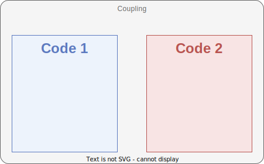
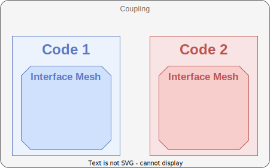
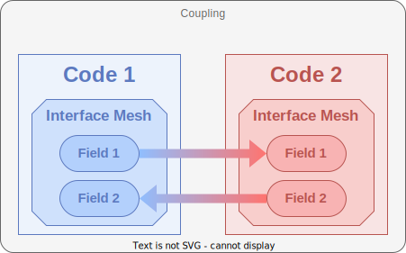

.. _old_to_new:

Old to New
##########

Version 1.x introduces major changes in the CWIPI library API compared to version 0.x.
This new version offers much more advanced features.
However, users should be able to easily reproduce their current applications with this new version.

In order to ease this transition, we focus here on the equivalence between the features of versions 0.x and 1.x.

Initialize and Finalize
=======================

All function calls are still framed by a call to the initialization and finalization functions.
Version 1.x supports multiple codes running on a single MPI rank.
Besides, one can select which MPI ranks will be available for CWIPI.

In summary, since version 1.0 the following additional arguments are required at CWIPI initialization:
   - ``n_code``: the number of codes executed on current MPI rank ;
   - ``code_names``: the list of local code names ;
   - ``is_active_rank``: this variable indicates whether the current MPI rank will participate in the coupling.

Create a coupling
=================

The key concepts used in CWIPI have been revisited in version 1.x.
Most importantly, the notion of *Field* as an object has been introduced (see section `Exchange fields`_).
The ``solver_type`` argument is now an attribute of the Field object.
Thus, a single Coupling object can now be used to exchange multiple fields with different degrees-of-freedom locations (mesh nodes, cell centers or user-defined target points).
All output-specific arguments are now passed to ``CWP_Visu_set``.

On the other hand, some new arguments are now required.
First, as a coupling involves exactly two codes, the identifier of the local code involved in the coupling must be specified.
Next, since multiple spatial interpolation algorithms are now available, ``spatial_interp`` determines which one will be used for the coupling.
The specific properties for this algorithm (such as the geometric tolerance) are now defined via the function ``CWP_Spatial_interp_property_set``.
Since version 1.x supports multiple partitions (or subdomains) per MPI rank, ``n_part`` indicates the number of partitions of the coupling interface for the local code, on current MPI rank.
Finally, ``recv_freq_type`` will enable the user to choose a specific time interpolation scheme (not implemented yet).

The following table establishes the equivalence between the arguments that are essentially unchanged:

========================= =========================
**Version 0.x**           **Version 1.x**
========================= =========================
``coupling_name``         ``cpl_id``
``entitiesDim``           ``entities_dim``
``coupling_type``         ``comm_type``
``coupled_application``   ``coupled_code_name``
``mesh_type``             ``displacement``
========================= =========================

Thus, a coupling object is created between exactly two codes.

Define the interface mesh
=========================

Each code defines an interface mesh for the given coupling.

In version 0.x a single function ``cwipi_define_mesh`` was used to define the mesh in an element->vertex fashion.
Version 1.x, gives more flexibility in the way the mesh is provided so several functions must be called to define the mesh.
In any case, you proceed the same way to define the mesh vertex coordinates. An example code in C is given below.

Mesh vertices coordinates
-------------------------

The coordinates of the mesh vertices should be provided in the following way::

  CWP_Mesh_interf_vtx_set("code_name",
                          "coupling_name",
                          partition_identifier,
                          number_of_vertices,
                          coordinates,
                          NULL);

The different ways to provide the mesh to CWIPI are explained below with C code. Note that all functions with the ``partition_identifier``
argument must be called for all partitions on the given MPI rank.

Polygonal/Polyhedral Mesh
--------------------------

This way of defining the mesh is the most similar to the way the mesh where defined in version 0.x.
If you want to provide a polygonal (2D) mesh in an element->vertex fashion, you should do::

  int block_idendifier = CWP_Mesh_interf_block_add("code_name",
                                                   "coupling_name",
                                                   polygonal_block_type);

  CWP_Mesh_interf_f_poly_block_set("code_name",
                                   "coupling_name",
                                   partition_identifier,
                                   block_idendifier,
                                   number_of_faces,
                                   face_vertex_index,
                                   face_vertex_connectivity,
                                   NULL);

If you want to provide a polyhedral (3D) mesh in an element->vertex fashion, you should do::

  int block_idendifier = CWP_Mesh_interf_block_add("code_name",
                                                   "coupling_name",
                                                   polyhedral_block_type);

  CWP_Mesh_interf_c_poly_block_set("code_name",
                                   "coupling_name",
                                   partition_identifier,
                                   block_idendifier,
                                   number_of_cells,
                                   face_edge_index,
                                   face_edge_connectivity,
                                   cell_vertex_index,
                                   cell_vertex_connectivity,
                                   NULL);

Standard element Mesh
---------------------

If you want to provide your mesh per standard element type (eg for Finite Element codes), you should do for each element type::

  int block_idendifier = CWP_Mesh_interf_block_add("code_name",
                                                   "coupling_name",
                                                   standard_block_type);

  CWP_Mesh_interf_block_std_set("code_name",
                                "coupling_name",
                                partition_identifier,
                                block_idendifier,
                                number_of_elements,
                                element_vertex_connectivity,
                                NULL);

Standard high-order element Mesh
--------------------------------

If you want to provide your mesh per standard high-order element type, you should do for each element type::

  int block_idendifier = CWP_Mesh_interf_block_add("code_name",
                                                   "coupling_name",
                                                   high_order_standard_block_type);

  CWP_Mesh_interf_block_ho_set("code_name",
                               "coupling_name",
                               partition_identifier,
                               block_idendifier,
                               number_of_elements,
                               order,
                               element_vertex_connectivity,
                               NULL);

   CWP_Mesh_interf_ho_ordering_from_IJK_set("code_name",
                                            "coupling_name",
                                            high_order_standard_block_type,
                                            order,
                                            number_of_vertices_per_element,
                                            high_element_vertex_ordering_per_element);

Downward topological connections Mesh
-------------------------------------

If you want to provide a polygonal (2D) mesh in a downward topological connection fashion (eg for Finite Volume codes), you should do::

  CWP_Mesh_interf_from_faceedge_set("code_name",
                                    "coupling_name",
                                    partition_identifier,
                                    number_of_faces,
                                    face_edge_index,
                                    face_edge_connectivity,
                                    number_of_edges,
                                    edge_vertex_connectivity,
                                    NULL);

If you want to provide a polyhedral (3D) mesh in a downward topological connection fashion, you should do::

  CWP_Mesh_interf_from_cellface_set("code_name",
                                    "coupling_name",
                                    partition_identifier,
                                    number_of_cells,
                                    cell_face_index,
                                    cell_face_connectivity,
                                    number_of_faces,
                                    face_vertex_index,
                                    face_vertex_connectivity,
                                    NULL);

Finalize Mesh
-------------

In any case, it is mandatory to finalize the mesh definition using ``CWP_Mesh_interf_finalize``. The ``NULL`` argument in the previous
code blocks allows to provide a global numbering. Since it is only used low-level in CWIPI, the finalize function allow to generate them
if not provided.

.. TODO: on mettrait pas l'argument global_ids plutôt que NULL? En précisant qu'il est optionnel

Exchange fields
===============

In version 0.x the field data array was provided upon exchange.
More flexibility and clarity is provided by version 1.x with an object-oriented point of view.
Multiple fields can be defined for the same coupling object, each one having its own set of degrees-of-freedom.
The field definition is given once and for all at start.
Setting the field objects means giving an array pointer in which the field data is defined.
This pointer should be changed is the field data is to be updated.
The only case a field has to be set again is if the mesh topology changes.
The non-blocking exchange functions were kept and are the way to go.

