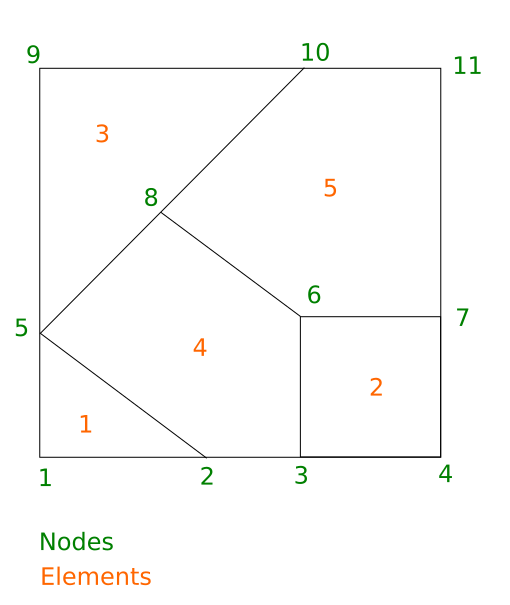

.. _quick_start:

Quick Start
###########

Here is shown how to couple two codes using the 1.x version of CWIPI in the different
programming languages in which CWIPI is available. Both codes have the same basic
polygonal mesh (see figure). code1 sends a field on the nodes to code2 and the unmapped points are checked.

CWIPI C
-------

.. literalinclude:: ../../../tests/tutorial/c_new_api_polygon_sol.c
   :language: c

CWIPI Fortran
-------------

.. literalinclude:: ../../../tests/tutorial/fortran_new_api_polygon_sol.F90
   :language: fortran

CWIPI Python
------------

.. literalinclude:: ../../../tests/tutorial/python_new_api_polygon_sol.py
   :language: python
