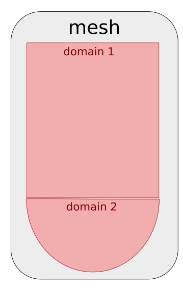

---
jupytext:
  text_representation:
    extension: '.md'
    format_name: myst
    format_version: '0.7'
    jupytext_version: 1.4.0+dev
kernelspec:
  display_name: Python 3
  language: python
  name: python3
---

+++ {"editable": false, "deletable": false}

# Exercise 1 : Mesh partitioning

+++ {"editable": false, "deletable": false}

It's time for some hands on experience with **ParaDiGM**!
Using the API referenced [here](https://numerics.gitlab-pages.onera.net/mesh/paradigm/dev_formation/user_manual/partitioning/multipart.html#c-api),
you will have to fill in the code cells to partition a mesh, i.e. to cut it in subdomains that will be mapped onto the processors of a parallel machine.
In the first section, we generate a block-distributed cube mesh for you. In the next section, you'll start running the partitioning algorithm.
After that, you will be able to retrieve the arrays describing the partitioned mesh.

+++ {"editable": false, "deletable": false}

## Load magic commands
We start by loading the custom magic commands for the proper functioning of the Notebook.

```{code-cell}
---
"editable": false
"deletable": false
---
import os, sys
module_path = os.path.abspath(os.path.join('../../utils'))
if module_path not in sys.path:
    sys.path.append(module_path)
```

```{code-cell}
---
"editable": false
"deletable": false
---
%reload_ext visu_magics
%reload_ext code_magics
```

+++ {"editable": false, "deletable": false}

## Generate the mesh

In this section, **ParaDiGM** tools are used to generate a simple mesh for this exercise: a cube made of tetrahedra.
You have **nothing to do here**. Still if you are curious about this feature, you can have a look [here](https://numerics.gitlab-pages.onera.net/mesh/paradigm/dev_formation/user_manual/simple_mesh_gen/dcube_nodal.html#c-api).

In your numerical simulation software you rarely generate a mesh.
This step actually generates a block-distributed mesh which is distributed in the same way as a mesh you would have **read in parallel**.

```{code-cell}
---
"editable": false
"deletable": false
---
%%code_block -p exercise_1 -i 1

#include "pdm_multipart.h"
#include "pdm_dcube_nodal_gen.h"
#include "pdm_mesh_nodal.h"
#include "pdm_array.h"
#include "pdm_writer.h"
#include "pdm_part_connectivity_transform.h"
#include "pdm_part_extension.h"
#include "pdm_part_connectivity_transform.h"

int main
(
 int   argc,
 char *argv[]
)
{

  // Initialize MPI environment
  int          i_rank = -1;
  int          n_rank = -1;
  PDM_MPI_Comm comm   = PDM_MPI_COMM_WORLD;

  PDM_MPI_Init(&argc, &argv);
  PDM_MPI_Comm_rank(comm, &i_rank);
  PDM_MPI_Comm_size(comm, &n_rank);

  // Generate block-distributed parallelepided mesh
  int                  n_x      = 10;
  int                  n_y      = 10;
  int                  n_z      = 10;
  double               lengthx  = 1.;
  double               xmin     = 0.;
  double               ymin     = 0.;
  double               zmin     = 0.;
  PDM_Mesh_nodal_elt_t elt_type = PDM_MESH_NODAL_TETRA4;
  int                  order    = 1; // call PDM_dcube_nodal_gen_ordering_set if order > 1
  PDM_dcube_nodal_t *dcube = PDM_dcube_nodal_gen_create(comm,
                                                        n_x,
                                                        n_y,
                                                        n_z,
                                                        lengthx,
                                                        xmin,
                                                        ymin,
                                                        zmin,
                                                        elt_type,
                                                        order,
                                                        PDM_OWNERSHIP_USER);

  PDM_dcube_nodal_gen_build (dcube);

  PDM_dmesh_nodal_t *dmn = PDM_dcube_nodal_gen_dmesh_nodal_get(dcube);

  PDM_dmesh_nodal_generate_distribution(dmn);

  // free
  PDM_dcube_nodal_gen_free(dcube);

```

Here you can see that the mesh were stored in a Dirstibuted-Nodal-Mesh structure (`dmn`).
This is an internal mesh structure to **ParaDiGM** not for user purpose.
Each feature is made such that you can set the mesh using basic arrays.

+++ {"editable": false, "deletable": false}

Now that we have our mesh, let's partition it !

## Mesh partitioning

For mesh partitioning, as for all other **ParaDiGM** features, there are 5 main steps:
1. **create** the feature structure
2. **set** the data necessary to operate with that feature
3. **compute**, operate the algorithm of the feature
4. **get**, retrieve the output of the algorithm
5. **free** the memory allocated to operate the feature

Following this logic, let's start **creating** (step 1) the mesh partitioning structure for **homogeneously** balanced subdomains.

*Remark : since this is a basic example, we ask you to stick with the fixed values for n_domain, n_part, i_domain, i_part and merge_domains.
To get insight about the concepts behind those values you can have a look [here](#Annex-1)*

**ParaDiGM** offers multiple partitioning methods.
Here, we chose to partition the cube with the **Hilbert method**.
This method is favored within the **ParaDiGM** algorithms since it provides quickly a good load balance, though it does not ensure the connectedness of each subdomain.
To ensure the partitions are connected, you should use either
`PDM_SPLIT_DUAL_WITH_PARMETIS` or `PDM_SPLIT_DUAL_WITH_PTSCOTCH` which call the external libraries ParMETIS and PT-Scotch.

*Remark : In this exercise we do not provide weights for the partitioning.*

```{code-cell}
---
"deletable": false
---
%%code_block -p exercise_1 -i 2

  // Create partitioning structure
  int              n_domain         = 1;         // fixed
  int              n_part           = 1;         // fixed
  int              i_domain         = 0;         // fixed
  int              i_part           = 0;         // fixed
  PDM_bool_t       merge_domains    = PDM_FALSE; // fixed
  PDM_split_dual_t part_method      = PDM_SPLIT_DUAL_WITH_HILBERT;
  PDM_part_size_t  part_size_method = PDM_PART_SIZE_HOMOGENEOUS;
  double          *part_fraction    = NULL; // unused here since the subdomains are homogeneous
  PDM_multipart_t *mpart = PDM_multipart_create(n_domain,                  // Number of domains
                                                &n_part,                   // Number of partitions per domain
                                                merge_domains,             // PDM_FALSE (do not fuse domains)
                                                part_method,               // Partitioning method
                                                part_size_method,          // Subdomains are homogeneously balanced
                                                part_fraction,             // Weight (in %) of each partition in heterogeneous case
                                                comm,                      // MPI communicator
                                                PDM_OWNERSHIP_KEEP);       // Data ownership

```

+++ {"editable": false, "deletable": false}

After mapping the partitioned subdomains on the processors, it is interesting to renumber the entities
of the mesh on each processor for performance through cache blocking but it also provides interesting properties for the application.
This is an **advanced setting we won't be using here**, so we just specify that no renumbering should be performed.
<!-- You can here call the renumbering function but by telling it not to do any renumbering for a start. -->

```{code-cell}
---
"deletable": false
---
%%code_block -p exercise_1 -i 3

  PDM_multipart_set_reordering_options(mpart,
                                       -1,
                                       "PDM_PART_RENUM_CELL_NONE",
                                       NULL,
                                       "PDM_PART_RENUM_FACE_NONE");

```
+++ {"editable": false, "deletable": false}

Now that you have created a mesh partitioning structure `mpart`, you can **set** (step 2) the cube mesh to it.
For simplicity of the exercise, we here set the mesh using the **Dirstibuted-Nodal-Mesh** structure (`dmn`).
This is a pratice internal to **ParaDiGM** algorithms. In your software you would just set the mesh using basic arrays.

```{code-cell}
---
"deletable": false
---
%%code_block -p exercise_1 -i 4

  PDM_multipart_dmesh_nodal_set(mpart, i_domain, dmn);
```
+++ {"editable": false, "deletable": false}

At this point you have provided all the information necessary to run the mesh partitioning algorithm. You can call the function to
**compute** (step 3) the subdomains that make up the partitioned cube.

```{code-cell}
---
"deletable": false
---
%%code_block -p exercise_1 -i 5

  PDM_multipart_compute(mpart);
```
+++ {"editable": false, "deletable": false}

## Get the partitioned mesh

You can now **get** (step 4) the output mesh of the partitioning algorithm. Depending on the numerical method, the mesh has to be
described in a different way. For Finite-Element methods a nodal connectivity ([option 1](#Nodal-connectivity-(i.e.-Finite-Element-style)))) usually
suffices while for Finite-Volume methods all descending connectivities ([option 2](#Descending-connectivity-(i.e.-Finite-Volume-style))) are of interest.
Choose which one suits you best and go further in the exercise to the associated section.

### Nodal connectivity (i.e. Finite-Element style)

You chose to get the partitioned mesh in nodal connectivity, i.e. cell->vertex connectivity.

*Remark : The structure in **ParaDiGM** in which partitioned nodal meshes are stored is `part_mesh_nodal`.
Here we get this structure from `mpart` to have a direct access to the arrays we are interested in.
For more information about this structure, have a look [here](https://numerics.gitlab-pages.onera.net/mesh/paradigm/dev_formation/user_manual/partitioning/multipart.html#partitioned-nodal-mesh)*

Let's start with the **vertices** composing the subdomain. How many vertices are there? What are their global ids? What are their coordinates?

```{code-cell}
---
"deletable": false
---
%%code_block -p exercise_1 -i 6


//  double *coords = NULL;
//  int n_vtx = PDM_multipart_part_vtx_coord_get(mpart,
//                                               i_domain,
//                                               i_part,
//                                               &coords,
//                                               PDM_OWNERSHIP_USER);
//
//  PDM_part_mesh_nodal_t *pmn  = NULL;
//  PDM_multipart_get_part_mesh_nodal(mpart,
//                                    i_domain,
//                                    &pmn,
//                                    PDM_OWNERSHIP_USER);
//
//  PDM_g_num_t *vtx_ln_to_gn = PDM_part_mesh_nodal_vtx_g_num_get(pmn,
//                                                                i_part);


```
+++ {"editable": false, "deletable": false}

Let's move on to the **cells**. How are the vertices connected to form cells? What are their global ids? How many cells are there?

*Remark : since this is a basic example, we ask you to stick with the fixed value for i_section.
To get insight about the concept behind this value you can have a look [here](#Annex-1)*

```{code-cell}
---
"deletable": false
---
%%code_block -p exercise_1 -i 7


//  int i_section = 0; // fixed
//
//  int         *elt_vtx             = NULL;
//  PDM_g_num_t *elt_ln_to_gn        = NULL;
//  int         *parent_num          = NULL;
//  PDM_g_num_t *parent_entity_g_num = NULL;
//  PDM_part_mesh_nodal_section_std_get(pmn,
//                                      i_section,
//                                      i_part,
//                                      &elt_vtx,
//                                      &elt_ln_to_gn,
//                                      &parent_num,
//                                      &parent_entity_g_num,
//                                      PDM_OWNERSHIP_USER);
//
//  int n_elt = PDM_part_mesh_nodal_section_n_elt_get(pmn,
//                                                    i_section,
//                                                    i_part);
//
//  // free
//  free(parent_num);
//  free(parent_entity_g_num);

```
+++ {"editable": false, "deletable": false}

Now we write the mesh that we just got to be able to visualize it later on **(nothing to do)**.

```{code-cell}
---
"deletable": false
---
%%code_block -p exercise_1 -i 8


//  writer_wrapper(comm,
//                 "visu",
//                 "pmesh",
//                 1, // n_part
//                 &n_vtx,
//                 &coords,
//                 &vtx_ln_to_gn,
//                 &n_elt,
//                 NULL, // elt_vtx_idx
//                 &elt_vtx,
//                 &elt_ln_to_gn,
//                 PDM_WRITER_TETRA4,
//                 0, // n_face
//                 NULL, // cell_face_idx
//                 NULL, // cell_face
//                 "Ensight",
//                 0, // n_elt_field
//                 NULL, // elt_field_name
//                 NULL, // elt_field_values
//                 0, // n_vtx_field
//                 NULL, // vtx_field_name
//                 NULL); // vtx_field_values
//
//  // free
//  free(elt_vtx);
//  free(elt_ln_to_gn);
//  free(coords);
//  PDM_part_mesh_nodal_free(pmn);

```
+++ {"editable": false, "deletable": false}

### Descending connectivity (i.e. Finite-Volume style)

You choose to get the partitioned mesh in descending connectivity, i.e. **cell->face**, **face->vtx** connectivities.
Generic getters have been implemented in **ParaDiGM** for the connectivities and global identifier arrays.
Enumerators allow to specify which data is requested (see details in [documentation](https://numerics.gitlab-pages.onera.net/mesh/paradigm/dev_formation/user_manual/partitioning/index.html#enumerators)). Here you will need for the mesh connectivity:
- **PDM_CONNECTIVITY_TYPE_CELL_FACE** : cell->face connectivity
- **PDM_CONNECTIVITY_TYPE_FACE_VTX**  : face->vertex connectivity
For the global identifier arrays you will use:
- **PDM_MESH_ENTITY_CELL**  : cell entity
- **PDM_MESH_ENTITY_FACE**  : face entity
- **PDM_MESH_ENTITY_VTX**  : vertex entity

Let's start from the top with **cell data**. How many cells are there? What are their global ids? Which faces compose the cells?

```{code-cell}
---
"deletable": false
---
%%code_block -p exercise_1 -i 9


  PDM_g_num_t *cell_ln_to_gn = NULL;
  int n_cell = PDM_multipart_part_ln_to_gn_get(mpart,
                                               i_domain,
                                               i_part,
                                               PDM_MESH_ENTITY_CELL,
                                               &cell_ln_to_gn,
                                               PDM_OWNERSHIP_USER);

  int *cell_face_idx = NULL;
  int *cell_face     = NULL;
  PDM_multipart_part_connectivity_get(mpart,
                                      i_domain,
                                      i_part,
                                      PDM_CONNECTIVITY_TYPE_CELL_FACE,
                                      &cell_face_idx,
                                      &cell_face,
                                      PDM_OWNERSHIP_USER);

```
+++ {"editable": false, "deletable": false}

For the **faces** we proceed in a similar way. How many faces are there? What are their global ids? Which vertices compose the faces?

```{code-cell}
---
"deletable": false
---
%%code_block -p exercise_1 -i 10


  PDM_g_num_t *face_ln_to_gn = NULL;
  int n_face = PDM_multipart_part_ln_to_gn_get(mpart,
                                              i_domain,
                                              i_part,
                                              PDM_MESH_ENTITY_FACE,
                                              &face_ln_to_gn,
                                              PDM_OWNERSHIP_USER);

  int *face_vtx_idx = NULL;
  int *face_vtx     = NULL;
  PDM_multipart_part_connectivity_get(mpart,
                                      i_domain,
                                      i_part,
                                      PDM_CONNECTIVITY_TYPE_FACE_VTX,
                                      &face_vtx_idx,
                                      &face_vtx,
                                      PDM_OWNERSHIP_USER);

```
+++ {"editable": false, "deletable": false}

To finish with, we need to have the description of the **vertices**.

```{code-cell}
---
"deletable": false
---
%%code_block -p exercise_1 -i 12


  PDM_g_num_t *vtx_ln_to_gn = NULL;
  int n_vtx = PDM_multipart_part_ln_to_gn_get(mpart,
                                              i_domain,
                                              i_part,
                                              PDM_MESH_ENTITY_VTX,
                                              &vtx_ln_to_gn,
                                              PDM_OWNERSHIP_USER);

  double *coords = NULL;
  PDM_multipart_part_vtx_coord_get(mpart,
                                   i_domain,
                                   i_part,
                                   &coords,
                                   PDM_OWNERSHIP_USER);

```
+++ {"editable": false, "deletable": false}

Now we write the mesh that we just got to be able to visualize it later on **(nothing to do)**.

```{code-cell}
---
"deletable": false
---
%%code_block -p exercise_1 -i 13


  writer_wrapper(comm,
                 "visu",
                 "pmesh",
                 1, // n_part
                 &n_vtx,
                 &coords,
                 &vtx_ln_to_gn,
                 &n_cell,
                 &face_vtx_idx,
                 &face_vtx,
                 &cell_ln_to_gn,
                 -1, // cell_t
                 &n_face,
                 &cell_face_idx,
                 &cell_face,
                 "Ensight",
                 0, // n_elt_field
                 NULL, // elt_field_name
                 NULL, // elt_field_values
                 0, // n_vtx_field
                 NULL, // vtx_field_name
                 NULL); // vtx_field_values

  // free
  free(vtx_ln_to_gn);
  free(coords);
  free(face_ln_to_gn);
  free(face_vtx_idx);
  free(face_vtx);
  free(cell_ln_to_gn);
  free(cell_face_idx);
  free(cell_face);
```
+++ {"editable": false, "deletable": false}

## Execution and visualization

First, we finalize the the code you juste wrote by with the last step :  **free** (step 5).

```{code-cell}
---
"deletable": false
---
%%code_block -p exercise_1 -i 14


  // free
  PDM_DMesh_nodal_free(dmn);
  PDM_multipart_free(mpart);

  // Finalize MPI environment
  PDM_MPI_Finalize();

  if (i_rank == 0) {
    printf("End :)\n");
  }

  return 0;
}

```
+++ {"editable": false, "deletable": false}

Run the following cells to execute the program you just wrote and visualize the output partitioned mesh.

```{code-cell}
---
"deletable": false
---
%merge_code_blocks -l c -p exercise_1 -n 2 -v
```

```{code-cell}
---
"deletable": false
---
%%visualize
visu/PMESH.case : i_part
```
+++ {"editable": false, "deletable": false}

## Bonus : Extended partition

If you are reading this, you finished quickly the partitioning exercise. Thus, it means you understood well the **5 step scheme** for using **ParaDiGM**features.

*Remark : To do this bonus you need to have retrieved the mesh in descending connectivity. If you haven't done that yet, please comment your
work on nodal connectivities and get the mesh in descending connectivity first.*

In this bonus, we want to get one layer of extended cells by nodes for our mesh partitions.
This bonus is not guided, so you should have a close look at the [documentation](https://numerics.gitlab-pages.onera.net/mesh/paradigm/dev_formation/user_manual/partitioning/part_extension.html#c-api).

### Step 1

```{code-cell}
---
"deletable": false
---
%%code_block -p exercise_1 -i 15

  PDM_extend_type_t  extend_type = PDM_EXTEND_FROM_VTX;
  int                depth       = 1;
  PDM_part_extension_t *part_ext = PDM_part_extension_create(n_domain,
                                                             &n_part,
                                                             extend_type,
                                                             depth,
                                                             comm,
                                                             PDM_OWNERSHIP_KEEP);
```
+++ {"editable": false, "deletable": false}

### Step 2

```{code-cell}
---
"deletable": false
---
%%code_block -p exercise_1 -i 16

  int *vtx_part_bound_proc_idx = NULL;
  int *vtx_part_bound_part_idx = NULL;
  int *vtx_part_bound          = NULL;
  PDM_multipart_part_graph_comm_get(mpart,
                                    i_domain,
                                    i_part,
                                    PDM_MESH_ENTITY_VTX,
                                    &vtx_part_bound_proc_idx,
                                    &vtx_part_bound_part_idx,
                                    &vtx_part_bound,
                                    PDM_OWNERSHIP_KEEP);

  PDM_part_extension_connectivity_set(part_ext,
                                      i_domain,
                                      i_part,
                                      PDM_CONNECTIVITY_TYPE_CELL_FACE,
                                      cell_face_idx,
                                      cell_face);

  PDM_part_extension_connectivity_set(part_ext,
                                      i_domain,
                                      i_part,
                                      PDM_CONNECTIVITY_TYPE_FACE_VTX,
                                      face_vtx_idx,
                                      face_vtx);

  PDM_part_extension_vtx_coord_set(part_ext,
                                   i_domain,
                                   i_part,
                                   coords);

  PDM_part_extension_ln_to_gn_set(part_ext,
                                  i_domain,
                                  i_part,
                                  PDM_MESH_ENTITY_CELL,
                                  n_cell,
                                  cell_ln_to_gn);

  PDM_part_extension_ln_to_gn_set(part_ext,
                                  i_domain,
                                  i_part,
                                  PDM_MESH_ENTITY_FACE,
                                  n_face,
                                  face_ln_to_gn);

  PDM_part_extension_ln_to_gn_set(part_ext,
                                  i_domain,
                                  i_part,
                                  PDM_MESH_ENTITY_VTX,
                                  n_vtx,
                                  vtx_ln_to_gn);

  PDM_part_extension_part_bound_graph_set(part_ext,
                                          i_domain,
                                          i_part,
                                          PDM_MESH_ENTITY_VTX,
                                          vtx_part_bound_proc_idx,
                                          vtx_part_bound_part_idx,
                                          vtx_part_bound);
```
+++ {"editable": false, "deletable": false}

### Step 3

```{code-cell}
---
"deletable": false
---
%%code_block -p exercise_1 -i 17

  PDM_part_extension_compute(part_ext);
```
+++ {"editable": false, "deletable": false}

### Step 4

```{code-cell}
---
"deletable": false
---
%%code_block -p exercise_1 -i 18

  // Cell
  PDM_g_num_t *cell_ln_to_gn_ext = NULL;
  int n_cell_ext = PDM_part_extension_ln_to_gn_get (part_ext,
                                                    i_domain,
                                                    i_part,
                                                    PDM_MESH_ENTITY_CELL,
                                                    &cell_ln_to_gn_ext);

  int *cell_face_ext     = NULL;
  int *cell_face_ext_idx = NULL;
  PDM_part_extension_connectivity_get (part_ext,
                                       i_domain,
                                       i_part,
                                       PDM_CONNECTIVITY_TYPE_CELL_FACE,
                                       &cell_face_ext_idx,
                                       &cell_face_ext);

  // Face
  PDM_g_num_t *face_ln_to_gn_ext = NULL;
  int n_face_ext = PDM_part_extension_ln_to_gn_get (part_ext,
                                                    i_domain,
                                                    i_part,
                                                    PDM_MESH_ENTITY_FACE,
                                                    &face_ln_to_gn_ext);

  int *face_vtx_ext     = NULL;
  int *face_vtx_ext_idx = NULL;
  PDM_part_extension_connectivity_get (part_ext,
                                       i_domain,
                                       i_part,
                                       PDM_CONNECTIVITY_TYPE_FACE_VTX,
                                       &face_vtx_ext_idx,
                                       &face_vtx_ext);

  // Vertices
  PDM_g_num_t *vtx_ln_to_gn_ext = NULL;
  int n_vtx_ext = PDM_part_extension_ln_to_gn_get (part_ext,
                                                   i_domain,
                                                   i_part,
                                                   PDM_MESH_ENTITY_VTX,
                                                   &vtx_ln_to_gn_ext);

  double *vtx_coord_ext = NULL;
  PDM_part_extension_vtx_coord_get(part_ext,
                                   i_domain,
                                   i_part,
                                   &vtx_coord_ext);
```
+++ {"editable": false, "deletable": false}

### Step 5 (and visualisation)

```{code-cell}
---
"deletable": false
---
%%code_block -p exercise_1 -i 19

  int total_n_cell = n_cell + n_cell_ext;
  int total_n_face = n_face + n_face_ext;
  int total_n_vtx  = n_vtx  + n_vtx_ext;

  // Cell
  PDM_g_num_t *total_cell_ln_to_gn = (PDM_g_num_t *) malloc(sizeof(PDM_g_num_t) * total_n_cell);
  memcpy(total_cell_ln_to_gn,          cell_ln_to_gn,     sizeof(PDM_g_num_t) * n_cell);
  memcpy(total_cell_ln_to_gn + n_cell, cell_ln_to_gn_ext, sizeof(PDM_g_num_t) * n_cell_ext);

  int *total_cell_face_idx = malloc(sizeof(int) * (total_n_cell + 1));
  memcpy(total_cell_face_idx, cell_face_idx, sizeof(int) * (n_cell + 1));

  for (int i = 0; i <= n_cell_ext; i++) {
    total_cell_face_idx[n_cell + i] = cell_face_idx[n_cell] + cell_face_ext_idx[i];
  } // end loop on extension cells

  double *total_cell_color = malloc(sizeof(double) * total_n_cell);
  for (int i = 0; i < n_cell; i++) {
    total_cell_color[i] = 2*i_rank;
  }
  for (int i = n_cell; i < total_n_cell; i++) {
    total_cell_color[i] = 2*i_rank+1;
  }

  int *total_cell_face = malloc(sizeof(int) * total_cell_face_idx[total_n_cell]);
  memcpy(total_cell_face,                         cell_face,     sizeof(int) * cell_face_idx[n_cell]);
  memcpy(total_cell_face + cell_face_idx[n_cell], cell_face_ext, sizeof(int) * cell_face_ext_idx[n_cell_ext]);

  // Face
  PDM_g_num_t *total_face_ln_to_gn = (PDM_g_num_t *) malloc(sizeof(PDM_g_num_t) * total_n_face);
  memcpy(total_face_ln_to_gn,          face_ln_to_gn,     sizeof(PDM_g_num_t) * n_face);
  memcpy(total_face_ln_to_gn + n_face, face_ln_to_gn_ext, sizeof(PDM_g_num_t) * n_face_ext);

  int *total_face_vtx_idx = malloc(sizeof(int) * (total_n_face + 1));
  memcpy(total_face_vtx_idx, face_vtx_idx, sizeof(int) * (n_face + 1));

  for (int i = 0; i <= n_face_ext; i++) {
    total_face_vtx_idx[n_face + i] = face_vtx_idx[n_face] + face_vtx_ext_idx[i];
  } // end loop on extension faces

  int *total_face_vtx = malloc(sizeof(int) * total_face_vtx_idx[total_n_face]);
  memcpy(total_face_vtx,                        face_vtx,     sizeof(int) * face_vtx_idx[n_face]);
  memcpy(total_face_vtx + face_vtx_idx[n_face], face_vtx_ext, sizeof(int) * face_vtx_ext_idx[n_face_ext]);

  // Vtx
  PDM_g_num_t *total_vtx_ln_to_gn = (PDM_g_num_t *) malloc(sizeof(PDM_g_num_t) * total_n_vtx);
  memcpy(total_vtx_ln_to_gn,          vtx_ln_to_gn,     sizeof(PDM_g_num_t) * n_vtx);
  memcpy(total_vtx_ln_to_gn + n_vtx, vtx_ln_to_gn_ext, sizeof(PDM_g_num_t) * n_vtx_ext);

  double *total_coords = (double *) malloc(sizeof(double) * 3 * total_n_vtx);
  memcpy(total_coords,             coords,        sizeof(double) * 3 * n_vtx);
  memcpy(total_coords + 3 * n_vtx, vtx_coord_ext, sizeof(double) * 3 * n_vtx_ext);


  const char  *field_name[]   = {"extension"};
  double     **field_value[1] = {&total_cell_color};

  writer_wrapper(comm,
                 "visu",
                 "pext",
                  1, // n_part
                  &total_n_vtx,
                  &total_coords,
                  &total_vtx_ln_to_gn,
                  &total_n_cell,
                  &total_face_vtx_idx,
                  &total_face_vtx,
                  &total_cell_ln_to_gn,
                  -1, // cell_t
                  &total_n_face,
                  &total_cell_face_idx,
                  &total_cell_face,
                  "Ensight",
                  1, // n_elt_field
                  field_name, // elt_field_name
                  field_value, // elt_field_values
                  0, // n_vtx_field
                  NULL, // vtx_field_name
                  NULL); // vtx_field_values

  // free fusion
  free(total_cell_color);
  free(total_cell_ln_to_gn);
  free(total_cell_face_idx);
  free(total_cell_face);
  free(total_face_ln_to_gn);
  free(total_face_vtx_idx);
  free(total_face_vtx);
  free(total_vtx_ln_to_gn);
  free(total_coords);

  // free
  PDM_part_extension_free(part_ext);

  free(vtx_ln_to_gn);
  free(coords);
  free(face_ln_to_gn);
  free(face_vtx_idx);
  free(face_vtx);
  free(cell_ln_to_gn);
  free(cell_face_idx);
  free(cell_face);

  // free
  PDM_DMesh_nodal_free(dmn);
  PDM_multipart_free(mpart);

  // Finalize MPI environment
  PDM_MPI_Finalize();

  if (i_rank == 0) {
    printf("End :)\n");
  }

  return 0;
}
```
+++ {"editable": false, "deletable": false}

## Execution and visualization

Run the following cells to execute the program you just wrote and visualize the mesh partition extension.

```{code-cell}
---
"deletable": false
---
%merge_code_blocks -l c -p exercise_1 -n 2
```

```{code-cell}
---
"deletable": false
---
%%visualize
visu/PEXT.case : extension
```
+++ {"editable": false, "deletable": false}

## Annex 1

In some cases, the mesh is an assembly of several sub-meshes. These are called *domains*.
In the figure bellow, we can see a mesh made of two domains.



Each *domain* is partitioned in subdomains which
are mapped to the processors of the parallel machine. On a processor the subdomain (of a mesh or a domain) can be subdivided in *parts*.
This figure shows rank 0 for the above mesh which has a subdomain of each domain with two parts for the subdomain of domain 1.


A mesh can be composed of several element types (tetrahedra, hexahedra, prisms...). In certain settings, the mesh definition for each specific element type
is stored in a separate *section*. So in a *section* one will find data for a specific element type.
Here we can see part 1 of the subdomain on rank 0 of domain 1 which has two sections.


# Exercise 2

You can now move on to [Exercise 2](./../03_Exercise_2/exercise_2.ipynb).

