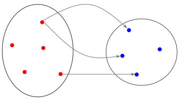

---
jupytext:
  text_representation:
    extension: '.md'
    format_name: myst
    format_version: '0.7'
    jupytext_version: 1.4.0+dev
kernelspec:
  display_name: Python 3
  language: python
  name: python3
---

+++ {"editable": false, "deletable": false}

# Exercise 2 : Localization of a point cloud inside a mesh

+++ {"editable": false, "deletable": false}

In this second exercise we will focus on the **Mesh Location** feature.
It consists in computing the location of one or more partitioned point clouds (referred to as the *targets*) inside a partitioned mesh (referred to as the *source*).

A mapping between the source mesh elements and the target points they contain is computed, which consists in
  - geometric data (distances, barycentric and parametric coordinates, ...) ;
  - an MPI communication graph as the associated entities are, in general, distributed on different processes.

This mapping is typically used for interpolating data from the source mesh to the point clouds in applications such as the coupling between non-matching grids.


The aim of this exercise is to perform such an interpolation.
The exercise is structured in two parts:
1. Compute the location
2. Perform the interpolation

Your task is to fill in the empty code cells using the API referenced [here](https://numerics.gitlab-pages.onera.net/mesh/paradigm/dev_formation/user_manual/prepro_algo/mesh_location.html#c-api).

*Note: For easier visualization, we will study a two-dimensional case but the feature is also available in three dimensions.*

+++ {"editable": false, "deletable": false}

## Load magic commands
As usual we start by loading the custom magic commands.

```{code-cell} ipython3
---
"editable": false
"deletable": false
---
import os, sys
module_path = os.path.abspath(os.path.join('../../utils'))
if module_path not in sys.path:
    sys.path.append(module_path)
```

```{code-cell}
---
"editable": false
"deletable": false
---
%reload_ext visu_magics
%reload_ext code_magics
```


+++ {"editable": false, "deletable": false}

## Include the required headers and initialize MPI

To begin, we include the required C headers and initialize MPI.

```{code-cell}
---
"editable": false
"deletable": false
---
%%code_block -p exercise_2 -i 1

// Required headers
#include "pdm_mesh_location.h"
#include "pdm_generate_mesh.h"

int main(int argc, char *argv[])
{
  // Initialize MPI
  PDM_MPI_Comm comm = PDM_MPI_COMM_WORLD;
  int i_rank;
  PDM_MPI_Init(&argc, &argv);
  PDM_MPI_Comm_rank(comm, &i_rank);
```

+++ {"editable": false, "deletable": false}

## 1. Localization


### Generate a partitioned "source" mesh

We start by generating the partitioned source mesh.

By now you should be capable of partitioning a mesh using **ParaDiGM** (if not, you should definitely take a look at [**Exercise 1**](../02_Exercise_1/exercise_1.ipynb)).
To gain some time, let's use the [*PDM_generate_mesh*](https://numerics.gitlab-pages.onera.net/mesh/paradigm/dev_formation/user_manual/simple_mesh_gen/generate_mesh.html#c-api) service to generate a partitioned mesh in a single function call.

Here we generate a square mesh composed of polygonal elements that looks like this (here partitioned on 4 processes, each one represented by a distinct color):


*Nothing to do here, you can move on. Just don't forget to run the cell!*

```{code-cell}
---
"deletable": false
---
%%code_block -p exercise_2 -i 2

  // Generate partitioned source mesh
  PDM_g_num_t src_n_vtx_seg = 10;  // number of vertices along each side of the square
  int         src_n_part    = 1;   // number of partitions per MPI rank
  double      src_random    = 0.8; // randomization factor

  int          *src_n_vtx         = NULL;
  int          *src_n_edge        = NULL;
  int          *src_n_face        = NULL;
  double      **src_vtx_coord     = NULL;
  int         **src_edge_vtx      = NULL;
  int         **src_face_edge_idx = NULL;
  int         **src_face_edge     = NULL;
  int         **src_face_vtx      = NULL;
  PDM_g_num_t **src_vtx_ln_to_gn  = NULL;
  PDM_g_num_t **src_edge_ln_to_gn = NULL;
  PDM_g_num_t **src_face_ln_to_gn = NULL;
  PDM_generate_mesh_rectangle_ngon(comm,
                                   PDM_MESH_NODAL_POLY_2D,
                                   0.,
                                   0.,
                                   0.,
                                   1.,
                                   1.,
                                   src_n_vtx_seg,
                                   src_n_vtx_seg,
                                   src_n_part,
                                   PDM_SPLIT_DUAL_WITH_PARMETIS,
                                   src_random,
                                   &src_n_vtx,
                                   &src_n_edge,
                                   &src_n_face,
                                   &src_vtx_coord,
                                   &src_edge_vtx,
                                   &src_face_edge_idx,
                                   &src_face_edge,
                                   &src_face_vtx,
                                   &src_vtx_ln_to_gn,
                                   &src_edge_ln_to_gn,
                                   &src_face_ln_to_gn);
```

+++ {"editable": false, "deletable": false}

### Generate a partitioned "target" mesh

We then generate a second partitioned mesh.
We will use its vertices as a target point cloud.
This second mesh is deliberately offset so that some target points lie outside the source mesh.
These points may not be located.
We will see later how to deal with these *unlocated* points.

The partitioned cloud typically looks like this:


Note that we use a different partitioning method for the two meshes so that the source and target partitions do not match.

*Nothing to do here either. However, once you've successfully completed the localization procedure, feel free to play with the parameters of the two meshes.*

```{code-cell}
---
"deletable": false
---
%%code_block -p exercise_2 -i 3

  // Generate target source mesh
  PDM_g_num_t tgt_n_vtx_seg = 8;    // number of vertices along each side of the square
  int         tgt_n_part    = 1;    // number of partitions per MPI rank
  double      tgt_xmin      = 0.25; // x-offset
  double      tgt_ymin      = 0.25; // y-offset
  double      tgt_random    = 0.0;  // randomization factor

  int          *tgt_n_vtx         = NULL;
  int          *tgt_n_edge        = NULL;
  int          *tgt_n_face        = NULL;
  double      **tgt_vtx_coord     = NULL;
  int         **tgt_edge_vtx      = NULL;
  int         **tgt_face_edge_idx = NULL;
  int         **tgt_face_edge     = NULL;
  int         **tgt_face_vtx      = NULL;
  PDM_g_num_t **tgt_vtx_ln_to_gn  = NULL;
  PDM_g_num_t **tgt_edge_ln_to_gn = NULL;
  PDM_g_num_t **tgt_face_ln_to_gn = NULL;

  PDM_generate_mesh_rectangle_ngon(comm,
                                   PDM_MESH_NODAL_QUAD4,
                                   tgt_xmin,
                                   tgt_ymin,
                                   0.,
                                   1.,
                                   1.,
                                   tgt_n_vtx_seg,
                                   tgt_n_vtx_seg,
                                   tgt_n_part,
                                   PDM_SPLIT_DUAL_WITH_HILBERT,
                                   tgt_random,
                                   &tgt_n_vtx,
                                   &tgt_n_edge,
                                   &tgt_n_face,
                                   &tgt_vtx_coord,
                                   &tgt_edge_vtx,
                                   &tgt_face_edge_idx,
                                   &tgt_face_edge,
                                   &tgt_face_vtx,
                                   &tgt_vtx_ln_to_gn,
                                   &tgt_edge_ln_to_gn,
                                   &tgt_face_ln_to_gn);
```

+++ {"editable": false, "deletable": false}

### Create the `PDM_mesh_location_t` structure

Now that we have all the required inputs, let's create an instance of the `PDM_mesh_location_t` structure.

```{code-cell}
---
"deletable": false
---
%%code_block -p exercise_2 -i 4

  // Create the PDM_mesh_location_t structure
  // EXO
  PDM_mesh_location_t *mesh_loc = PDM_mesh_location_create(1,
                                                           comm,
                                                           PDM_OWNERSHIP_KEEP);

```

+++ {"editable": false, "deletable": false}

### Set the target point cloud

The mesh location feature offers the possibility to provide several target point clouds.
That means that you need to loop over the target points clouds to provide each one of them to the Mesh-Location structure.
Since we handle only one target point cloud here, we didn't write a loop.
We just use the 0 value to tell that we store this target point cloud at position 0 of the target point cloud array inside **ParaDiGM**.
Recall that there can be more than one partition per MPI rank.

```{code-cell}
---
"deletable": false
---
%%code_block -p exercise_2 -i 5

  // Set target point cloud
  // EXO
  PDM_mesh_location_n_part_cloud_set(mesh_loc,
                                     0,
                                     tgt_n_part);

  for (int i_part = 0; i_part < tgt_n_part; i_part++) {
    PDM_mesh_location_cloud_set(mesh_loc,
                                0,
                                i_part,
                                tgt_n_vtx       [i_part],
                                tgt_vtx_coord   [i_part],
                                tgt_vtx_ln_to_gn[i_part]);
  }
```

+++ {"editable": false, "deletable": false}

### Set the source mesh

Now let's provide the source mesh to the structure.

Here you have essentially two options:
- you can either define the mesh with "nodal" connectivity (i.e. Finite-Element style)
- or with "descending" connectivity (i.e. Finite-Volume style)

Choose the one that suits you best, and again, recall that there can be more than one partition per MPI rank.

##### **<span style="color:darkorange;">Note</span>**
*<span style="color:darkorange;">
The number of edges in a 2D mesh element (a face) is equal to the number of vertices. This means that `face_edge_idx == face_vtx_idx`.
</span>*

```{code-cell}
---
"deletable": false
---
%%code_block -p exercise_2 -i 6

  // Set source mesh
  // EXO
  PDM_mesh_location_mesh_n_part_set(mesh_loc, src_n_part);

  int nodal = 0;

  if (nodal) {
    for (int i_part = 0; i_part < src_n_part; i_part++) {
      PDM_mesh_location_nodal_part_set_2d(mesh_loc,
                                          i_part,
                                          src_n_face       [i_part],
                                          src_face_edge_idx[i_part],
                                          src_face_vtx     [i_part],
                                          src_face_ln_to_gn[i_part],
                                          src_n_vtx        [i_part],
                                          src_vtx_coord    [i_part],
                                          src_vtx_ln_to_gn [i_part]);
    }
  }
  else {
    for (int i_part = 0; i_part < src_n_part; i_part++) {
      PDM_mesh_location_part_set_2d(mesh_loc,
                                    i_part,
                                    src_n_face       [i_part],
                                    src_face_edge_idx[i_part],
                                    src_face_edge    [i_part],
                                    src_face_ln_to_gn[i_part],
                                    src_n_edge       [i_part],
                                    src_edge_vtx     [i_part],
                                    src_n_vtx        [i_part],
                                    src_vtx_coord    [i_part],
                                    src_vtx_ln_to_gn [i_part]);
    }
  }
```

+++ {"editable": false, "deletable": false}

### Compute the localization

Now that everything is ready, we can compute the localization.
Once the calculation is complete, we can display the elapsed and CPU times.

```{code-cell}
---
"deletable": false
---
%%code_block -p exercise_2 -i 8

  // Compute location
  // EXO
  PDM_mesh_location_compute(mesh_loc);

  // Dump elapsed and CPU times
  // EXO
  PDM_mesh_location_dump_times(mesh_loc);

```

+++ {"editable": false, "deletable": false}

## 2. Interpolation

Now that the localization has been computed, the mesh location structure stores the mapping between the source mesh elements and the target points.
This mapping consists in:
- a set of geometric data sufficient for P1 interpolation of node-based fields ;
- an MPI communication graph to exchange data between the mapped entities.

The figure below illustrates the mapping between source and targets.
It is clear that MPI communication are necessary to transfer data between the two as the mapped entities are in general not hosted by the same process.


In the second part of this exercise you will have to use these two pieces of information to:
1. exchange the global ids of the source elements to the corresponding target points: this way each *located* point is supposed to receive the global id of the element it is contained in ;
2. interpolate (and exchange) a node-based field: we choose a linear field such as the Cartesian coordinate *x* so we can easily check everything went right.


+++ {"editable": false, "deletable": false}

### Retrieve the `PDM_part_to_part_t` instance

The communication graph is embodied in the form of a [`PDM_part_to_part_t`](https://numerics.gitlab-pages.onera.net/mesh/paradigm/dev_formation/user_manual/comm_graph/ptp.html#c-api) instance.

The Part-to-part feature was designed as a generic means of exchanging data between two arbitrarily partitioned sets of entities.
The Part-to-part structure is thus built by specifying the partitions of both sets, as well as the graph of the links between elements of set 1 (*Part1*) to set 2 (*Part2*).



On the figure above the first set is represented in red and the second set in blue.
The graph between *Part1* and *Part2* is symbolized by the gray arrows.

In this case, *Part1* represents the source mesh and *Part2* the target point cloud.

The `PDM_part_to_part_t` instance was built during the localization computation and can be accessed from the `PDM_mesh_location_t` structure.

```{code-cell}
---
"deletable": false
---
%%code_block -p exercise_2 -i 9

  // Get PDM_part_to_part_t structure
  // EXO
  PDM_part_to_part_t *ptp = NULL;
  PDM_mesh_location_part_to_part_get(mesh_loc,
                                     0,
                                     &ptp,
                                     PDM_OWNERSHIP_USER);
```

+++ {"editable": false, "deletable": false}

Part-to-part is able to perform non-blocking exchanges so here's how we're going to proceed:
1. initiate the first exchange: each source element sends its global id to all the target points it contains ;
2. overlap this communication by the computation of the interpolated *x* on the source side ;
3. initiate the second exchange ;
4. finalize both exchanges.

### First exchange

Here you need to initiate the exchange of global ids from the source mesh elements to the target points.

##### **<span style="color:olivedrab;">Analogy</span>**
*<span style="color:olivedrab;">
Marie is part of the Dupont family. She is going to meet members of the Perez family. She already knows some of them.
Marie is going to provide her name to the members of the Perez family she doesn't know.
In a sense, we can link Marie with the members of the Perez family she doesn't know. Then communicate to them the same information,
which is her name. This is exactly a Part-to-part exchange with the mode `PDM_PART_TO_PART_DATA_DEF_ORDER_PART1`.
In our mesh location exercise, who is the Dupont family who will provide their name and who is the Perez family?
</span>*

As each MPI ranks hosts source *and* target partitions, we will use the **PDM_part_to_part_iexch** function which allows for transparent, bilateral data exchange.

<!-- +++ {"jupyter": {"source_hidden": true}, "editable": false, "deletable": false}

Hints:
  - each cell sends a **single** value (its **global id**)
  - the **same** value is sent to each corresponding target -->

```{code-cell}
---
"deletable": false
---
%%code_block -p exercise_2 -i 10

  // Initiate exchange of first field
  int request1 = -1;
  PDM_g_num_t **tgt_recv_field1 = NULL;
  // EXO
  PDM_part_to_part_iexch(ptp,                                   //
                         PDM_MPI_COMM_KIND_P2P,                 //
                         PDM_STRIDE_CST_INTERLACED,             //
                         PDM_PART_TO_PART_DATA_DEF_ORDER_PART1, //
                         1,                                     //
                         sizeof(PDM_g_num_t),                   //
                         NULL,                                  //
        (const void  **) src_face_ln_to_gn,                     // ?
                         NULL,                                  //
              (void ***) &tgt_recv_field1,                      // ?
                         &request1);                            // ?

```

+++ {"editable": false, "deletable": false}

### Interpolate the second field

Here you need to interpolate the node-based field from the source mesh onto the target points.
That means for each target point computing the weighted average of the field on the vertices of the element it is located in.
The resulting interpolated field must be partitioned the same way as the input target point cloud.


<br>
Let $f$ denote the field of interest, $T$ a target point and $S$ the source element containing $T$.
Then the interpolated field at $T$ reads
$$f(T) = \sum_i w_i f(v_i),$$
where $\left\{ v_i \right\}$ is the set of vertices of $S$ and $\left\{ w_i \right\}$ the interpolation weights.

<br>

The figure on the right depicts a source element $S$ with eight vertices and containing two target points.
The iso-contours of the field continuously interpolated inside $S$ from the values at its vertices are shown in color.
<!-- Each color on the picture above represents the weight associated to the red point in this pentagon. -->

<!-- *Will the weighted average be the same for $T_1$ and $T_2$?*

This means there is a better side to do the interpolation computation.
Depending at the side of which part (*Part1* or *Part2*) the computation is done more data will be exchanged.

*What is the most efficient side in terms of amount of data to exchange to do the computation?* -->

*How are we going to proceed to achieve this interpolation in practice?*

The interpolated values at $T_1$ and $T_2$ are different, so we need to proceed in a way different from the first exchange.

You can either:
1. interpolate the values on the source side (*Part1*), and then send to each target point its interpolated field value ;
2. send to each target point the field values at the vertices of the source element along with the corresponding weights, and then perform the interpolation on the target side (*Part2*).
<!-- Doing the interpolation on *Part1* (the source side), you will send one value to the target point in *Part 2* : the interpolated field.
Doing the interpolation on *Part2* (the target side), you will send to each target point the coordinates and the field at each vertex of the element of the source mesh it has been located in. -->

*Which is the better option?*

You will implement the first option as it involves fewer data transfers. <!-- You can start doing the interpolation. -->

*What data do you have access to?*

You are on the side of *Part1* (source mesh).
<!-- You have access to the elements of the mesh, the face$\to$vertex connectivity and for each face the list of target points located in it. -->
You have access to:
  - the field values at each vertex of the source mesh ;
  - the face$\to$vtx connectivity, i.e. the list of vertices composing each element ;
  - the list of target points located inside each source element ;
  - the set of interpolation weights associated to each target point located in the source mesh.

*Knowing this, how will you set up the loops in your code to compute the interpolation?*

<!-- Interpolation of node-based fields is not as straightforward as cell-based ones.
Let $f$ denote the field of interest, $T$ a target point and $S$ the source element containing $T$.
Then the interpolated field at $T$ reads
$$f(T) = \sum_i w_i f(v_i),$$
where $\left\{ v_i \right\}$ is the set of vertices of $S$ and $\left\{ w_i \right\}$ the interpolation weights.

In practice, to perform this interpolation, you need
 - the element$\to$vertex connectivity
 - the interpolation weights


for each element: get the list of associated target points


Now you need to compute the spatially interpolated *x* values **on the source side**.


Let $T$ denote a target point and $S$ the source element containing $T$.
 -->

```{code-cell}
---
"deletable": false
---
%%code_block -p exercise_2 -i 11

  // Interpolate second field
  double **src_vtx_field2 = malloc(sizeof(double *) * src_n_part);
  for (int i_part = 0; i_part < src_n_part; i_part++) {
    src_vtx_field2[i_part] = malloc(sizeof(double) * src_n_vtx[i_part]);
    for (int i_vtx = 0; i_vtx < src_n_vtx[i_part]; i_vtx++) {
      src_vtx_field2[i_part][i_vtx] = src_vtx_coord[i_part][3*i_vtx];
    }
  }

  double **src_send_field2 = malloc(sizeof(double *) * src_n_part);
  // EXO
  for (int i_part = 0; i_part < src_n_part; i_part++) {
    int         *src_to_tgt_idx          = NULL;
    PDM_g_num_t *points_gnum             = NULL;
    double      *points_coords           = NULL;
    double      *points_uvw              = NULL;
    int         *points_weights_idx      = NULL;
    double      *points_weights          = NULL;
    double      *points_dist2            = NULL;
    double      *points_projected_coords = NULL;

    PDM_mesh_location_points_in_elt_get(mesh_loc,
                                        0,
                                        i_part,
                                        &src_to_tgt_idx,
                                        &points_gnum,
                                        &points_coords,
                                        &points_uvw,
                                        &points_weights_idx,
                                        &points_weights,
                                        &points_dist2,
                                        &points_projected_coords);

    int *cell_vtx_idx = NULL;
    int *cell_vtx     = NULL;
    PDM_mesh_location_cell_vertex_get(mesh_loc,
                                      i_part,
                                      &cell_vtx_idx,
                                      &cell_vtx);

    int n_pts = src_to_tgt_idx[src_n_face[i_part]];

    src_send_field2[i_part] = malloc(sizeof(double) * n_pts);
    for (int i_elt = 0; i_elt < src_n_face[i_part]; i_elt++) {
      for (int i_pt = src_to_tgt_idx[i_elt]; i_pt < src_to_tgt_idx[i_elt+1]; i_pt++) {
        src_send_field2[i_part][i_pt] = 0;

        int elt_n_vtx = cell_vtx_idx[i_elt+1] - cell_vtx_idx[i_elt];
        assert(points_weights_idx[i_pt+1] - points_weights_idx[i_pt] == elt_n_vtx);

        for (int i_vtx = 0; i_vtx < elt_n_vtx; i_vtx++) {
          int vtx_id = cell_vtx[cell_vtx_idx[i_elt] + i_vtx] - 1;
          src_send_field2[i_part][i_pt] += points_weights[points_weights_idx[i_pt] + i_vtx] * src_vtx_field2[i_part][vtx_id];
        }

      }
    }
  }

```

+++ {"editable": false, "deletable": false}

### Exchange the second interpolated field

Now that you've done the interpolation, it is time to send the interpolated field to the target points.

##### **<span style="color:olivedrab;">Analogy</span>**
*<span style="color:olivedrab;">
Marie met the grandparents of the Perez family : Marta & Luis and Julio & Paula. She wants to send them a Christmas postcard.
She chose a card with a Christmas tree for Marta & Luis and a card with Santa for Julio & Paula.
In a sense, we can link Marie to Marta & Luis and Julio & Paula. This time she won't provide the same information to both of them.
This is exactly a Part-to-part exchange with the mode `PDM_PART_TO_PART_DATA_DEF_ORDER_PART1_TO_PART2`.
What does the postcard represent in our location exercise?
</span>*

You can now initiate the exchange of the interpolated field you just computed.

```{code-cell}
---
"deletable": false
---
%%code_block -p exercise_2 -i 12

  // Initiate exchange of second field
  int request2 = -1;
  double **tgt_recv_field2 = NULL;
  // EXO
  PDM_part_to_part_iexch(ptp,                                            //
                         PDM_MPI_COMM_KIND_P2P,                          //
                         PDM_STRIDE_CST_INTERLACED,                      //
                         PDM_PART_TO_PART_DATA_DEF_ORDER_PART1_TO_PART2, //
                         1,                                              //
                         sizeof(double),                                 //
                         NULL,                                           //
        (const void  **) src_send_field2,                                // ?
                         NULL,                                           //
              (void ***) &tgt_recv_field2,                               // ?
                         &request2);                                     // ?

```

+++ {"editable": false, "deletable": false}

### Check the interpolated field received on the target side

Finally, we can finalize both exchanges, check and visualize the received fields on the target side.

#### *Watch out for unlocated points!*
Notice that you only received information relative to the *located* points.
You must therefore use the appropriate indirection to correctly read the received arrays.

```{code-cell}
---
"deletable": false
---
%%code_block -p exercise_2 -i 13

  // Finalize both exchanges
  PDM_part_to_part_iexch_wait(ptp, request1);
  PDM_part_to_part_iexch_wait(ptp, request2);

  double **tgt_field[3];
  tgt_field[0] = malloc(sizeof(double *) * tgt_n_part);
  tgt_field[1] = malloc(sizeof(double *) * tgt_n_part);
  tgt_field[2] = malloc(sizeof(double *) * tgt_n_part);

  for (int i_part = 0; i_part < tgt_n_part; i_part++) {
    tgt_field[0][i_part] = malloc(sizeof(double) * tgt_n_vtx[i_part]);
    tgt_field[1][i_part] = malloc(sizeof(double) * tgt_n_vtx[i_part]);
    tgt_field[2][i_part] = malloc(sizeof(double) * tgt_n_vtx[i_part]);

    double *tgt_field1 = tgt_field[0][i_part];
    double *tgt_field2 = tgt_field[1][i_part];
    double *is_located = tgt_field[2][i_part];

    // EXO
    int n_located = PDM_mesh_location_n_located_get(mesh_loc,
                                                    0,
                                                    i_part);

    int *located = PDM_mesh_location_located_get(mesh_loc,
                                                 0,
                                                 i_part);

    int n_unlocated = PDM_mesh_location_n_unlocated_get(mesh_loc,
                                                        0,
                                                        i_part);

    int *unlocated = PDM_mesh_location_unlocated_get(mesh_loc,
                                                     0,
                                                     i_part);

    for (int i = 0; i < n_unlocated; i++) {
      int vtx_id = unlocated[i] - 1;
      is_located[vtx_id] = 0;
      tgt_field1[vtx_id] = -1;
      tgt_field2[vtx_id] = -1;
    }

    for (int i = 0; i < n_located; i++) {
      int vtx_id = located[i] - 1;
      is_located[vtx_id] = 1;
      tgt_field1[vtx_id] = tgt_recv_field1[i_part][i];
      tgt_field2[vtx_id] = tgt_recv_field2[i_part][i];

      double error = fabs(tgt_field2[vtx_id] - tgt_vtx_coord[i_part][3*vtx_id]);
      if (error > 1e-9) {
        printf("!! error vtx "PDM_FMT_G_NUM" : %e\n",
               tgt_vtx_ln_to_gn[i_part][vtx_id],
               error);
      }
    }

  }
```

+++ {"editable": false, "deletable": false}

*Write output files for visualization, nothing to do here.*

```{code-cell}
---
"deletable": false
---
%%code_block -p exercise_2 -i 14
  // Export for visualization, nothing to do here
  const char *field_name[] = {
    "field1",
    "field2",
    "is_located"
  };


  double **src_elt_field_values = malloc(sizeof(double *) * src_n_part);
  for (int i_part = 0; i_part < src_n_part; i_part++) {
    src_elt_field_values[i_part] = malloc(sizeof(double) * src_n_face[i_part]);
    for (int i_elt = 0; i_elt < src_n_face[i_part]; i_elt++) {
      src_elt_field_values[i_part][i_elt] = (double) src_face_ln_to_gn[i_part][i_elt];
    }
  }

  writer_wrapper(comm,
                 "visu",
                 "src_mesh",
                 src_n_part,
                 src_n_vtx,
                 src_vtx_coord,
                 src_vtx_ln_to_gn,
                 src_n_face,
                 src_face_edge_idx,
                 src_face_vtx,
                 src_face_ln_to_gn,
                 -1,
                 0,
                 NULL,
                 NULL,
                 "Ensight",
                 1,
                 &field_name[0],
                 &src_elt_field_values,
                 1,
                 &field_name[1],
                 &src_vtx_field2);

  for (int i_part = 0; i_part < src_n_part; i_part++) {
    free(src_elt_field_values[i_part]);
  }
  free(src_elt_field_values);


  writer_wrapper(comm,
                 "visu",
                 "tgt_mesh",
                 tgt_n_part,
                 tgt_n_vtx,
                 tgt_vtx_coord,
                 tgt_vtx_ln_to_gn,
                 tgt_n_face,
                 tgt_face_edge_idx,
                 tgt_face_vtx,
                 tgt_face_ln_to_gn,
                 -1,
                 0,
                 NULL,
                 NULL,
                 "Ensight",
                 0,
                 NULL,
                 NULL,
                 3,
                 field_name,
                 tgt_field);

```

+++ {"editable": false, "deletable": false}

### Free memory

Congratulations! You've made it to the end of the exercise :)
Now let's clean the mess we just made and free the allocated memory.

```{code-cell}
---
"deletable": false
---
%%code_block -p exercise_2 -i 15
  // Free memory
  // EXO
  PDM_mesh_location_free(mesh_loc);

  PDM_part_to_part_free(ptp); // /!\ Ownership

  for (int i_part = 0; i_part < src_n_part; i_part++) {
    free(src_vtx_coord    [i_part]);
    free(src_edge_vtx     [i_part]);
    free(src_face_edge_idx[i_part]);
    free(src_face_edge    [i_part]);
    free(src_face_vtx     [i_part]);
    free(src_vtx_ln_to_gn [i_part]);
    free(src_edge_ln_to_gn[i_part]);
    free(src_face_ln_to_gn[i_part]);
    free(src_vtx_field2   [i_part]);
    free(src_send_field2  [i_part]);
  }
  free(src_n_vtx        );
  free(src_n_edge       );
  free(src_n_face       );
  free(src_vtx_coord    );
  free(src_edge_vtx     );
  free(src_face_edge_idx);
  free(src_face_edge    );
  free(src_face_vtx     );
  free(src_vtx_ln_to_gn );
  free(src_edge_ln_to_gn);
  free(src_face_ln_to_gn);
  free(src_vtx_field2   );
  free(src_send_field2  ); // can be free'd right after PDM_part_to_part_iexch_wait(ptp, &request2);

  for (int i_part = 0; i_part < tgt_n_part; i_part++) {
    free(tgt_vtx_coord    [i_part]);
    free(tgt_edge_vtx     [i_part]);
    free(tgt_face_edge_idx[i_part]);
    free(tgt_face_edge    [i_part]);
    free(tgt_face_vtx     [i_part]);
    free(tgt_vtx_ln_to_gn [i_part]);
    free(tgt_edge_ln_to_gn[i_part]);
    free(tgt_face_ln_to_gn[i_part]);
    free(tgt_recv_field1  [i_part]);
    free(tgt_recv_field2  [i_part]);
    free(tgt_field[0][i_part]);
    free(tgt_field[1][i_part]);
    free(tgt_field[2][i_part]);
  }
  free(tgt_n_vtx        );
  free(tgt_n_edge       );
  free(tgt_n_face       );
  free(tgt_vtx_coord    );
  free(tgt_edge_vtx     );
  free(tgt_face_edge_idx);
  free(tgt_face_edge    );
  free(tgt_face_vtx     );
  free(tgt_vtx_ln_to_gn );
  free(tgt_edge_ln_to_gn);
  free(tgt_face_ln_to_gn);
  free(tgt_recv_field1  );
  free(tgt_recv_field2  );
  free(tgt_field[0]);
  free(tgt_field[1]);
  free(tgt_field[2]);
```

+++ {"editable": false, "deletable": false}

### Finalize

Finalize MPI.

```{code-cell}
---
"deletable": false
---
%%code_block -p exercise_2 -i 16
  // Nothing to do here
  PDM_MPI_Finalize();

  if (i_rank == 0) {
    printf("End :)\n");
    fflush(stdout);
  }

  return EXIT_SUCCESS;
}

```

+++ {"editable": false, "deletable": false}

## Compile the code and run

Moment of truth!

```{code-cell}
---
"deletable": false
---
%merge_code_blocks -l c -p exercise_2 -n 2
```

+++ {"editable": false, "deletable": false}

## Visualize the results

```{code-cell}
---
"deletable": false
---
%%visualize -nl -sv
visu/SRC_MESH.case
visu/TGT_MESH.case : is_located : points
```


+++ {"editable": false, "deletable": false}

# Bonus: optional parameters

The location algorithm uses a preconditioning stage which consists in associating candidate elements and points before computed the exact location.
Three preconditioning methods are available:
- `PDM_MESH_LOCATION_OCTREE`
- `PDM_MESH_LOCATION_DBBTREE`
- `PDM_MESH_LOCATION_LOCATE_ALL_TGT`

The first two methods use bounding boxes and distributed tree data structures to find the candidate pairs efficiently.
Theses boxes can be expanded using a **relative geometric tolerance** allowing for safer candidate detection.
The third method uses a combination of both trees to ensure all target points are "located", i.e. associated to the nearest source element, independently of the tolerance.

By default, the `PDM_MESH_LOCATION_OCTREE` method is used, with a relative tolerance equal to zero.
Increasing the tolerance values allows to locate more points, at the expense of the CPU cost.


The next cell runs an interactive widget that allows you to play with these two options and see how they can affect the localization status of some points.

```{code-cell}
---
"deletable": false
---
%reload_ext figure_magics
%localization
```

Now you can call the appropriate functions to tweak these options, and re-run your code.
(Note that this piece of code is placed *before* the call to **PDM_mesh_location_compute**.)

```{code-cell}
---
"deletable": false
---
%%code_block -p exercise_2 -i 7

  // Set the location preconditioning method (optional)
  // EXO
  PDM_mesh_location_method_set(mesh_loc,
                               PDM_MESH_LOCATION_OCTREE);

  // Set the geometric tolerance (optional)
  // EXO
  double tolerance = 1e-6;
  PDM_mesh_location_tolerance_set(mesh_loc, tolerance);

```

+++ {"editable": false, "deletable": false}

## Compile the code and run

```{code-cell}
---
"deletable": false
---
%merge_code_blocks -l c -p exercise_2 -n 2
```

+++ {"editable": false, "deletable": false}

## Visualize the results

```{code-cell}
---
"deletable": false
---
%%visualize -nl -sv
visu/SRC_MESH.case
visu/TGT_MESH.case : is_located : points
```
