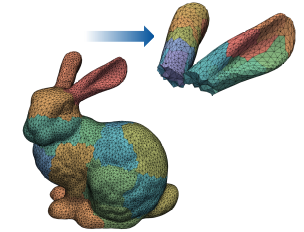

---
jupytext:
  text_representation:
    extension: '.md'
    format_name: myst
    format_version: '0.7'
    jupytext_version: 1.4.0+dev
kernelspec:
  display_name: Python 3
  language: python
  name: python3
---

# Introduction

Welcome to the **ParaDiGM** library introductory day !

The aim of the day is to give you : 
 - An overview of **ParaDiGM**'s features
 - An understanding of **ParaDiGM**'s advanced parallelism concepts
 - An understanding of how **ParaDiGM** can be called in your software written in C/C++, Fortran or Python.

This is an interactive course, so don't hesitate to interrupt us to ask your questions.

The training will take place in three stages:
- General presentation of **ParaDiGM**
- Description of the abstract concept of inter-partition communication graphs
- Focus on two functionalities through interactive exercises :
    - Exercise 1 : Mesh partitioning
    - Exercise 2 : Localization of a point cloud inside a mesh

# **ParaDiGM** highlights

## Origins of **ParaDiGM**

From 2009 to 2015, various HPC libraries dedicated to different themes were written. **ppart** for parallel graph partitioning, **pario** for parallel I/O as a wrapping to MPI-IO, **CWIPI** for HPC coupling... These libraries shared many principles and structures and were complementary. The idea of merging these libraries into a single one emerged in 2016.  **ParaDiGM** was born!

As the **CWIPI** library was already well used in the academic and industrial communities, it was retained, but its entire algorithmic core was replaced by **ParaDiGM**.

## Objectives

An efficient parallel algorithm takes much longer to write and validate than a sequential one. A simple sequential operation can become very difficult if you want to maintain good *load* and *memory* balancing during all algorithm steps.

**ParaDiGM** aims to offer a set of efficient services to simplify the writing of massively parallel distributed numerical simulation software, from reading data files to writing results.
Numerical codes are generally based on a discretization of the study domain which can take the form of a mesh.
**ParaDiGM** only offers services for unstructured meshes.

## API

The API has been designed to be as user-friendly and intuitive as possible. All functionalities are in object form. To use a feature, the user **creates** an object and then **provides** the necessary data in the form of arrays and scalars. Once all the data has been provided, the user executes the feature **compute**. As with data, results are **retrieved** in the form of arrays or **ParaDiGM** objects. All concrete results required by the user are obtained directly by dedicated functions, without the need for abstract intermediate structures. User manipulation of abstract **ParaDiGM** objects is reduced to a strict minimum.

The native API is in C and can be used in C/C++ software.

Two other APIs are available. The first one is in Python/Numpy, automatically generated from Cython, and the second one is in Fortran using Fortran's *iso-c-binding* interfaces. These APIs are not simply direct interfaces to C functions. They have been designed to be user-friendly and intuitive in each language.
Feel free to give us feedback so that we can improve ourselves !
The Python API reinforces the notion of objects, and results are provided in the form of dictionaries. The Fortran API takes Fortran pointers as input/output and not `c_ptr` types with which Fortran developers are unfamiliar. The C API contains pointer arrays. This notion is not defined in Fortran. When giving data or retrieving results in this form, the user must use the Fortran **pdm_pointer_array** intermediate structure.

## License

**ParaDiGM** is licensed under LGPL V3.0.

## Where can I find **ParaDiGM**?

- https://gitlab.onera.net/numerics/mesh/paradigm (ONERA users only)
- GitHub (in progress)

### Extensions

The module ParaDiGMA contains somme advanced functionnalities. These functionnalities are stored into : 

- https://gitlab.onera.net/numerics/mesh/paradigma (ONERA users only)

In ParaDiGM, ParaDiGMA is a git submodule. By default, this module is not installed

## Releases

The latest stable version is 2.4.0, released on November ??, 2023.

The first stable version 1.0.0 was released on March 22, 2017.

Minor versions are released every 3 to 4 months and main versions are released every 2 to 4 years.

Backward compatibility is not guaranteed between two major versions. 

API compatibility is guaranteed between two minor versions, except for new beta functionalities. 

## Man power

- DMPE :

 

Eric Quémerais (PLM) : founder of **ParaDiGM** and **CWIPI** libraries

  

 

Bastien Andrieu (PLM)

  

 

Karmijn Hoogveld (PLM)

  

 

Nicolas Dellinger (HEAT) : MoDeTheC developer

  

 

Alain Hervault (PLM) : arrived the 6th of November to work on the mesh adaptation workflow

  

 

Robin Cazalbou (PLM) : PhD student on optimizing code coupling in a massively parallel hybrid CPU-GPU environment

  

- DAAA :

 

Bruno Maugars (CLEF) : SoNICS developer

  

 

Julien Coulet (CLEF) : MAIA developer

  

 

Clément Benazet (CLEF)

  

## **ParaDiGM**'s position within the ONERA ecosystem

## Organization

Work has been carried out to develop the library with a workflow that takes advantage of modern software development tools.
**ParaDiGM** is available through [GitLab](https://gitlab.onera.net/numerics/mesh/paradigm) for ONERA users/developers and there is a git repository available for external users.
We work on making the library available on GitHub.
Using GitLab allows us to use GitLab CI which is a continuous method of software development. At each commit on the repository,
it checks whether the library builds and passes the test base successfully.

The recent increase in the number of developers has made it possible to devote a significant amount of time to developing [documentation](https://numerics.gitlab-pages.onera.net/mesh/paradigm/dev_formation/index.html) with Sphinx.
This is still a work in progress, so we welcome your comments and contributions!

## How do I install **ParaDiGM**?

Start by getting the sources of **ParaDiGM** (by cloning the [GitLab](https://gitlab.onera.net/numerics/mesh/paradigm) repository for instance).
The library builds with [CMake](https://cmake.org/).

### Basic Installation

>**cmake .**

>**make**

>**make install**

### CMake general options

> **cmake . -D\<option1_name\>=\<option1_value\> ... -D\<optionN_name\>=\<optionN_value\>** with options :

 - **CMAKE\_INSTALL\_PREFIX=\<prefix\>** : Installation directory path

 - **PDM_ENABLE_Fortran=<ON | OFF> (default : OFF)** : Enable Fortran interface

 - **PDM_ENABLE_PYTHON_BINDINGS=<ON | OFF> (default : OFF)** : Enable python interface

 - **PDM_ENABLE_SHARED=<ON | OFF> (default : ON)** : Enable shared libraries

 - **PDM_ENABLE_STATIC=<ON | OFF> (default : ON)** : Enable static libraries

 - **PDM_ENABLE_PARMETIS=<ON | OFF> (default : ON)** : Enable [ParMETIS](https://github.com/KarypisLab/ParMETIS) library (parallel graph partitioning). **ParaDiGM** is compatible with a 32-bit or 64-bit installation.

 - **PDM_ENABLE_PTSCOTCH=<ON | OFF> (default : ON)** : Enable [PTSCOTCH](https://gitlab.inria.fr/scotch/scotch) library (parallel graph partitioning). **ParaDiGM** is compatible with a 32-bit or 64-bit installation.

 - **PDM_ENABLE_LONG_G_NUM= <ON | OFF> (default : ON)** : Enable long global numbering

 - **PDM_ENABLE_PDMA= <ON | OFF> (default : OFF)** : Enable ParaDiGMA installation. *(This option can be enabled only if you have access to the git repository.)*

For further details about the install process of **ParaDiGM**, please refer to the [documentation](https://numerics.gitlab-pages.onera.net/mesh/paradigm/dev_formation/getting_started/installation.html).

## Concepts and definition

### 0-based/1-based

- **0-based** : Numbering starts at 0 
- **1-based** : Numbering starts at 1 

### MPI

- **comm** : MPI communicator given at the creation of a ParaDiGM object. Please note that all **ParaDiGM** functions require collective MPI communications. Please note that all **ParaDiGM** functions require collective MPI communications. Each MPI comm rank must simultaneously call the functions linked to the feature to avoid deadlock.
- **i_rank** or **rank** : Curent rank mpi in **comm** (0-based)
- **n_rank** : Size of **comm**  

### Ownership of results

Ownership of the results is defined either when the feature is created or when the function giving the result is called, using the **ownership** argument. Two choices are possible: 

- **PDM_OWNERSHIP_KEEP** : The memory of the result(s) is freed when the feature is freed ;
- **PDM_OWNERSHIP_USER** : The user becomes the owner of the result(s) accessed. It is the user's responsibility to free them. 

### Stride

The notion of **stride** (PDM_stride_t) represents the number of field components. There are 3 modes:
- **PDM_STRIDE_CST_INTERLACED**   : The number of components is constant for each element. The field is stored according to this pattern $ \left(c_{1,1} ... c_{s,1} ... c_{1,n} ... c_{s,n}\right)$ , where $s$ is the stride and $n$ the number of field elements. In this mode, $s$ is an scalar. ;
- **PDM_STRIDE_CST_INTERLEAVED**  : The number of components is constant for each element. The field is stored according to this pattern $ \left(c_{1,1} ... c_{1,n} ... c_{s,1} ... c_{s,n}\right)$ , where $s$ is the stride and $n$ the number of field elements. In this mode, $s$ is an scalar ;
- **PDM_STRIDE_VAR_INTERLACED**   : The number of components is variable for each element. The field is stored according to this pattern $ \left(c_{1,1} ... c_{s_1,1} ... c_{1,n} ... c_{s_n,n}\right)$ , where $s_i$ is the $i$ element stride and $n$ the number of field elements. In this mode, $s$ is an array.  

### Mesh

Most computational methods rely on a *mesh* for the spatial discretization of partial differential equations.
If you are not familiar with this notion, here's a quick recap.

A mesh is composed of entities of different dimensions. The following terminology is used in **ParaDiGM** :
- **cells**: 3D entities such as tetrahedra, pyramids, prisms, hexahedra or arbitrary polyhedra ;
- **faces**: 2D entities such as triangles, quadrangles or arbitrary (simply connected) polygons ;
- **edges**: 1D entities (segment between two points) ;
- **vertices** (*shortened as "**vtx**"*): points defined by their Cartesian coordinates $(x, y, z)$.

A mesh can either be *structured* or *unstructured*.

| Structured mesh | Unstructured mesh |
|:---------------:|:-----------------:|
|||

In a structured mesh, all entities are arranged in a regular grid.
Adjacency relations between these entities are therefore implicit : face $F_{i,j}$ is adjacent to faces $F_{i-1,j}$, $F_{i+1,j}$, $F_{i,j-1}$, and $F_{i,j+1}$.

Unstructured meshes, however, require an explicit description of the connectivity between mesh entities.

**ParaDiGM** deals essentially with *unstructured* meshes.

The entities and connectivities of interest depend on the numerical method.
For example, Finite Element methods typically only require the cell$\to$vertex connectivity (and face$\to$vtx for boundary faces).
On the other hand, cell-centered Finite Volume methods generally require the cell$\to$face and face$\to$vtx connectivities.
Other method, such as node-centered Finite Volume methods may also require the connectivities relative to the edges.

In **ParaDiGM** all connectivities are stored as *1-based*, possibly signed, *flat* arrays.
Because each entity $A$ may be connected to a variable number of entities $B$, an **index** is necessary to access the array $\texttt{connect}$ representing the connectivity $A \to B$.
This index is an array $\texttt{connect\_idx}$ of length $n_A + 1$ which contains the ranges, i.e. the entities $B$ connected to $A_i$ are given by $ \texttt{connect}[j]$, for $j \in \left[ \texttt{connect\_idx}[i], \texttt{connect\_idx}[i+1] \right)$.
The first element in the index array is always zero, and the last element is the length of the connectivity array.

*Note that edges can only have two endpoints, so the index for the edge$\to$vtx is useless.*

##### **Note to Fortran users**
*
Because arrays are usually indexed starting from one, you should instead read :
the entities $B$ connected to $A_i$ are given by $ \texttt{connect}[j]$, for $j \in \left( \texttt{connect\_idx}[i], \texttt{connect\_idx}[i+1] \right]$.
*

Let's take a look at a simple example to illustrate the notion we just introduced:

Here we have a simple mesh composed of 3 faces and 9 vertices.
Let's see if you can guess what the face$\to$vtx connectivity and index arrays look like...

+++ {"jupyter": {"source_hidden": true}}
Solution:
The face$\to$vtx connectivity and its index are
\begin{flalign}
  \texttt{face\_vtx\_idx} & =  [0, 4, 12, 15]&&\\\nonumber
  \texttt{face\_vtx}      & =  [{\color{red}2, 3, 6, 5}, {\color{green}1, 2, 5, 6, 3, 4, 8, 7}, {\color{blue}7, 8, 9}]&&
\end{flalign}

<!-- <code>
  face_vtx_idx = [0, 4, 12, 15]
  face_vtx     = [2, 3, 6, 5, 1, 2, 5, 6, 3, 4, 8, 7, 7, 8, 9]
</code> -->

<!-- $$face_vtx = [\underbrace{2, 3, 6, 5}_{face 1}, \quad \underbrace{1, 2, 5, 6, 3, 4, 8, 7}_{face 2}, \quad \underbrace{7, 8, 9}_{face 3} ]$$
 -->

+++

Vertices are described by the $3 \cdot n_\mathrm{vtx}$ *flat* array of the Cartesian coordinates. The coordinates are stored in an *interlaced* fashion:
$\left(x_0, y_0, z_0, x_1, y_1, z_1, \ldots \right)$.

*Note that in **ParaDiGM** coordinates are always assumed to be three-dimensional, even for 2D, planar meshes.*

##### **Note to Fortran users**
*
Coordinates are stored as rank-2 arrays with shape $[3, n_\mathrm{vtx}]$.
*

#### You want more?

**ParaDiGM** features more advanced mesh-related capabilities.
Most notably, some mesh entities can be organized into **groups**, that come handy for instance to represent the different boundary conditions.
It is also worth mentioning that **ParaDiGM** supports high-order, curved meshes.
These more advanced notions go beyond the scope of this training so we will not focus on them today.

## ParaDiGM's approach for parallel algorithms

The aim of this section is to help you understand the reason for the **ParaDiGM**'s performance by walking you through the main concepts.

### Block-distributed frame

*
How is a mesh read in parallel?
*

In this section we will study the block-distributed frame by having a look at how a mesh is read in parallel.
We will do this as an interactive game. Some of you will be representatives of MPI ranks.
We will provide each one of you your MPI rank number (which you would retrieve in your code doing `MPI_Comm_rank`).

On the front desk we have laid out tokens with mesh elements on it.
Each element has number on it and we sorted them in ascending order.

In ascending order of MPI rank, a representative of each MPI rank will collect an equitably distributed number of tokens in ascending element number.

*
How many tokens will each rank get?
*

Once each MPI rank has read the mesh data assigned to them, the parallel mesh read is completed.
The way the data is distributed is what we call the **block-distributed frame**.

You have noticed that we made you get the tokens in a certain way such that the tokens are sorted in **ascending order** over the MPI ranks.
Ask the other representatives of MPI ranks which tokens they have. By doing so, you will notice that the number identifying each token appears only once.
This **unicity** turns out to be handy for parallel [data sorting](https://en.wikipedia.org/wiki/Bucket_sort), a core tool for parallel algorithms.

*
What do the numbers on your tokens represent?
*

Thus, each piece of data (here a mesh element) is associated to a unique number representing it in the data set over all MPI ranks.
This is what we refer to as the **global IDs**.

### Partitioned frame

Now, we will hand out to each MPI rank a partition of the mesh we just read.

*Remark : We never asked you to discard the tokens of the block-distributed frame. This is because they will coexist in memory.*

You can now turn around the tokens of the block-distributed frame. You will notice little drawings on the back side.
Those represent data associated to the element (that would be a field in a real-life application).

*
What drawing is associated to the elements of partition on your MPI rank?
*

The elements you have on your MPI rank in the block-distributed frame are most certainly not the ones you have in the partitioned frame.
You need to ask the information of the drawing to the representatives of the other MPI ranks.

*
How do you know who has the element in the block-distributed frame you have in the partitioned frame?
*

Indeed, you will have noticed that in the partitioned frame the elements are no more sorted by element number across the MPI ranks.
But in the block-distributed frame they are.
We ask each MPI rank representative to raise their hand with the element from the block-distributed frame with the lowest number on it.
This way you created the data distribution array across the MPI ranks. By dichotomy, you can find out whom you have to ask the drawing information for.

During this game you actually created a **Block-to-Part** communication graph and operated the exchange. This is a core building block for the algorithms in **ParaDiGM**.

### Multi-sequential vs load-balanced algorithm

We will now try to make you understand the difference between two types of parallel algorithms : multi-sequential and load-balanced.

To start, turn around the tokens in the partitioned frame. You can see values on the back side.
These values represent the values of a field exchanged using a **Block-to-Part** communication graph.

We use this partitioned mesh for a numerical simulation. The physical phenomena of interest only take place in a specific region of the mesh.
We marked the elements of that region by a Christmas tree shape on the back side.

Can those who have such marked elements raise their hand and tell the others how many such elements from their partitioned frame they have?

It turns out that but little MPI ranks possess elements where the physical phenomena of interest takes place.
We want to compute a reduction operation on the field values of the elements in that region (in real life this would be in integral computation).

Now we ask you to compute the following quantity for each element/token $e$ in your possession in the partitioned frame:
$$
\sum_{i=1}^{42}\left ( \sqrt{i f_{e}} + \prod_{j = 1}^{24} \left ( f_{e}^{\frac{j}{4}} \right )\right ),
$$
where $f_e$ designates the field value of $e$.

Then you will have to sum this information for all the elements in the region on MPI rank 0.

*
Would you rather share this task with representatives of other ranks or do it on your own while they have nothing to do?
*

To do such a tedious task, you'd like to get your fellow MPI rank representatives to work.

*
Is it worth sending them the data they need to help you out rather than just to it on your own?
*

It turns out that if the workload is sufficient it is worth to do this communication to speed up the computation.
This is the setting for most geometric operations.
Even if the partitioning was already well-balanced for the operation, the overload of the load balancing is minimal.
In most cases, this load-balancing strategy is a winner !

## Features overview

### MPI communication wrapper tools

##### **Note**
*
Advanced feature. Used in **ParaDiGM** algorithm development.
*

As you have seen with the game earlier, the *block-distributed* and *partitioned* point-of-views are key in parallel, load-balanced algorithms.
That for it is paramount to be able to easily switch between those two.
`PDM_part_to_block` and `PDM_block_to_part` are low-level tools to wrap the creation of MPI communication graphs.

It arose that we needed a function to link partitions in order to exchange fields.
This particularly is at stake at the end **ParaDiGM** algorithms to make a link between the partitioned input mesh data and the partitioned output mesh data.
This is the `PDM_part_to_part` function. You will use it at the end of the day in the last exercise.

### Preconditioning geometric algorithms using trees

##### **Note**
*
Advanced feature. Used in **ParaDiGM** algorithm development.
*

 

The performance in the features in **ParaDiGM** comes from the use of parallel search trees.
For search on points mainly octrees are used. The bounding-box tree is used to store and to search on mesh elements.

  

### Parallel I/O

When we talked about **ParaDiGM**'s history earlier, we mentioned **pario** as a wrapping to MPI-IO for parallel I/O.
Naturally, this feature is retained in the code. The parallel mesh writer in **ParaDiGM** is available for the Ensight format.
It is used to write the interpolated fields during coupling in **CWIPI** as well as writing output meshes and solutions in **CEDRE**.

### Partitioning

#### Mesh partitioning

 

- What ? Mesh partitioning
- What for ? To partition an input mesh which has been read in parallel for instance

  

This feature will be explored in the first exercise of this training.

#### Mesh partition extraction

##### **Note**
*
Beta-feature. Still under construction. API might change.
*

 

- What ? Extract and partition an area of a mesh
- What for ? To run an algorithm only on a sub-mesh or for post-processing an area of interest

  

#### Mesh partition extension

##### **Note**
*
Beta-feature. Still under construction. API might change.
*

 

- What ? To provide a topologically consistent mesh partition over an extended neighborhood
- What for ? Allows to parallelize numerical methods that would initially be complex parallelize (WENO/ENO, multislope, v4)

  

This feature is given as a bonus of the first exercise of this training.

### Pre-, Co- and Post- processing

#### Mesh location

 

- What ? Locate a point cloud into a mesh
- What for ? Spatial interpolation, coupling

  

You will explore this feature in the last exercise of this training.

#### Closest points

 

- What ? Find the k closest points of a target point cloud with respect to the points of a source point cloud
- What for ? Spatial interpolation, coupling

  

#### Mesh intersection & overlay

 

- What ? Intersection between two meshes and reconstruction of the intersected mesh (only available in 2D)
- What for ? Spatial interpolation, coupling

  

#### Ray tracing

 

- What ? Check if the points of a point cloud are inside or outside of a given closed surface
- What for ? For chimera methods, IBC ...

  

#### Distance to surface

 

- What ? Compute the distance of points to a surface
- What for ? Allows level-setting, computation of wall distances for turbulence models

  

#### Iso-surfaces & slices

##### **Note**
*
Beta-feature. Still under construction. API might change.
*

 

- What ? Get the slice of a mesh on iso-lines of the field
- What for ? Post-processing a numerical simulation

  

#### Mesh adaptation/remeshing

##### **Note**
*
Beta-feature. Still under construction. API might change.
*

 

- What ? Parallel mesh adaptation algorithm
- What for ? To use mesh adaptation in a fully parallel workflow

  

## Application examples

### Geometric core for code coupling : **CWIPI**

The **CWIPI** library has been created by Eric Quémerais in 2009.

- What for ?

The purpose of this LGPL library is to couple codes in a massively parallel distributed setting.
It provides tools to define code coupling algorithms to control each exchange between the codes.
It does the transfer of interpolated fields through a geometric coupling interface.

- Why use **ParaDiGM** ?

Formerly, **CWIPI** used the LGPL **FVM** library developed at EDF R&D for geometrical computations.
To expand the range of spatial interpolation algorithms available and answer users feedback, **CWIPI** has been rewritten and relies on **ParaDiGM** since *version 1.0* (released in July 2023).

- Which **ParaDiGM** features are used ?

The spatial interpolation algorithms available in **CWIPI** rely on geometric algorithms implemented in **ParaDiGM**: `PDM_mesh_location`, `PDM_mesh_intersection` and `PDM_closest_points`.
For the data exchange of the interpolated fields algorithm the `PDM_part_to_part` exchange tool is used.
This means that if you need to do an interpolation operation out of a coupling setting you can directly call this functions from **ParaDiGM**.

- Where ?

  - https://gitlab.onera.net/numerics/coupling/cwipi (ONERA users only)
  - https://w3.onera.fr/cwipi/bibliotheque-couplage-cwipi (in French)
  - on GitHub (in progress)

### Python/CGNS interface : **MAIA**

This work is being carried out by Julien Coulet, Berenger Berthoul, Clément Benazet and Bruno Maugars of the DAAA/CLEF team.

- What for?

Pre- and Post-processing library for users in applied departments working with the Python/[CGNS](https://cgns.github.io/CGNS_docs_current/sids/index.html) framework.
Aiming towards a complete parallel workflow, [**MAIA**](https://numerics.gitlab-pages.onera.net/mesh/maia/dev/index.html) proposes an extension of CGNS standard in order to manage in memory the block-distributed and partitioned approaches within the parallel trees and the available features are powered by **ParaDiGM**.

In this script we can see calls to **MAIA** functions to read a CGNS tree, partition a mesh, do a wall distance computation and finally compute and write a slice in an output file. This has been done in but 7 function calls !

- A strong link with **ParaDiGM**

**MAIA** developers do not only use **ParaDiGM**, they strongly contribute in terms of development and by providing a new range of users thus test cases to make the code more robust.

- Where ?

  - Installed with in eslA software suite (ONERA users only)
  - https://gitlab.onera.net/numerics/mesh/maia (ONERA users only)
  - https://github.com/onera/Maia

### Use of low level features : MCC in [**CEDRE**](https://cedre.onera.fr/)

This work is being carried out by Philippe Grenard (DMPE/MPF).

- What for ?

The aim of the MCC (Maillages Chevauchants Conservatifs) feature is to slice a background volume by the contour of a masking mesh.
This means that the cells need to be tagged as "hidden", "cut" or "visible" with respect to the masking mesh.
Once this is done, a communication graph on the interface between the sliced background and the masking mesh needs to be created.

- How was it formerly done ?

A multi-sequential algorithm was implemented. Indeed, the surface mesh was duplicated on all the MPI ranks.
Then the sequential slicing algorithm was run on all MPI ranks. Then global communications were used to bring the result on to all MPI ranks (`MPI_Allgather`).

- Why change ?

Because the memory cost exploded on large cases.
The goal was thus to rewrite the feature leaving most of the data on their source MPI rank and create a load-balanced algorithm.

- What are the hardships for legacy codes ?

Using an external library in a legacy code to incrementally replace an existing feature while ensuring a minimum of non-regression can be complicated due to fixed complex data structures.
Since the MCC feature is not yet widely used in **CEDRE**, it was easier to decide to recast it using an external library.

- Why use **ParaDiGM** ?

Developing parallel algorithms requires a high level of HPC expertise.
Since the functions needed to develop this algorithm were (almost) present in **ParaDiGM**, it was easily available.

- Which **ParaDiGM** features are used ?

  - `PDM_gnum` to build the final unique global numbering
  - `PDM_global_reduce` to estimate a characteristic mesh size at the vertices
  - `PDM_extract_part` to extract the mesh area of interest
  - `PDM_mesh_intersection` to operate the masking mesh intersection with the background volume mesh
  - `PDM_part_to_part` to change data between those meshes

CEDRE uses other high-level features of **ParaDiGM** such as point-to-surface distance computation and parallel I/O.

### Modernizing an existing code : **MoDeTheC**

This work is being carried out by Nicolas Dellinger (DMPE/HEAT).

- What for?

**MoDeTheC** is a software for simulating heat and mass transfers in anisotropic reactive porous materials written in Fortran.

- How was it formerly done ?

Before the modernization task, it was a multi-thread (OpenMP) code.

- Why use **ParaDiGM** ?

The use of a shared tool allowed a significant time saving in the parallelization process.

- Which **ParaDiGM** features are used ?

Incrementally **ParaDiGM** features were added while ensuring a minimum of non-regression.
Over the period September 2022 to April 2023, which marks the first parallel calculation, the following features have been added to the code:
  - `PDM_mesh_location`
  - `PDM_part_to_part`
  - `PDM_part`
  - `PDM_gnum`
  - `PDM_renum_hpc`
  - `PDM_(part_)mesh_nodal*`
  - `PDM_part_extension`
  - `PDM_dist_cloud_surf`
Later the following features have been added : `PDM_closest_points`, `PDM_extract_part`, `PDM_multipart` and `PDM_dcube_gen`.

- A strong link with **ParaDiGM**

Aware of the workload of the development team, Nicolas did many developments to set up some missing Fortran interfaces.

### Creating a new code : **SoNICS**

This work is being carried out as a collaboration between ONERA And Safran.

- What for?

Software for aerodynamic finite-volume (node-centered and cell-centered) simulations of the Navier-Stokes equations on structured and unstructured meshes.
Successor to **elsA** based on an innovative architecture for current and future hybrid hardware.

- A strong link with **ParaDiGM**

**SoNICS** developers do not only use **ParaDiGM**, they strongly contribute to it. Since the aim is to share expertise and development of parallel algorithms, when new features can be used outside the context of **SoNICS**, its developers code it in a generic way in **ParaDiGM**.

- Which **ParaDiGM** features are used ?

  - for pre-processing : partitioning and renumbering
  - for co-processing : computation of spatial interpolation weights (e.g. for chimera method) and wall distance computations for specific surface turbomachinery conditions (e.g. mixing plane, chorochronic)
  - for post-processing : extraction of mesh partition and iso-surface computation
  - strongly interested in parallel mesh adaptation !

### Use in legacy codes

Let's have a look a the dependencies of a legacy code like [**elsA**](https://elsa.onera.fr/).

On this figure, it is clear that there is a direct dependency to **ParaDiGM** function calls in the software itself.
We can see that **elsA** has a dependency to **MAIA** which we mentioned earlier.
Moreover, the tool ETC relies on **ppart** which itself relies on **ParaDiGM**'s mesh partitioning features.

# Clone repository  

Go to **exercise_clone_repo** in your working directory and clone https://gitlab.onera.net/numerics/mesh/paradigm.git

In the **test directory**, you'll find a large number of validation tests. These tests are good examples of how to use the software to discover functionalities that will not be covered during this day.  

- **PDM_t_closest_point** : Finding the $k$ nearest points in a cloud
- **PDM_t_dist** : Calculating the distance from a point cloud to a surface
- ...

# Exercise 0

You can now move on to [Exercise 0](./exercise_0.ipynb).
