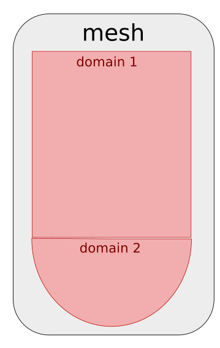
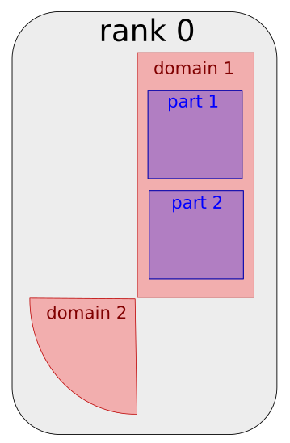
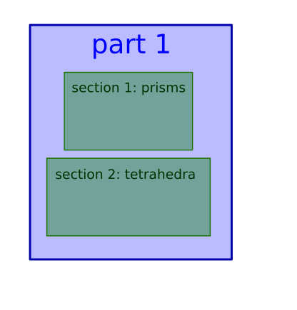

---
jupytext:
  text_representation:
    extension: '.md'
    format_name: myst
    format_version: '0.7'
    jupytext_version: 1.4.0+dev
kernelspec:
  display_name: Python 3
  language: python
  name: python3
---

+++ {"editable": false, "deletable": false}

# Exercise 1 : Mesh partitioning

+++ {"editable": false, "deletable": false}

It's time for some hands on experience with **ParaDiGM**!
Using the API referenced [here](https://numerics.gitlab-pages.onera.net/mesh/paradigm/dev_formation/user_manual/partitioning/multipart.html#python-api),
you will have to fill in the code cells to partition a mesh, i.e. to cut it in subdomains that will be mapped onto the processors of a parallel machine.
In the first section, we generate a block-distributed cube mesh for you. In the next section, you'll start running the partitioning algorithm.
After that, you will be able to retrieve the arrays describing the partitioned mesh.

+++ {"editable": false, "deletable": false}

## Load magic commands
We start by loading the custom magic commands for the proper functioning of the Notebook.

```{code-cell}
---
"editable": false
"deletable": false
---
import os, sys
module_path = os.path.abspath(os.path.join('../../utils'))
if module_path not in sys.path:
    sys.path.append(module_path)
```

```{code-cell}
---
"editable": false
"deletable": false
---
%reload_ext visu_magics
%reload_ext code_magics
```

+++ {"editable": false, "deletable": false}


## Generate the mesh

In this section, **ParaDiGM** tools are used to generate a simple mesh for this exercise: a cube made of tetrahedra.
You have **nothing to do here**. Still if you are curious about this feature, you can have a look [here](https://numerics.gitlab-pages.onera.net/mesh/paradigm/dev_formation/user_manual/simple_mesh_gen/dcube_nodal.html#python-api).

In your numerical simulation software you rarely generate a mesh.
This step actually generates a block-distributed mesh which is distributed in the same way as a mesh you would have **read in parallel**.

```{code-cell}
---
"editable": false
"deletable": false
---
%%code_block -p exercise_1 -i 1
#!/usr/bin/env python

import numpy as np
import mpi4py.MPI as MPI
import Pypdm.Pypdm as PDM

 # Initialize MPI environment
comm   = MPI.COMM_WORLD
n_rank = MPI.COMM_WORLD.size
i_rank = MPI.COMM_WORLD.rank

# Generate block-distributed cube mesh
n_x      = 10
n_y      = 10
n_z      = 10
lengthx  = 1.
xmin     = 0.
ymin     = 0.
zmin     = 0.
elt_type = PDM._PDM_MESH_NODAL_TETRA4
order    = 1
dcube = PDM.DCubeNodalGenerator(n_x,
                                n_y,
                                n_z,
                                lengthx,
                                xmin,
                                ymin,
                                zmin,
                                elt_type,
                                order,
                                comm)

dcube.compute()

dmn = dcube.get_dmesh_nodal()

PDM.generate_distribution(dmn)
```

Here you can see that the mesh were stored in a Dirstibuted-Nodal-Mesh structure (`dmn`).
This is an internal mesh structure to **ParaDiGM** not for user purpose.
Each feature is made such that you can set the mesh using basic arrays.

+++ {"editable": false, "deletable": false}

Now that we have our mesh, let's partition it !

## Mesh partitioning

For mesh partitioning, as for all other **ParaDiGM** features, there are 5 main steps:
1. **create** the feature object
2. **set** the data necessary to operate with that feature
3. **compute**, operate the algorithm of the feature
4. **get**, retrieve the output of the algorithm
5. **free** the memory allocated to operate the feature

Following this logic, let's start **creating** (step 1) the mesh partitioning object for **homogeneously** balanced subdomains.

*Remark : since this is a basic example, we ask you to stick with the fixed values for n_domain, n_part, i_domain, i_part and merge_domains.
To get insight about the concepts behind those values you can have a look [here](#Annex-1)*

**ParaDiGM**offers multiple partitioning methods.
Here, we chose to partition the cube with the **Hilbert method**.
This method is favored within the **ParaDiGM** algorithms since it provides quickly a good load balance, though it does not ensure the connectedness of each subdomain.
To ensure the partitions are connected, you should use either
`PARMETIS` or `PTSCOTCH` which call the external libraries ParMETIS and PT-Scotch.

*Remark : In this exercise we do not provide weights for the partitioning.*

```{code-cell}
---
"deletable": false
---
%%code_block -p exercise_1 -i 2

# Create partitioning object
n_domain = 1      # fixed
n_part = 1        # fixed
i_domain = 0      # fixed
i_part = 0        # fixed
merge_domains = 0 # fixed
part_method      = PDM.MultiPart.HILBERT
part_size_method = PDM.MultiPart.HOMOGENEOUS
part_fraction    = None # unused here since the subdomains are homogeneous
mpart = PDM.MultiPart(n_domain,                           # Number of domains
                      np.array([n_part]).astype(np.intc), # Number of partitions per domain
                      merge_domains,                      # Do not fuse domains
                      part_method,                        # Partitioning method
                      part_size_method,                   # Subdomains are homogeneously balanced
                      None,                               # Weight (in %) of each partition in heterogeneous case
                      comm)                               # MPI communicator

```

+++ {"editable": false, "deletable": false}

After mapping the partitioned subdomains on the processors, it is interesting to renumber the entities
of the mesh on each processor for performance through cache blocking but it also provides interesting properties for the application.
This is an **advanced setting we won't be using here**, so we just specify that no renumbering should be performed.
<!-- You can here call the renumbering function but by telling it not to do any renumbering for a start. -->

```{code-cell}
---
"deletable": false
---
%%code_block -p exercise_1 -i 3

renum_cell = bytes("PDM_PART_RENUM_CELL_NONE", 'ascii')
renum_face = bytes("PDM_PART_RENUM_FACE_NONE", 'ascii')
mpart.reordering_set(-1,         # All domains
                     renum_cell,
                     None,
                     renum_face)

```

+++ {"editable": false, "deletable": false}

Now that you have created a mesh partitioning object `mpart`, you can **set** (step 2) the cube mesh to it.
For simplicity of the exercise, we here set the mesh using the **Dirstibuted-Nodal-Mesh** structure (`dmn`).
This is a pratice internal to **ParaDiGM** algorithms. In your software you would just set the mesh using basic arrays.

```{code-cell}
---
"deletable": false
---
%%code_block -p exercise_1 -i 4

mpart.dmesh_nodal_set(i_domain, dmn)
```

+++ {"editable": false, "deletable": false}

At this point you have provided all the information necessary to run the mesh partitioning algorithm. You can call the function to
**compute** (step 3) the subdomains that make up the partitioned cube.

```{code-cell}
---
"deletable": false
---
%%code_block -p exercise_1 -i 5

mpart.compute()
```

+++ {"editable": false, "deletable": false}

## Get the partitioned mesh

You can now **get** (step 4) the output mesh of the partitioning algorithm. Depending on the numerical method, the mesh has to be
described in a different way. For Finite-Element methods a nodal connectivity ([option 1](#Nodal-connectivity-(i.e.-Finite-Element-style)))) usually
suffices while for Finite-Volume methods all descending connectivities ([option 2](#Descending-connectivity-(i.e.-Finite-Volume-style))) are of interest.
Choose which one suits you best and go further in the exercise to the associated section.

### Nodal connectivity (i.e. Finite-Element style)

You choose to get the partitioned mesh in nodal connectivity, i.e. cell->vertex connectivity.

*Remark : The object in **ParaDiGM** in which partitioned nodal meshes are stored is `part_mesh_nodal`.
Here we get this object from `mpart` to have a direct access to the arrays we are interested in. Partitionned nodal mesh
For more information about this structure, have a look [here](https://numerics.gitlab-pages.onera.net/mesh/paradigm/dev_formation/user_manual/partitioning/multipart.html#id11)*

Let's start with the **vertices** composing the subdomain. How many vertices are there? What are their global ids? What are their coordinates?

```{code-cell}
---
"deletable": false
---
%%code_block -p exercise_1 -i 6

# coords = mpart.vtx_coord_get(i_part,
#                              i_domain)
#
# pmn = mpart.part_mesh_nodal_get(i_domain)
# vtx_ln_to_gn = PDM.part_mesh_nodal_vtx_g_num_get(pmn, i_part)
# n_vtx        = len(vtx_ln_to_gn)

```

+++ {"editable": false, "deletable": false}

Let's move on to the **cells**. How are the vertices connected to form cells? What are their global ids? How many cells are there?

*Remark : since this is a basic example, we ask you to stick with the fixed value for i_section.
To get insight about the concept behind this value you can have a look [here](#Annex-1)*

```{code-cell}
---
"deletable": false
---
%%code_block -p exercise_1 -i 7

# i_section = 0 # fixed
# output = PDM.part_mesh_nodal_get_sections(pmn,
#                                           PDM._PDM_GEOMETRY_KIND_VOLUMIC,
#                                           i_part)
# elt_vtx      = output[i_section]["np_connec"]
# elt_ln_to_gn = output[i_section]["np_numabs"]
# n_elt        = len(elt_ln_to_gn)

```

+++ {"editable": false, "deletable": false}

Now we write the mesh that we just got to be able to visualize it later on **(nothing to do)**.

```{code-cell}
---
"deletable": false
---
%%code_block -p exercise_1 -i 8

# PDM.writer_wrapper(comm,
#                    "visu",
#                    "pmesh",
#                    [coords],
#                    [vtx_ln_to_gn],
#                    [None],
#                    [elt_vtx],
#                    [elt_ln_to_gn],
#                    PDM._PDM_WRITER_TETRA4)

```

+++ {"editable": false, "deletable": false}

### Descending connectivity (i.e. Finite-Volume style)

You choose to get the partitioned mesh in descending connectivity, i.e. **cell->face**, **face->vtx** connectivities.
Generic getters have been implemented in **ParaDiGM** for the connectivities and global identifier arrays.
Enumerators allow to specify which data is requested (see details in [documentation](https://numerics.gitlab-pages.onera.net/mesh/paradigm/dev_formation/user_manual/partitioning/index.html#enumerators)). Here you will need for the mesh connectivity:
- **\_PDM_CONNECTIVITY_TYPE_CELL_FACE** : cell->face connectivity
- **\_PDM_CONNECTIVITY_TYPE_FACE_VTX**  : face->vertex connectivity
For the global identifier arrays you will use:
- **\_PDM_MESH_ENTITY_CELL**  : cell entity
- **\_PDM_MESH_ENTITY_FACE**  : face entity
- **\_PDM_MESH_ENTITY_VTX**  : vertex entity

Let's start from the top with **cell** data. How many cells are there? What are their global ids? Which faces compose the cells?

```{code-cell}
---
"deletable": false
---
%%code_block -p exercise_1 -i 9

cell_ln_to_gn = mpart.ln_to_gn_get(i_domain,
                                   i_part,
                                   PDM._PDM_MESH_ENTITY_CELL)
n_cell = len(cell_ln_to_gn)

cell_face_idx, cell_face = mpart.connectivity_get(i_domain,
                                                  i_part,
                                                  PDM._PDM_CONNECTIVITY_TYPE_CELL_FACE)

```

+++ {"editable": false, "deletable": false}

For the **faces** we proceed in a similar way. How many faces are there? What are their global ids? Which vertices compose the faces?

```{code-cell}
---
"deletable": false
---
%%code_block -p exercise_1 -i 10

face_ln_to_gn = mpart.ln_to_gn_get(i_domain,
                                   i_part,
                                   PDM._PDM_MESH_ENTITY_FACE)
n_face = len(face_ln_to_gn)

face_vtx_idx, face_vtx = mpart.connectivity_get(i_domain,
                                                i_part,
                                                PDM._PDM_CONNECTIVITY_TYPE_FACE_VTX)

```

+++ {"editable": false, "deletable": false}

To finish with, we need to have the description of the **vertices**.

```{code-cell}
---
"deletable": false
---
%%code_block -p exercise_1 -i 12

vtx_ln_to_gn = mpart.ln_to_gn_get(i_domain,
                                  i_part,
                                  PDM._PDM_MESH_ENTITY_VTX)
n_vtx = len(vtx_ln_to_gn)

coords = mpart.vtx_coord_get(i_domain,
                             i_part)

```

+++ {"editable": false, "deletable": false}

Now we write the mesh that we just got to be able to visualize it later on **(nothing to do)**.

```{code-cell}
---
"deletable": false
---
%%code_block -p exercise_1 -i 13

PDM.writer_wrapper(comm,
                   "visu",
                   "pmesh",
                   [coords],
                   [vtx_ln_to_gn],
                   [face_vtx_idx],
                   [face_vtx],
                   [cell_ln_to_gn],
                   -1,
                   [cell_face_idx],
                   [cell_face])

```

+++ {"editable": false, "deletable": false}

## Execution and visualization

Run the following cells to execute the program you just wrote and visualize the output partitioned mesh.

```{code-cell}
---
"deletable": false
---
%merge_code_blocks -l python -p exercise_1 -n 2 -v
```

```{code-cell}
---
"deletable": false
---
%%visualize
visu/PMESH.case : i_part
```

+++ {"editable": false, "deletable": false}

## Bonus : Extended partition

If you are reading this, you finished quickly the partitioning exercise. Thus, it means you understood well the **5 step scheme** for using **ParaDiGM** features.

*Remark : To do this bonus you need to have retrieved the mesh in descending connectivity. If you haven't done that yet, please comment your
work on nodal connectivities and get the mesh in descending connectivity first.*

In this bonus, we want to get one layer of extended cells by nodes for our mesh partitions.
This bonus is not guided, so you should have a close look at the [documentation](https://numerics.gitlab-pages.onera.net/mesh/paradigm/dev_formation/user_manual/partitioning/part_extension.html#python-api).

### Step 1

```{code-cell}
---
"deletable": false
---
%%code_block -p exercise_1 -i 14

extend_type = PDM.PartExtension.VTX
depth       = 1
part_ext = PDM.PartExtension(n_domain,
                             np.array([n_part]).astype(np.intc),
                             extend_type,
                             depth,
                             comm)
```

+++ {"editable": false, "deletable": false}

### Step 2

```{code-cell}
---
"deletable": false
---
%%code_block -p exercise_1 -i 15

output = mpart.graph_comm_get(i_domain,
                              i_part,
                              PDM._PDM_MESH_ENTITY_VTX)

vtx_part_bound_proc_idx = output["np_entity_part_bound_proc_idx"]
vtx_part_bound_part_idx = output["np_entity_part_bound_part_idx"]
vtx_part_bound          = output["np_entity_part_bound"]

part_ext.connectivity_set(i_domain,
                          i_part,
                          PDM._PDM_CONNECTIVITY_TYPE_CELL_FACE,
                          cell_face_idx,
                          cell_face)

part_ext.connectivity_set(i_domain,
                          i_part,
                          PDM._PDM_CONNECTIVITY_TYPE_FACE_VTX,
                          face_vtx_idx,
                          face_vtx)

part_ext.vtx_coord_set(i_domain,
                       i_part,
                       coords)

part_ext.ln_to_gn_set(i_domain,
                      i_part,
                      PDM._PDM_MESH_ENTITY_CELL,
                      cell_ln_to_gn)

part_ext.ln_to_gn_set(i_domain,
                      i_part,
                      PDM._PDM_MESH_ENTITY_FACE,
                      face_ln_to_gn)

part_ext.ln_to_gn_set(i_domain,
                      i_part,
                      PDM._PDM_MESH_ENTITY_VTX,
                      vtx_ln_to_gn)

part_ext.part_bound_graph_set(i_domain,
                              i_part,
                              PDM._PDM_MESH_ENTITY_VTX,
                              vtx_part_bound_proc_idx,
                              vtx_part_bound_part_idx,
                              vtx_part_bound)

```

+++ {"editable": false, "deletable": false}

### Step 3

```{code-cell}
---
"deletable": false
---
%%code_block -p exercise_1 -i 16

part_ext.compute()
```

+++ {"editable": false, "deletable": false}

### Step 4

```{code-cell}
---
"deletable": false
---
%%code_block -p exercise_1 -i 17

# Cell
cell_ext_ln_to_gn = part_ext.ln_to_gn_get(i_domain,
                                          i_part,
                                          PDM._PDM_MESH_ENTITY_CELL)

cell_face_ext_idx, cell_face_ext = part_ext.connectivity_get(i_domain,
                                                             i_part,
                                                             PDM._PDM_CONNECTIVITY_TYPE_CELL_FACE)

# Face
face_ext_ln_to_gn = part_ext.ln_to_gn_get(i_domain,
                                          i_part,
                                          PDM._PDM_MESH_ENTITY_FACE)

face_vtx_ext_idx, face_vtx_ext = part_ext.connectivity_get(i_domain,
                                                           i_part,
                                                           PDM._PDM_CONNECTIVITY_TYPE_FACE_VTX)

# Vertices
vtx_ext_ln_to_gn = part_ext.ln_to_gn_get(i_domain,
                                         i_part,
                                         PDM._PDM_MESH_ENTITY_VTX)

vtx_coord_ext = part_ext.vtx_coord_get(i_domain,
                                       i_part)
```

```{code-cell}
---
"deletable": false
---
%%code_block -p exercise_1 -i 18

n_cell_ext = len(cell_ext_ln_to_gn)
n_face_ext = len(face_ext_ln_to_gn)
n_vtx_ext  = len(vtx_ext_ln_to_gn)

total_n_cell = n_cell + n_cell_ext
total_n_face = n_face + n_face_ext
total_n_vtx  = n_vtx  + n_vtx_ext

# Cell
total_cell_ln_to_gn = np.concatenate((cell_ln_to_gn, cell_ext_ln_to_gn), axis=0, dtype=PDM.npy_pdm_gnum_dtype)

total_cell_face_idx = np.zeros(total_n_cell + 1, dtype=np.intc)
for i in range(n_cell + 1):
  total_cell_face_idx[i] = cell_face_idx[i]
for i in range(n_cell_ext + 1):
  total_cell_face_idx[n_cell + i] = cell_face_idx[n_cell] + cell_face_ext_idx[i]

total_cell_face = np.concatenate((cell_face, cell_face_ext), axis=0, dtype=np.intc)

# Face
total_face_ln_to_gn = np.concatenate((face_ln_to_gn, face_ext_ln_to_gn), axis=0, dtype=PDM.npy_pdm_gnum_dtype)

total_face_vtx_idx = np.zeros(total_n_face + 1, dtype=np.intc)
for i in range(n_face + 1):
  total_face_vtx_idx[i] = face_vtx_idx[i]
for i in range(n_face_ext + 1):
  total_face_vtx_idx[n_face + i] = face_vtx_idx[n_face] + face_vtx_ext_idx[i]

total_face_vtx = np.concatenate((face_vtx, face_vtx_ext), axis=0, dtype=np.intc)

# Vertices

total_vtx_ln_to_gn = np.concatenate((vtx_ln_to_gn, vtx_ext_ln_to_gn), axis=0, dtype=PDM.npy_pdm_gnum_dtype)

total_coords = np.concatenate((coords, vtx_coord_ext), axis=0, dtype=np.double)


total_cell_color = np.empty(total_n_cell, dtype=int)
total_cell_color[:n_cell] = 2*i_rank
total_cell_color[n_cell:] = 2*i_rank+1

elt_fields={"extension": [total_cell_color]}

PDM.writer_wrapper(comm,
                   "visu",
                   "pext",
                   [total_coords],
                   [total_vtx_ln_to_gn],
                   [total_face_vtx_idx],
                   [total_face_vtx],
                   [total_cell_ln_to_gn],
                   -1, # cell_t
                   [total_cell_face_idx],
                   [total_cell_face],
                   elt_fields=elt_fields)

if i_rank == 0:
  print("The end :)")
```

+++ {"editable": false, "deletable": false}

### Step 5

Well, you have nothing to do for step 5 since it is implicit in Python.

## Execution and visualization

Run the following cells to execute the program you just wrote and visualize the mesh partition extension.

```{code-cell}
---
"deletable": false
---
%merge_code_blocks -l python -p exercise_1 -n 2 -v
```

```{code-cell}
---
"deletable": false
---
%%visualize
visu/PEXT.case : extension
```

+++ {"editable": false, "deletable": false}

## Annex 1

In some cases, the mesh is an assembly of several sub-meshes. These are called *domains*.
In the figure bellow, we can see a mesh made of two domains.



Each *domain* is partitioned in subdomains which
are mapped to the processors of the parallel machine. On a processor the subdomain (of a mesh or a domain) can be subdivided in *parts*.
This figure shows rank 0 for the above mesh which has a subdomain of each domain with two parts for the subdomain of domain 1.



A mesh can be composed of several element types (tetrahedra, hexahedra, prisms...). In certain settings, the mesh definition for each specific element type
is stored in a separate *section*. So in a *section* one will find data for a specific element type.
Here we can see part 1 of the subdomain on rank 0 of domain 1 which has two sections.




# Exercise 2

You can now move on to [Exercise 2](./../03_Exercise_2/exercise_2.ipynb).
