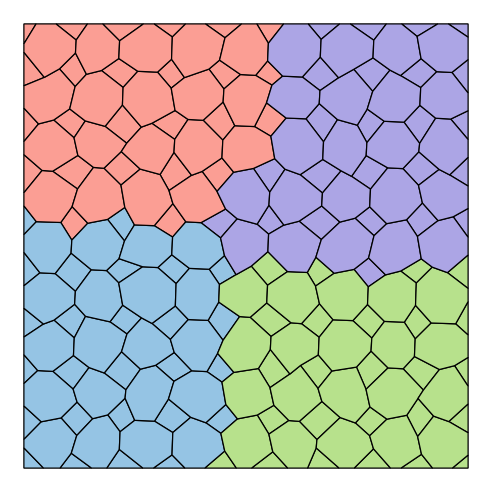
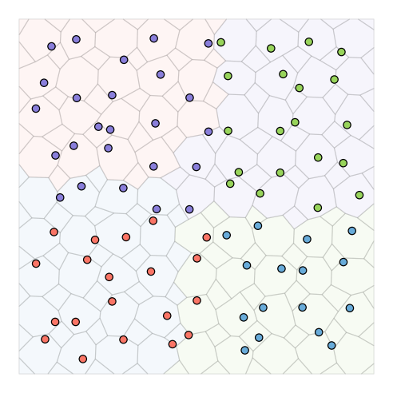
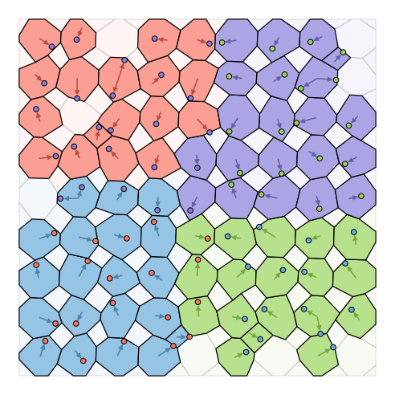
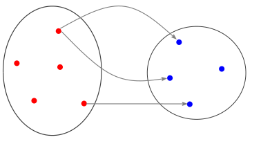

---
jupytext:
  text_representation:
    extension: '.md'
    format_name: myst
    format_version: '0.7'
    jupytext_version: 1.4.0+dev
kernelspec:
  display_name: Python 3
  language: python
  name: python3
---

+++ {"editable": false, "deletable": false}

# Exercise 2 : Localization of a point cloud inside a mesh

+++ {"editable": false, "deletable": false}

In this second exercise we will focus on the **Mesh Location** feature.
It consists in computing the location of one or more partitioned point clouds (referred to as the *targets*) inside a partitioned mesh (referred to as the *source*).

A mapping between the source mesh elements and the target points they contain is computed, which consists in
  - geometric data (distances, barycentric and parametric coordinates, ...) ;
  - an MPI communication graph as the associated entities are, in general, distributed on different processes.

This mapping is typically used for interpolating data from the source mesh to the point clouds in applications such as the coupling between non-matching grids.


The aim of this exercise is to perform such an interpolation.
The exercise is structured in two parts:
1. Compute the location
2. Perform the interpolation

Your task is to fill in the empty code cells using the API referenced [here](https://numerics.gitlab-pages.onera.net/mesh/paradigm/dev_formation/user_manual/prepro_algo/mesh_location.html#python-api).

*Note: For easier visualization, we will study a two-dimensional case but the feature is also available in three dimensions.*

+++ {"editable": false, "deletable": false}

## Load magic commands
As usual we start by loading the custom magic commands.

```{code-cell} ipython3
---
"editable": false
"deletable": false
---
import os, sys
module_path = os.path.abspath(os.path.join('../../utils'))
if module_path not in sys.path:
    sys.path.append(module_path)
```

```{code-cell}
---
"editable": false
"deletable": false
---
%reload_ext visu_magics
%reload_ext code_magics
```


+++ {"editable": false, "deletable": false}

## Load the required Python modules

To begin, we import the required modules (**mpi4py**, **numpy** and **Pypdm**).

```{code-cell}
---
"editable": false
"deletable": false
---
%%code_block -p exercise_2 -i 1

# Load modules
import mpi4py.MPI as MPI
import numpy as np
import Pypdm.Pypdm as PDM

comm = MPI.COMM_WORLD

```

+++ {"editable": false, "deletable": false}

## 1. Localization


### Generate a partitioned "source" mesh

We start by generating the partitioned source mesh.

By now you should be capable of partitioning a mesh using **ParaDiGM** (if not, you should definitely take a look at [**Exercise 1**](../02_Exercise_1/exercise_1.ipynb)).
To gain some time, let's use the [*generate_mesh*](https://numerics.gitlab-pages.onera.net/mesh/paradigm/dev_formation/user_manual/simple_mesh_gen/generate_mesh.html#python-api) service to generate a partitioned mesh in a single function call.

Here we generate a square mesh composed of polygonal elements that looks like this (here partitioned on 4 processes, each one represented by a distinct color):



*Nothing to do here, you can move on. Just don't forget to run the cell!*

```{code-cell}
---
"deletable": false
---
%%code_block -p exercise_2 -i 2

# Generate partitioned source mesh
src_n_vtx_seg = 10  # number of vertices along each side of the square
src_n_part    = 1   # number of partitions per MPI rank
src_random    = 0.8 # randomization factor

src_mesh = PDM.generate_mesh_rectangle_ngon(comm          = comm,
                                            elt_type      = PDM._PDM_MESH_NODAL_POLY_2D,
                                            xmin          = 0.,
                                            ymin          = 0.,
                                            zmin          = 0.,
                                            lengthx       = 1.,
                                            lengthy       = 1.,
                                            n_x           = src_n_vtx_seg,
                                            n_y           = src_n_vtx_seg,
                                            n_part        = src_n_part,
                                            part_method   = PDM._PDM_SPLIT_DUAL_WITH_PARMETIS,
                                            random_factor = src_random)

src_n_vtx         = src_mesh["pn_vtx"]
src_n_face        = src_mesh["pn_face"]
src_vtx_coord     = src_mesh["pvtx_coord"]
src_face_vtx_idx  = src_mesh["pface_edge_idx"]
src_face_vtx      = src_mesh["pface_vtx"]
src_face_edge     = src_mesh["pface_edge"]
src_edge_vtx      = src_mesh["pedge_vtx"]
src_vtx_ln_to_gn  = src_mesh["pvtx_ln_to_gn"]
src_face_ln_to_gn = src_mesh["pface_ln_to_gn"]

```


+++ {"editable": false, "deletable": false}

### Generate a partitioned "target" mesh

We then generate a second partitioned mesh.
We will use its vertices as a target point cloud.
This second mesh is deliberately offset so that some target points lie outside the source mesh.
These points may not be located.
We will see later how to deal with these *unlocated* points.

The partitioned cloud typically looks like this:



Note that we use a different partitioning method for the two meshes so that the source and target partitions do not match.

*Nothing to do here either. However, once you've successfully completed the localization procedure, feel free to play with the parameters of the two meshes.*

```{code-cell}
---
"deletable": false
---
%%code_block -p exercise_2 -i 3

# Generate partitioned target mesh
tgt_n_vtx_seg = 10   # number of vertices along each side of the square
tgt_n_part    = 1    # number of partitions per MPI rank
tgt_xmin      = 0.25 # x-offset
tgt_ymin      = 0.25 # y-offset
tgt_random    = 0.0  # randomization factor

tgt_mesh = PDM.generate_mesh_rectangle_ngon(comm          = comm,
                                            elt_type      = PDM._PDM_MESH_NODAL_QUAD4,
                                            xmin          = tgt_xmin,
                                            ymin          = tgt_ymin,
                                            zmin          = 0.,
                                            lengthx       = 1.,
                                            lengthy       = 1.,
                                            n_x           = tgt_n_vtx_seg,
                                            n_y           = tgt_n_vtx_seg,
                                            n_part        = tgt_n_part,
                                            part_method   = PDM._PDM_SPLIT_DUAL_WITH_HILBERT,
                                            random_factor = tgt_random)

tgt_n_vtx         = tgt_mesh["pn_vtx"]
tgt_n_face        = tgt_mesh["pn_face"]
tgt_vtx_coord     = tgt_mesh["pvtx_coord"]
tgt_face_vtx_idx  = tgt_mesh["pface_edge_idx"]
tgt_face_vtx      = tgt_mesh["pface_vtx"]
tgt_face_edge     = tgt_mesh["pface_edge"]
tgt_edge_vtx      = tgt_mesh["pedge_vtx"]
tgt_vtx_ln_to_gn  = tgt_mesh["pvtx_ln_to_gn"]
tgt_face_ln_to_gn = tgt_mesh["pface_ln_to_gn"]

```

+++ {"editable": false, "deletable": false}

### Create the `MeshLocation` object

Now that we have all the required inputs, let's create an instance of the `MeshLocation` class.

```{code-cell}
---
"deletable": false
---
%%code_block -p exercise_2 -i 4

# Create the MeshLocation object
# mesh_loc = ...

```


+++ {"editable": false, "deletable": false}

### Set the target point cloud

`MeshLocation` offers the possibility to provide several target point clouds.
That means that you need to loop over the target points clouds to provide each one of them to the `MeshLocation` object.
Since we handle only one target point cloud here, we didn't write a loop.
We just use the 0 value to tell that we store this target point cloud at position 0 of the target point cloud array inside **ParaDiGM**.
Recall that there can be more than one partition per MPI rank.

```{code-cell}
---
"deletable": false
---
%%code_block -p exercise_2 -i 5

# Set the target point cloud
#...

```

+++ {"editable": false, "deletable": false}

### Set the source mesh

Now let's provide the source mesh to the `MeshLocation` object.

Here you have essentially two options:
- you can either define the mesh with "nodal" connectivity (i.e. Finite-Element style)
- or with "descending" connectivity (i.e. Finite-Volume style)

Choose the one that suits you best, and again, recall that there can be more than one partition per MPI rank.

##### **<span style="color:darkorange;">Note</span>**
*<span style="color:darkorange;">
The number of edges in a 2D mesh element (a face) is equal to the number of vertices. This means that `face_edge_idx == face_vtx_idx`.
</span>*

```{code-cell}
---
"deletable": false
---
%%code_block -p exercise_2 -i 6

# Set the source mesh
#...

```


+++ {"editable": false, "deletable": false}

### Compute the localization

Now that everything is ready, we can compute the localization.
Once the calculation is complete, we can display the elapsed and CPU times.

```{code-cell}
---
"deletable": false
---
%%code_block -p exercise_2 -i 8

# Compute location
#...

# Dump elapsed and CPU times
# mesh_loc.dump_times()

```

+++ {"editable": false, "deletable": false}

## 2. Interpolation

Now that the localization has been computed, the mesh location object stores the mapping between the source mesh elements and the target points.
This mapping consists in:
- a set of geometric data sufficient for $P1$ interpolation of node-based fields ;
- an MPI communication graph to exchange data between the mapped entities.

The figure below illustrates the mapping between source and targets.
It is clear that MPI communication are necessary to transfer data between the two as the mapped entities are in general not hosted by the same process.




In the second part of this exercise you will have to use these two pieces of information to:
1. exchange the global ids of the source elements to the corresponding target points: this way each *located* point is supposed to receive the global id of the element it is contained in ;
2. interpolate (and exchange) a node-based field: we choose a linear field such as the Cartesian coordinate *x* so we can easily check everything went right.


+++ {"editable": false, "deletable": false}

### Retrieve the `PartToPart` instance

The communication graph is embodied in the form of a [`PartToPart`](https://numerics.gitlab-pages.onera.net/mesh/paradigm/dev_formation/user_manual/comm_graph/ptp.html#python-api) instance.

The Part-to-part feature was designed as a generic means of exchanging data between two arbitrarily partitioned sets of entities.
The Part-to-part object is thus built by specifying the partitions of both sets, as well as the graph of the links between elements of set 1 (*Part1*) to set 2 (*Part2*).



On the figure above the first set is represented in red and the second set in blue.
The graph between *Part1* and *Part2* is symbolized by the gray arrows.

In this case, *Part1* represents the source mesh and *Part2* the target point cloud.

The `PartToPart` instance was built during the localization computation and can be accessed from the `MeshLocation` object.

```{code-cell}
---
"deletable": false
---
%%code_block -p exercise_2 -i 9

# Get PartToPart object
# ptp = ...

```


+++ {"editable": false, "deletable": false}

Part-to-part is able to perform non-blocking exchanges so here's how we're going to proceed:
1. initiate the first exchange: each source element sends its global id to all the target points it contains ;
2. overlap this communication by the computation of the interpolated *x* on the source side ;
3. initiate the second exchange ;
4. finalize both exchanges.

### First exchange

Here you need to initiate the exchange of global ids from the source mesh elements to the target points.

##### **<span style="color:olivedrab;">Analogy</span>**
*<span style="color:olivedrab;">
Marie is part of the Dupont family. She is going to meet members of the Perez family. She already knows some of them.
Marie is going to provide her name to the members of the Perez family she doesn't know.
In a sense, we can link Marie with the members of the Perez family she doesn't know. Then communicate to them the same information,
which is her name. This is exactly a Part-to-part exchange with the mode `_PDM_PART_TO_PART_DATA_DEF_ORDER_PART1`.
In our mesh location exercise, who is the Dupont family who will provide their name and who is the Perez family?
</span>*

As each MPI ranks hosts source *and* target partitions, we will use the **iexch** function which allows for transparent, bilateral data exchange.

<!-- +++ {"jupyter": {"source_hidden": true}, "editable": false, "deletable": false}

Hints:
  - each cell sends a **single** value (its **global id**)
  - the **same** value is sent to each corresponding target -->

```{code-cell}
---
"deletable": false
---
%%code_block -p exercise_2 -i 10

# Initiate exchange of first field
# request1 = ptp.iexch(PDM._PDM_MPI_COMM_KIND_P2P,
#                      PDM._PDM_PART_TO_PART_DATA_DEF_ORDER_PART1,
#                      ?,
#                      part1_stride=1)

```


+++ {"editable": false, "deletable": false}

### Interpolate the second field

Here you need to interpolate the node-based field from the source mesh onto the target points.
That means for each target point computing the weighted average of the field on the vertices of the element it is located in.
The resulting interpolated field must be partitioned the same way as the input target point cloud.


<br>
Let $f$ denote the field of interest, $T$ a target point and $S$ the source element containing $T$.
Then the interpolated field at $T$ reads
$$f(T) = \sum_i w_i f(v_i),$$
where $\left\{ v_i \right\}$ is the set of vertices of $S$ and $\left\{ w_i \right\}$ the interpolation weights.

<br>

The figure on the right depicts a source element $S$ with eight vertices and containing two target points.
The iso-contours of the field continuously interpolated inside $S$ from the values at its vertices are shown in color.

*How are we going to proceed to achieve this interpolation in practice?*

The interpolated values at $T_1$ and $T_2$ are different, so we need to proceed in a way different from the first exchange.

You can either:
1. interpolate the values on the source side (*Part1*), and then send to each target point its interpolated field value ;
2. send to each target point the field values at the vertices of the source element along with the corresponding weights, and then perform the interpolation on the target side (*Part2*).

*Which is the better option?*

You will implement the first option as it involves fewer data transfers.

*What data do you have access to?*

You are on the side of *Part1* (source mesh).
You have access to:
  - the field values at each vertex of the source mesh ;
  - the face$\to$vtx connectivity, i.e. the list of vertices composing each element ;
  - the list of target points located inside each source element ;
  - the set of interpolation weights associated to each target point located in the source mesh.

*Knowing this, how will you set up the loops in your code to compute the interpolation?*

```{code-cell}
---
"deletable": false
---
%%code_block -p exercise_2 -i 11

# Interpolate second field
src_vtx_field2 = []
for i_part in range(src_n_part):
  src_vtx_field2.append(np.array(src_vtx_coord[i_part][::3]))

src_send_field2 = []
# for i_part in range(src_n_part):
#   src_result = mesh_loc.points_in_elt_get(0, i_part)
#   src_to_tgt_idx = src_result["elt_pts_inside_idx"]
#   n_pts = src_to_tgt_idx[src_n_face[i_part]]
#
#   src_connect = mesh_loc.cell_vertex_get(i_part)
#   src_cell_vtx_idx = src_connect["cell_vtx_idx"]
#   src_cell_vtx     = src_connect["cell_vtx"]
#
#   weights_idx = src_result["points_weights_idx"]
#   weights     = src_result["points_weights"]
#
#   field2 = np.zeros(n_pts, dtype=np.double)
#   for i_elt in range(src_n_face[i_part]):
#     for i_pt in range(src_to_tgt_idx[i_elt], src_to_tgt_idx[i_elt+1]):
#       field2[i_pt] = 0
#
#       elt_n_vtx = src_cell_vtx_idx[i_elt+1] - src_cell_vtx_idx[i_elt]
#       assert(weights_idx[i_pt+1] - weights_idx[i_pt] == elt_n_vtx)
#       for i_vtx in range(elt_n_vtx):
#         vtx_id = src_cell_vtx[src_cell_vtx_idx[i_elt] + i_vtx] - 1
#         field2[i_pt] += weights[weights_idx[i_pt] + i_vtx] * src_vtx_field2[i_part][vtx_id]
#
#   src_send_field2.append(field2)

```


+++ {"editable": false, "deletable": false}

### Exchange the second interpolated field

Now that you've done the interpolation, it is time to send the interpolated field to the target points.

##### **<span style="color:olivedrab;">Analogy</span>**
*<span style="color:olivedrab;">
Marie met the grandparents of the Perez family : Marta & Luis and Julio & Paula. She wants to send them a Christmas postcard.
She chose a card with a Christmas tree for Marta & Luis and a card with Santa for Julio & Paula.
In a sense, we can link Marie to Marta & Luis and Julio & Paula. This time she won't provide the same information to both of them.
This is exactly a Part-to-part exchange with the mode `_PDM_PART_TO_PART_DATA_DEF_ORDER_PART1_TO_PART2`.
What does the postcard represent in our location exercise?
</span>*

You can now initiate the exchange of the interpolated field you just computed.

```{code-cell}
---
"deletable": false
---
%%code_block -p exercise_2 -i 12

# Initiate exchange of second field
# request2 = ptp.iexch(PDM._PDM_MPI_COMM_KIND_P2P,
#                      PDM._PDM_PART_TO_PART_DATA_DEF_ORDER_PART1_TO_PART2,
#                      ?,
#                      part1_stride=1)

```

+++ {"editable": false, "deletable": false}

### Check the interpolated field received on the target side

Finally, we can finalize both exchanges, check and visualize the received fields on the target side.

#### *Watch out for unlocated points!*
Notice that you only received information relative to the *located* points.
You must therefore use the appropriate indirection to correctly read the received arrays.

```{code-cell}
---
"deletable": false
---
%%code_block -p exercise_2 -i 13

# Finalize both exchanges
# _, tgt_recv_field1 = ?
# _, tgt_recv_field2 = ?


# Check received fields
pis_located = []
ptgt_field1 = []
ptgt_field2 = []
for i_part in range(tgt_n_part):
  # located_tgt   = ?
  # unlocated_tgt = ?

  is_located = np.empty(tgt_n_vtx[i_part], dtype=bool)
  tgt_field1 = np.empty(tgt_n_vtx[i_part], dtype=np.double)
  tgt_field2 = np.empty(tgt_n_vtx[i_part], dtype=np.double)

  # For unlocated points, set 'is_located' to False, 'tgt_field1' and 'tgt_field2' to -1
  #...

  # For unlocated points, set 'is_located' to True, 'tgt_field1' and 'tgt_field2' to the appropriate received values
  #...

  pis_located.append(is_located)
  ptgt_field1.append(tgt_field1)
  ptgt_field2.append(tgt_field2)

```


+++ {"editable": false, "deletable": false}

*Write output files for visualization, nothing to do here.*

```{code-cell}
---
"deletable": false
---
%%code_block -p exercise_2 -i 14
# Export for visualization, nothing to do here
PDM.writer_wrapper(comm,
                   "visu",
                   "src_mesh",
                   src_vtx_coord,
                   src_vtx_ln_to_gn,
                   src_face_vtx_idx,
                   src_face_vtx,
                   src_face_ln_to_gn,
                   elt_fields={
                   "field1" : src_face_ln_to_gn
                   },
                   vtx_fields={
                   "field2" : src_vtx_field2})

PDM.writer_wrapper(comm,
                   "visu",
                   "tgt_mesh",
                   tgt_vtx_coord,
                   tgt_vtx_ln_to_gn,
                   tgt_face_vtx_idx,
                   tgt_face_vtx,
                   tgt_face_ln_to_gn,
                   vtx_fields={
                   "is_located" : pis_located,
                   "field1"     : ptgt_field1,
                   "field2"     : ptgt_field2})

```

+++ {"editable": false, "deletable": false}

### Finalize

Congratulations! You've made it to the end of the exercise :)

```{code-cell}
---
"deletable": false
---
%%code_block -p exercise_2 -i 15

if comm.rank == 0:
  print("The End :D")

MPI.Finalize()

```

+++ {"editable": false, "deletable": false}

## Run

Moment of truth!

```{code-cell}
---
"deletable": false
---
%merge_code_blocks -l python -p exercise_2 -n 2
```

+++ {"editable": false, "deletable": false}

## Visualize the results

```{code-cell}
---
"deletable": false
---
%%visualize -nl -sv
visu/SRC_MESH.case
visu/TGT_MESH.case : is_located : points
```

+++ {"editable": false, "deletable": false}

# Bonus: optional parameters

The location algorithm uses a preconditioning stage which consists in associating candidate elements and points before computed the exact location.
Three preconditioning methods are available:
- `OCTREE`
- `DBBTREE`
- `LOCATE_ALL_TGT`

The first two methods use bounding boxes and distributed tree data structures to find the candidate pairs efficiently.
Theses boxes can be expanded using a **relative geometric tolerance** allowing for safer candidate detection.
The third method uses a combination of both trees to ensure all target points are "located", i.e. associated to the nearest source element.

By default, the `OCTREE` method is used, with a relative tolerance equal to zero.

Increasing the tolerance values allows to locate more points, at the expense of the CPU cost.


The next cell runs an interactive widget that allows you to play with these two options and see how they can affect the localization status of some points.

```{code-cell}
---
"deletable": false
---
%reload_ext figure_magics
%localization
```

Now you can call the appropriate functions to tweak these options, and re-run your code.
(Note that this piece of code is placed *before* the call to **compute**.)


```{code-cell}
---
"deletable": false
---
%%code_block -p exercise_2 -i 7

# Set the location preconditioning method (optional)
#...

# Set the geometric tolerance (optional)
#...

```


## Run the code

```{code-cell}
---
"deletable": false
---
%merge_code_blocks -l python -p exercise_2 -n 2
```

+++ {"editable": false, "deletable": false}

## Visualize the results

```{code-cell}
---
"deletable": false
---
%%visualize -nl -sv
visu/SRC_MESH.case
visu/TGT_MESH.case : is_located : points
```
