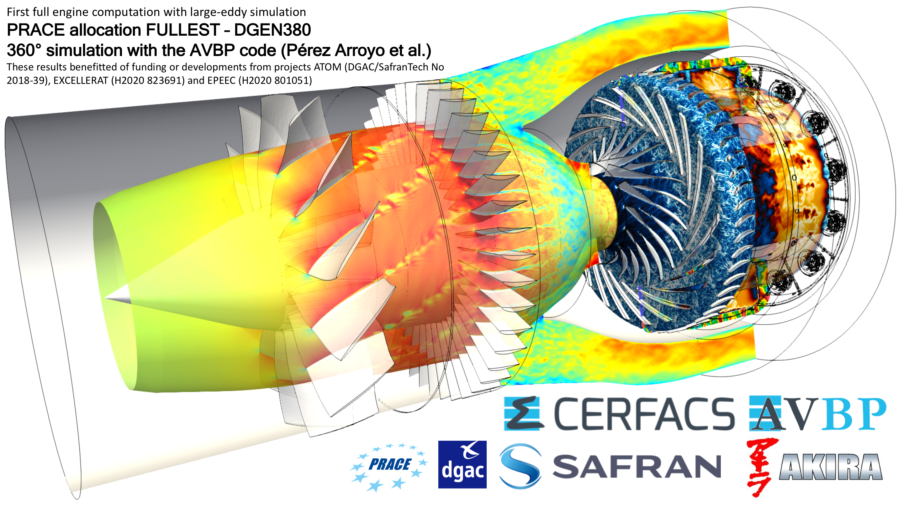
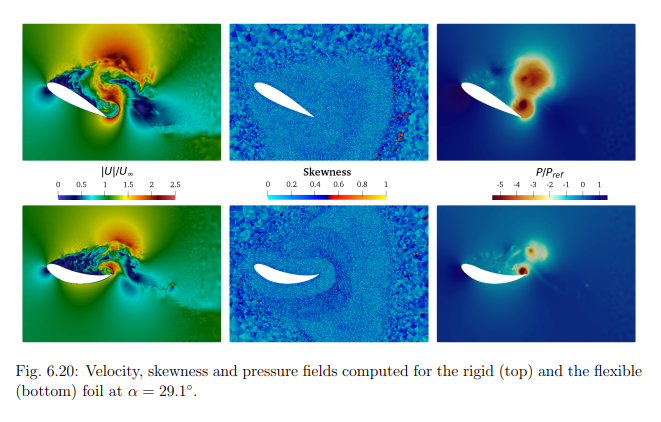
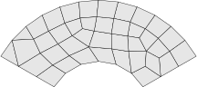
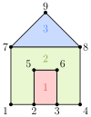
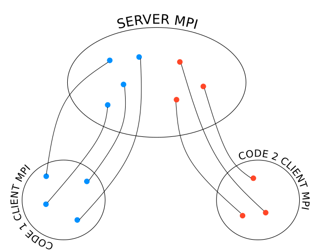

---
jupytext:
  text_representation:
    extension: '.md'
    format_name: myst
    format_version: '0.7'
    jupytext_version: 1.4.0+dev
kernelspec:
  display_name: Python 3
  language: python
  name: python3
---

# Introduction

Welcome to the **CWIPI** library introductory day !

The aim of the day is to give you : 
  - An overview of **CWIPI** 1.0 functionalities
  - An understanding on how **CWIPI** can be called to couple solvers written in C/C++, Fortran or Python.

This is an interactive course, so don't hesitate to interrupt us to ask your questions.

The training will take place in three stages:
  - General presentation of **CWIPI**
  - Exercise 0 : getting started with Jupyter Notebooks
  - Exercise 1 : a basic coupling
  - Exercise 2 : an extension on time step management with a deforming mesh

# What is **CWIPI**?

**CWIPI** is an open-source library for coupling scientific codes in a massively parallel distributed environment.

## Why coupling codes?

Coupling scientific codes allows to achieve complex, multi-physics, multi-components simulations in a modular fashion.

## What are the implications?

In order to couple multiple codes, we need to be able to
 - manage the execution of the coupled codes ;
 - manage the transfer of information between these codes.

## Objectives

Most scientific codes target large-scale simulations, therefore the coupling tool must be **efficient** and suited to massively parallel computing in order not to degrade performance.
To enable increasingly complex multi-components simulations, the coupling tool must be **easy to use**.
To accommodate the wide variety of numerical methods used in the different scientific domains, the coupling tool must finally be **flexible** and **generic**.

<!-- Portability: standard techniques for developments, -->

## Motivations and design philosophy

The demand for multi-physics studies has increased over the years, as a result of the sharp increase in computing resources, which now make it possible to study several physical phenomena simultaneously.
The monolithic approach is discarded since it becomes unmanageable when handling a variety of physics with different characteristic times.
Handling multi-physics by coupling specialized solver is the answer.
To facilitate the coupling of codes with different data structures and software architectures, the development philosophy of **CWIPI** is to guarantee a high degree of genericity.
This is achieved by not having any specific data structure but by working with simple arrays as in- and output.

## History

**CWIPI** has been created in 2009 upon the initiative of Eric Quémerais.
It has quickly gained traction in the aerospace-defense industry (Safran, ArianGroup...) as well as in the academic world (CERFACS, CORIA...). 
CERFACS is a main contributer and user of the **CWIPI** library. They enabled coupling definition through a Human Machine Interface (HMI) controled by the OpenPALM process.
This helped increasing the use of **CWIPI**.
The main attraction is the performance, which is mentioned in articles of similar coupling tools and which prompted the invitation to the ExCALIBUR workshop.
A part of this work is derived from "Finite Volume Mesh" library (FVM) and its
dependence "Base Functions and Types" (BFT). FVM and BFT are licensed under
LGPL 2.1. They are mainly developed for the CFD software code_saturne (Copyright EDF)

# Examples of use

## At ONERA

### Noise prediction at launcher lift-off

- Coupled codes : [CEDRE](https://cedre.onera.fr/) (aerodynamic near-field, Finite Volume method (FV)) - SPACE (acoustic far-field, Discontinuous Galerkin method)
- *Surface* coupling interface, high-order mesh
- Contributors : A. Langenais, F. Vuillot, C. Peyret, G. Chaineray, C. Bailly

### Modeling high-altitude jets

- Coupled codes : [CEDRE](https://cedre.onera.fr/) (dense jet, FV) - SPARTA (rarefied gas, Direct Simulation Monte Carlo)
- *Volume* coupling interface
- Contributors : Y. Dauvois

### Plasma in a flow

- Coupled codes : [CEDRE](https://cedre.onera.fr/) (CFD, FV) - TARANIS (plasma, FV)
- *Volume* coupling interface
- Contributors : A. Bourlet, F. Tholin, A. Vincent, J. Labaune

### Thermal degradation of composite materials

- Coupled codes : [CEDRE](https://cedre.onera.fr/) (convection, FV) - TARANIS (plasma, FV) - [MoDeTheC](https://gitlab.onera.net/numerics/solver/modethec) (heat transfer and material degradation, FV)
- *Surface* and *volume* coupling interfaces
- Contributors : X. Lamboley, B.Khiar

## Elsewhere

### 360-degrees Large-Eddy Simulation of a full engine

- Coupled codes : [AVBP](https://www.cerfacs.fr/avbp7x/) - [AVBP](https://www.cerfacs.fr/avbp7x/) (FV)
- *Volume* coupling interface, dynamic mesh
- Contributors : C. Pérez Arroyo, J. Dombard, F. Duchaine,L. Gicquel, B. Martin, N. Odier, G. Staffelbach

### Fluid - Structure interaction

- Coupled codes : [YALES2](https://www.coria-cfd.fr/index.php/YALES2) - [YALES2](https://www.coria-cfd.fr/index.php/YALES2) (FV)
- *Surface* coupling interface, dynamic mesh
- Contributors : T. Fabbri, G. Balarac, P. Bénard, V. Moureau

## Where can I find **CWIPI**?

**CWIPI** can be accessed in multiple ways:
  - https://gitlab.onera.net/numerics/coupling/cwipi (ONERA users only)
  - https://w3.onera.fr/cwipi/bibliotheque-couplage-cwipi (in French)
  - on GitHub (coming soon!)

## How do I install **CWIPI**?

Start by getting the sources of **CWIPI** (by cloning the GitLab repository for instance).
The library builds with [CMake](https://cmake.org/).
If you wish another interface than the native C, use the `CWP_ENABLE_Fortran=<ON | OFF> (default : OFF)` or `CWP_ENABLE_PYTHON_BINDINGS=<ON | OFF> (default : OFF)` option.

Version 1.0 has a dependency to [**ParaDiGM**](https://gitlab.onera.net/numerics/mesh/paradigm).
If your application already uses this library, you can link **CWIPI** to your own **ParaDiGM** instance using the `CWP_ENABLE_EXTERNAL_PDM=<ON | OFF> (default : OFF)` option.

For further details about the install process of **CWIPI**, please refer to the [documentation](https://numerics.gitlab-pages.onera.net/coupling/cwipi/dev/installation.html).

<!-- ## What is CWIPI ?

#### LGPL code coupling library in a massively parallel distributed setting:
- Provides tools to define code coupling algorithms to control each exchange between the codes
- Transfer of interpolated fields through a geometric coupling interface

#### Version 0.x:
- since 2009
- dependency to FVM (LGPL, EDF R&D)

#### Version 1.0:
- released in 2023
- dependency to ParaDiGM (LPGL, ONERA)

#### Contributors:
- ONERA: equivalent of one full-time developer (4 physical persons)
- CERFACS: post-doctoral researchers

#### Access
- https://gitlab.onera.net/numerics/coupling/cwipi (ONERA users only)
- https://w3.onera.fr/cwipi/bibliotheque-couplage-cwipi (in French)
- on GitHub (in progress)

#### Documentation
- https://numerics.gitlab-pages.onera.net/coupling/cwipi/dev/index.html

# Installation instructions

Follow these steps to build **CWIPI** from the sources:

1. `git clone git@gitlab.onera.net:numerics/coupling/cwipi.git` (ONERA users only)
1. `cd cwipi`
1. `git submodule update --init` (needed for dependencies)
1. `mkdir build`
1. `cd build`
1. `cmake ..`
1. `make`
1. `make install`
1. `./cwp_run` (if you want to run the test cases)

## CMake options

Note that you should add `-D` before your option in the compile command. Like this:
`cmake -D<option1_name>=<option1_value> ... -D<option2_name>=<option2_value>`

Let's have a look at the different install options:
- **CMAKE_INSTALL_PREFIX**=<prefix> : installation prefix
- **CWP_ENABLE_Fortran**=<ON | OFF> (default : OFF) : enable Fortran interface
- **CWP_ENABLE_PYTHON_BINDINGS**=<ON | OFF> (default : OFF) : enable Python interface

*Remark: If autodetection fails, you can use `PYTHON_LIBRARY=<path>` and `PYTHON_INCLUDE_DIR=<path>` options to find Python.
Refer to [FindPython](https://cmake.org/cmake/help/latest/module/FindPython.html) in the CMake documentation for more information.*

- **CWP_ENABLE_SHARED**=<ON | OFF> (default : ON) : build shared library
- **CWP_ENABLE_STATIC**=<ON | OFF> (default : ON) : build static library
- **CWP_ENABLE_BLAS**=<ON | OFF> (default : ON) : enable the use of [BLAS](https://www.netlib.org/blas/) (linear algebra)

*Remark : If a simple autodetection fails, ou can use `BLAS_DIR=<path>` (where to find the base directory of BLAS), `BLAS_INCDIR=<path>` (where to find the header files) and `BLAS_LIBDIR=<path>` (where to find the library files) options to find BLAS.
To force the use of a list of libraries, use `DBLAS_LIBRARIES="<lib_1> ... <lib_n>"`.*

- **CWP_ENABLE_CLIENT_SERVER**=<ON | OFF> (default : OFF) : enable client-server mode
- **CWP_ENABLE_DOCUMENTATION**=<ON | OFF> (default : OFF) : enable documentation mode
- **CWP_ENABLE_EXTERNAL_PDM**=<ON | OFF> (default : OFF) : enable use of external ParaDiGM

*Remark: use `PDM_ROOT=<path>` to specify the path to external ParaDiGM install.*

## Compiler choice

    CC=<C compiler> CXX=<CXX compiler> FC=<Fortran compiler> cmake ...

or use the following CMake options

    CMAKE_C_COMPILER=<C compiler>
    CMAKE_CXX_COMPILER=<CXX compiler>
    CMAKE_Fortran_COMPILER=<Fortran compiler>

## CMake MPI options

    MPI_C_COMPILER=<C MPI wrapper>
    MPI_CXX_COMPILER=<CXX MPI wrapper>
    MPI_Fortran_COMPILER=<Fortran MPI wrapper>

If a simple autodetection fails, you can use these options to find MPI :

    MPI_<language>_LIBRARIES
    MPI_<language>_INCLUDE_PATH

Refer to [FindMPI](https://cmake.org/cmake/help/latest/module/FindMPI.html) in the CMake documentation for more information. -->

+++

<!--
* Concepts fondamentaux
  * notion de maillage (comme PDM)
  * principe du couplage : les codes s'échangent des informations au niveau de l'interface entre leurs maillages respectifs
  -> CWIPI only deals with this interface, which can be of dimension 0, 1, 2 or 3.

  * exercice/jeu participatif
    But: introduire - les notions fondamentales (Coupling, Mesh, Field)
                    - les "features" (spatial interpolation, ctrl params, communicateurs MPI, TCP)
                    - les améliorations/nouveautés ont motivé la réécriture complète de CWIPI, d'où New API

    1. on pose le pb: on a veut coupler 2 codes => on crée un "environnement" de couplage (Coupling) (un Coupling fait toujours intervenir 2 codes (potentiellement des instances du même solveur), mais on peut avoir un nombre arbitraire de Couplings)
    2. on a dit que les codes devaient s'échanger des infos à travers une interface de couplage géométrique, discrétisée dans chaque code par une portion de son maillage => chaque code doit donc définir SA discrétisation (Interface Mesh) (pas de copie du maillage et si un code intervient dans plusieurs Couplings il peut avoir plusieurs Interface meshes)
    3. quelles sont les informations que les codes doivent s'échanger? Principalement des variables physiques (faire écho aux exemples d'utilisation?) (Field) (les dofs de ces Fields sont associés au Interface mesh et puisque on l'échange, la définition des Fields par les 2 codes couplés doit être cohérente)
    4. On a maintenant toutes les notions nécessaires pour commencer à esquisser le pseudo-code d'un cas de couplage basique : code1 envoie un champ F1 à code2(, code2 envoie un champ F2 à code1)
      -> les participants doivent obtenir un truc du genre:
          0 - (Init CWIPI)
          1 - Create a Coupling environment
          2 - Each code describes its Interface mesh
          3 - Definition of Field F1
          4 - code1 sends F1
          5 - code2 receives F1
          (6 - code2 sends F2
           7 - code1 receives F2)
          (8 - repeat 4 to 7 over N iterations)
          9 - Finalize CWIPI
    5. Ok mais en général les Interface meshes de code1 et code2 ne match pas => Spatial interpolation -> méthodes, PDM, perfo, user-defined interpolation
      -> voir comment ça s'insère dans le pseudo-code
    6. Ok on sait faire un ping-pong basique mais en pratique les applications nécessitent des schémas de couplages bien plus complexes (fig. JDG) => les codes doivent pouvoir communiquer autre chose que des champs, ils doivent partager les paramètres qui définissent le schéma de couplage => Control Parameters -> old/new
      -> voir comment ça s'insère dans le pseudo-code
    7. comms (dis)joints (script Python qui instrumente les deux codes)
    8. contraintes MPI (codes commerciaux, ...) => alternative client-serveur TCP/IP
    9. => Réécriture complète, nouvelle API, documentation upgrade 0.x -> 1.0

*** Il faut intercaler le "Behind the scenes" (parallèle massif caché, comms p2p avec illustration des partitions qui se recouvrent)
 -->

# Core concepts

Before starting the hands-on exercise, let's take a moment to establish **CWIPI**'s core concepts, and give an overview of the recent progress that lead to the release of version 1.0.

## Coupling environment

The aim of this training is to learn how to set up a basic coupling between two codes.
Those codes, which we will refer to as `code1` and `code2`, will exchange data necessary to fuel the numerical methods they implement.
As a start, one needs to define those two codes and provide the information to **CWIPI** that they are linked in a *Coupling* environment.
On the figure below, you can see the two codes joined in a coupling instance.

## Mesh

Most computational methods rely on a *mesh* for the spatial discretization of partial differential equations.
If you are not familiar with this notion, here's a quick recap.

A mesh is composed of entities of different dimensions. The following terminology is used in **CWIPI** :
- **cells**: 3D entities such as tetrahedra, pyramids, prisms, hexahedra or arbitrary polyhedra ;
- **faces**: 2D entities such as triangles, quadrangles or arbitrary (simply connected) polygons ;
- **edges**: 1D entities (segment between two points) ;
- **vertices** (*shortened as "**vtx**"*): points defined by their Cartesian coordinates $(x, y, z)$.

A mesh can either be *structured* or *unstructured*.

| Structured mesh | Unstructured mesh |
|:---------------:|:-----------------:|
|||

In a structured mesh, all entities are arranged in a regular grid.
Adjacency relations between these entities are therefore implicit : face $F_{i,j}$ is adjacent to faces $F_{i-1,j}$, $F_{i+1,j}$, $F_{i,j-1}$, and $F_{i,j+1}$.

Unstructured meshes, however, require an explicit description of the connectivity between mesh entities.

**CWIPI** deals essentially with *unstructured* meshes.

The entities and connectivities of interest depend on the numerical method.
For example, Finite Element methods typically only require the cell$\to$vertex connectivity (and face$\to$vtx for boundary faces).
On the other hand, cell-centered Finite Volume methods generally require the cell$\to$face and face$\to$vtx connectivities.
Other method, such as node-centered Finite Volume methods may also require the connectivities relative to the edges.

In **CWIPI** all connectivities are stored as *1-based*, possibly signed, *flat* arrays.
Because each entity $A$ may be connected to a variable number of entities $B$, an **index** is necessary to access the array $\texttt{connect}$ representing the connectivity $A \to B$.
This index is an array $\texttt{connect\_idx}$ of length $n_A + 1$ which contains the ranges, i.e. the entities $B$ connected to $A_i$ are given by $ \texttt{connect}[j]$, for $j \in \left[ \texttt{connect\_idx}[i], \texttt{connect\_idx}[i+1] \right)$.
The first element in the index array is always zero, and the last element is the length of the connectivity array.

*Note that edges can only have two endpoints, so the index for the edge$\to$vtx is useless.*

##### **Note to Fortran users**
*
Because arrays are usually indexed starting from one, you should instead read :
the entities $B$ connected to $A_i$ are given by $ \texttt{connect}[j]$, for $j \in \left( \texttt{connect\_idx}[i], \texttt{connect\_idx}[i+1] \right]$.
*

Let's take a look at a simple example to illustrate the notion we just introduced:

Here we have a simple mesh composed of 3 faces and 9 vertices.
Let's see if you can guess what the face$\to$vtx connectivity and index arrays look like...

+++ {"jupyter": {"source_hidden": true}}

Solution:
The face$\to$vtx connectivity and its index are
\begin{flalign}
  \texttt{face\_vtx\_idx} & =  [0, 4, 12, 15]&&\\\nonumber
  \texttt{face\_vtx}      & =  [{\color{red}2, 3, 6, 5}, {\color{green}1, 2, 5, 6, 3, 4, 8, 7}, {\color{blue}7, 8, 9}]&&
\end{flalign}

+++

Vertices are described by the $3 \cdot n_\mathrm{vtx}$ *flat* array of the Cartesian coordinates. The coordinates are stored in an *interlaced* fashion:
$\left(x_0, y_0, z_0, x_1, y_1, z_1, \ldots \right)$.

*Note that in **CWIPI** coordinates are always assumed to be three-dimensional, even for 2D, planar meshes.*

##### **Note to Fortran users**
*
Coordinates are stored as rank-2 arrays with shape $[3, n_\mathrm{vtx}]$.
*

### Interface mesh

In the context of coupling, the codes need to exchange information across the interface between their respective meshes.
**CWIPI** only deals with this *interface mesh*, which can be of dimension 0, 1, 2 or 3.
**CWIPI** supports all types of mesh elements listed above, as well as high-order, curved elements.

Each coupled code must then define its own discretization of the coupling interface.
Indeed, the two interface meshes generally do not match.

The interface mesh can be defined either in "nodal" connectivity (e.g. for Finite Element solvers), by providing blocks of elements of the same type, or in "descending" connectivity (e.g. for Finite Volume solvers), by providing the cell$\to$face and face$\to$vtx connectivities for volume coupling interfaces, or face$\to$edge and edge$\to$vtx for surface coupling interfaces.

Note that **CWIPI** does not copy the interface mesh data.
Also, if a code is involved in more than one coupling environment, it may have multiple interface meshes, or reuse the same in multiple couplings.

## Fields

We said earlier that coupling two codes involved exchanging data through a coupling interface.
But what exactly is this data?
It consists essentially in a set of physical variables.
For instance, in simulations of fluid-structure interaction phenomena, the fluid code will transfer aerodynamic forces to the structure code, that will in return send a deformation field.

In **CWIPI**, these variables are called *Fields*. This is a concept introduced in version 1.0.
A Field is identified by its name and is described by its degrees-of-freedom (dofs), which are associated to the interface mesh (nodes or cell centers), or to an arbitrary user-defined set of points.
For a given code, a Field can be sent (source), received (target) or both, in which case the dofs must be specified for both the source and target (they don't have to be identical).

There are ways to store field components:
- **CWP_FIELD_STORAGE_INTERLACED**   : The number of components is constant for each element. The field is stored according to this pattern $ \left(c_{1,1} ... c_{s,1} ... c_{1,n} ... c_{s,n}\right)$ , where $s$ is the number of components and $n$ the number of field elements ;
- **CWP_FIELD_STORAGE_INTERLEAVED**  : The number of components is constant for each element. The field is stored according to this pattern $ \left(c_{1,1} ... c_{1,n} ... c_{s,1} ... c_{s,n}\right)$ , where $s$ is the number of components and $n$ the number of field elements. In this mode,

In any case, in each Coupling the two coupled codes must specify the same field identifiers, with compatible source/target status.

In the following illustration `code1` sends `field1` and receives `field2`.
On the other hand, `code2` receives `field1` and sends `field2`.

## Exercise

With the notions we just introduced, you should be able to write in pseudo-code the main steps for implementing the coupling case illustrated above.

+++ {"jupyter": {"source_hidden": true}}

Solution:

  The lines in red are only executed by `code1`, the ones in blue are only executed by `code2`.

  * Initialize CWIPI
  * Create a Coupling environment
  * Each code defines its Interface mesh
  * Each code defines the Fields `field1` and `field2`
  * Repeat over $n$ iterations:
    * `code1` sends `field1`   
    * `code2` receives `field1`
    * `code2` sends `field2`   
    * `code1` receives `field2`
  * Finalize CWIPI
+++

## Spatial interpolation

The pseudo-code we just wrote works just fine, as long as the interface meshes of the two code match exactly.
This, in general, is not the case.
The transferred Field must then be interpolated from the source dofs to the target dofs.

<!-- (en // distribué car les partitionnements ne match pas non plus) -->

**CWIPI** 0.x versions featured a single spatial interpolation method, based on locating the target dofs (treated as a point cloud) inside the source mesh elements.
For cell-centered source fields, each target point gets assigned the value of the element in which it is located.
For node-based source fields, each target point gets assigned a linear combination of the values at the element's vertices.

**CWIPI** 1.0 introduces two additional spatial interpolation methods :

 - Interpolation from nearest neighbors : for the points of a target mesh, the k closest points of the source mesh are determined;
 - Interpolation from mesh intersection : for the elements of a target mesh, the volume of intersection with the elements of the source mesh is determined.

The table below gives the admissible dof locations for each spatial interpolation method:

 | Method            | Source field dofs                        | Target field dofs                        |
|:-----------------:|:----------------------------------------:|:----------------------------------------:|
| *Location*          | nodes   cell centers | nodes   cell centers   user-defined points |
| *Nearest neighbors* | nodes   cell centers   user-defined points | nodes   cell centers   user-defined points |
| *Intersection*      | nodes$^*$   cell centers | nodes$^*$   cell centers |

$^*$*: not available in version 1.0, but will be in a near future.*

If you want more detailed information, take a look at the [documentation](https://numerics.gitlab-pages.onera.net/coupling/cwipi/dev/new_cwipi/new_cwipi.html#spatial-interpolation-methods).

Each method relies on some geometric mapping to perform spatial interpolation.
Spatial interpolation thus consists in two steps:
1. compute the mapping between source dofs and target dofs, as well as interpolation weights
2. use this mapping and interpolation weights to compute the interpolated target field

For step 2, each method comes with a default interpolation.
However, the data computed at step 1 can also be accessed to design customized interpolation functions.
These [user-defined interpolation functions](https://numerics.gitlab-pages.onera.net/coupling/cwipi/dev/new_cwipi/new_cwipi.html#user-defined-spatial-interpolation) are passed to **CWIPI** as function pointers.

The geometric algorithms underlying step 1 are implemented in the library **ParaDiGM**, which replaces **FVM** as the geometric core of **CWIPI** from version 1.0 onwards.
**CWIPI** also uses the generic partition-to-partition communication capacities of **ParaDiGM**.

*Here's an overview of other **ParaDiGM** features that can be integrated in a numerical simulation workflow beyond the scope of coupling:*

<!-- Here's a brief ... -->

### Comparison 0.x vs 1.0

Though the location method is still available in version 1.0, the underlying geometric algorithm has been completely rewritten to improve performance.

In typical coupling applications, the interface mesh represents only a small fraction of the whole computational mesh, as shown on the figure below.

As a consequence, only a few processes might actually be involved in the geometric computation of the spatial interpolation weights.
This load imbalance leaves most processes idle, which causes the CPU time spent on this computation to skyrocket (left side of the red curve on the graph below).

In the new implementation of the localization algorithm, a special effort was thus made to dynamically balance the workload at each computationally expensive step.
As a result, in version 1.0 the location CPU time is much less sensitive to the initial imbalance (blue curve on the graph below).

### Back to the exercise

How would you integrate the spatial interpolation step in your pseudo-code?

+++ {"jupyter": {"source_hidden": true}}

Solution:

  The computation of interpolation weights should always come before the sending/reception of the fields.
  If both meshes are static, it only needs to be performed once, even if the field values change over time.

  As for the computation of the interpolated fields, it depends on the method used.
  Indeed, for the location method, it is more convenient to perform the interpolation on the source side, that is just before the sending.
  For the two other methods it is actually more convenient to send the source field first and then interpolate the received source field on the target side.

  Let's say that in our example `field1` is interpolated on the source side and `field2` is interpolated on the target side.

  * Initialize CWIPI
  * Create a Coupling environment
  * Each code defines its Interface mesh
  * Each code defines the Fields `field1` and `field2`
  * *Compute the spatial interpolation mapping for both fields*
  * Repeat over $n$ iterations:
    * `code1` sends `field1`   
    * `code2` receives `field1`
    * `code2` sends `field2`   
    * `code1` receives `field2`
    <!-- *  `code1` interpolates `field1` at `code2`'s dofs
    *  `code1` sends the interpolated `field1`
    * `code2` receives the interpolated `field1`
    * `code2` sends the raw `field2` values
    *  `code1` receives the raw `field2` values
    *  `code1` interpolates the received `field2` at `code1`'s dofs -->
  * Finalize CWIPI
+++

### Behind the scenes

We have highlighted the fact that **CWIPI** has been developed for coupling in a massively parallel environment.
What about parallelism in this set-up?
The key point in the development of **CWIPI** is the transparency of parallelism to the user. That's why you can't see it!

Let's imagine that each code in our example is partitioned on two MPI ranks as illustrated below.

| Code 1 partitioning  |  Code 2 partitioning |  Partitions overlap  |
|:--------------------:|:--------------------:|:---:|
|  |  |  |

When computing the geometric mapping for spatial interpolation, **CWIPI** establishes the point-to-point communication graph between the processes of the two coupled codes.
Interpolated fields are therefore exchanged via direct MPI messages, thus limiting the communication overhead, which is essential for achieving good scalability.
The figure below illustrates the point-to-point communication graph corresponding to our little example.
The mesh partition of `code1`'s rank 0 overlap the mesh partitions of both ranks of `code2`.
However, the mesh partition of `code1`'s rank 1 only overlap the mesh partition of `code2`'s rank 1.

## Control parameters

Okay, at this point your pseudo-code defines a valid coupling between two non-matching grids, with basic ping-pong exchanges.
In real applications, much more complex coupling schemes are required for the numerical simulation to behave and converge properly.

Here's a non-exhaustive overview of some of these coupling schemes:

In order to implement such complex schemes, the coupled codes must be able to share additional information, other than physical fields.
In **CWIPI**, this can be achieved using *control parameters*.
These are scalar variables or character strings shared by the coupled codes.

In versions 0.x, the control parameters required *blocking* synchronizations.

It was not easy to set up coupling schemes requiring the exchange of control parameters.
Indeed, the developers of the coupled codes had to agree on the placement of the synchronization point in such a way as to avoid deadlocks and to ensure that the right variable was accessed.

To alleviate this constraint, the management of control parameters has been completely rewritten in version 1.0.
The control parameters are now shared via one-sided communications, allowing each code to access the parameters defined by the other code in a non-blocking fashion.

A code can define a new control parameter (methods **param_add_*** of the Coupling class), update the parameter values (**param_set_***) or delete a parameter (**param_del**).
A lock system ensures no read/write concurrent access occur (**param_lock**/**param_unlock**).
The control parameters of the coupled codes can be accessed without the need for explicit synchronization (**param_get**) if the read authorization has been granted.
Additional operations can be performed on the control parameters: reduction (min/max/sum), existence check, listing of all existing parameters.

<!-- 
  expliquer mécanique: add, (set), (un)lock, get...
 -->
<!-- on dit que c'est pas encore tout à fait stable? -->

<!-- 
Ok on sait faire un ping-pong basique, mais en pratique les applications nécessitent des schémas de couplages bien plus complexes (fig. JDG) => les codes doivent pouvoir communiquer autre chose que des champs, ils doivent partager les paramètres qui définissent le schéma de couplage => Control Parameters -> old/new

-> voir comment ça s'insère dans le pseudo-code
 -->

### Back to the exercise

Let's now spice up our coupling toy case.
Now suppose we only want to exchange `field1` under some specific condition.
Only `code1` is able to determine if this condition is satisfied.
A simple flag can be used to inform `code2` whether the exchange of `field1` should occur.
This flag can be materialized by a control parameter defined by `code1`.

+++ {"jupyter": {"source_hidden": true}}

Solution:

  * Initialize CWIPI
  * Create a Coupling environment
  * Each code defines its Interface mesh
  * Each code defines the Fields `field1` and `field2`
  * Compute the spatial interpolation mapping for both fields
  * * `code1` defines a control parameter `do_exchange_field1`*
  * Repeat over $n$ iterations:
    * * if the condition is met:*
      * * set `do_exchange_field1` to 1*
      * `code1` sends `field1`   
    * * `code2` gets the value of `do_exchange_field1`*
    * * if `code2`'s copy of `do_exchange_field1` is equal to 1:*
      * `code2` receives `field1`
    * `code2` sends `field2`   
    * `code1` receives `field2`
  * Finalize CWIPI
+++

## Command line to launch a coupling and MPI Communicators

We haven't yet explained how to launch the coupled codes. Indeed, in a code coupling application multiple codes will be executed with a common world communicator.
This is done using the following command : `mpirun -n <n1> code1 : -n <n2>  code2`. It is this common world communicator that is provided to **CWIPI** upon initialization.
**CWIPI** then determines through a split operation on the common world communicator the communicators a each specific code.
Those are provided as an output of the initialization function of **CWIPI** and refered to as intra-communicators.

Suppose now that each code has been encapsulated in a module, and that we want to be able to supervise the coupling in a single script run in parallel on all or part of processes.
This time we launch multiples codes within the one unique program. The command to used then is : `mpirun -n <n3> common_script_code1_code2`. This means that both codes run on the same processes.

Versions 0.x impose that the coupled codes be run on different processes so it cannot satisfy our demand.
This situation is depicted in the figure below, where each cross represents a process.

Version 1.0 overcomes this limitation and allows arbitrary distributions of the codes on the processes.
Most notably, all processes can now execute the two coupled codes:

Alternatively, the coupled codes can share only some of the processes:

You will see in Exercise 1 how to specify which of these configurations you choose to adopt.

<!-- 
supposons que j'ai la main sur les 2 codes et je veux pouvoir tout chapeauter dans un seul script (typiquement Python) => je dois pouvoir répartir les 2 codes comme je veux sur les processus...
 -->

## Client-server mode

Now suppose on the contrary that one of the coupled code is a commercial software with a fixed MPI implementation.

To make such couplings possible, we developed a client-server mode of **CWIPI** relying on TCP/IP exchanges.
These exchanges are performed between codes with their specific MPI (client) and a common MPI environment on which **CWIPI** runs (server).

<!-- 
supposons cette fois au contraire que je ne l'ai pas la main sur un des deux codes, e.g. commercial, qui a son propre MPI => mode client-serveur avec TCP/IP
 -->

This is based on work done by CERFACS for the OpenPALM client/server mode.
Note that this mode provides greater flexibility, at the expense of performance.

## New API

All the improvements and new features we mentioned required a complete rewriting of the library.
Version 1.0 thus features a brand new API.
The rest of this training course focuses essentially on this new API.
<!-- *Note: Current API is still present though, and ?* -->

Hopefully, users of previous versions will still recognize the general philosophy.
We started a [documentation page](https://numerics.gitlab-pages.onera.net/coupling/cwipi/dev/old_to_new/old_to_new.html) designed to help you upgrading your coupling from **CWIPI** 0.x to version 1.0.
Feel free to suggest changes to improve it!

# Clone repository  

Go to **exercise_clone_repo** in your working directory and clone https://gitlab.onera.net/numerics/coupling/cwipi.git

In the **tests** directory**, you'll find a large number of validation tests. These tests are good examples of how to use the software to discover functionalities that will not be covered during this day.  

- **c_new_api_user_interp_fct** : Implementation of an user interpolation
- **c_client_server\*** : Using client/server mode 
- ...

# Exercise 0

You can now move on to [Exercise 0](./exercise_0.ipynb).
