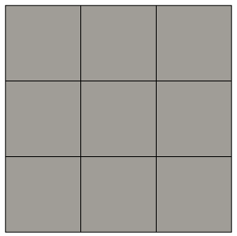
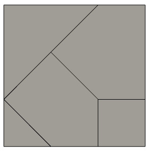

---
jupytext:
  text_representation:
    extension: '.md'
    format_name: myst
    format_version: '0.7'
    jupytext_version: 1.4.0+dev
kernelspec:
  display_name: Python 3
  language: python
  name: python3
---

+++ {"editable": false, "deletable": false}

# Exercise 1 : a basic coupling

+++ {"editable": false, "deletable": false}

After having seen the core concepts to set up a coupling with CWIPI, we will discover the associated function calls in this very first basic coupling.
To help you with this, you are encouraged to look at the [documentation](https://numerics.gitlab-pages.onera.net/coupling/cwipi/dev/index.html).

+++ {"editable": false, "deletable": false}

## Load magic commands

We start by loading the custom magic commands.

```{code-cell}
---
"editable": false
"deletable": false
---
import os, sys
module_path = os.path.abspath(os.path.join('../../utils'))
if module_path not in sys.path:
    sys.path.append(module_path)
```

```{code-cell}
---
"editable": false
"deletable": false
---
%reload_ext visu_magics
%reload_ext code_magics
```

+++ {"editable": false, "deletable": false}

```{code-cell}
---
"editable": false
"deletable": false
---
%%code_block -p exercise_1_code_1 -i 1

#include "cwipi_configf.h"

program exercise_2

    use cwp

    implicit none

    include "mpif.h"

  !--------------------------------------------------------------------
  integer, parameter                        :: n_vtx = 16, n_elts = 9

  integer                                   :: ierr
  integer                                   :: i_rank, n_rank

  integer                                   :: n_code
  character(len = 5),            pointer    :: code_names(:)  => null()
  integer                                   :: is_active_rank = CWP_STATUS_ON
  integer,                       pointer    :: intra_comms(:) => null()

  integer                                   :: n_part
  character(len = 5),            pointer    :: coupled_code_names(:) => null()
  character(len = 99)                       :: coupling_name

  double precision, pointer, dimension(:,:) :: coords    => null()
  integer(c_long),  pointer, dimension(:)   :: vtx_g_num => null()

  integer, pointer, dimension(:)            :: connec    => null()
  integer(c_long), pointer, dimension(:)    :: elt_g_num => null()
  integer(c_int)                            :: id_block

  character(len = 99)                       :: field_name
  integer(c_int)                            :: n_components = 1

  integer                                   :: i

  double precision,              pointer    :: send_field_data(:) => null()
  !--------------------------------------------------------------------
```

+++ {"editable": false, "deletable": false}

CWIPI has been written to function in a massively parallel distributed environment.
Thus, the first thing to do, is the initialize the MPI environment:

```{code-cell}
---
"deletable": false
---
%%code_block -p exercise_1_code_1 -i 2

  ! MPI Initialization
  call MPI_Init(ierr)
  call MPI_Comm_rank(mpi_comm_world, i_rank, ierr)
  call MPI_Comm_size(mpi_comm_world, n_rank, ierr)
```

+++ {"editable": false, "deletable": false}

### Initialization

Now we will start using CWIPI functions !
Please refer to the API referenced [here](https://numerics.gitlab-pages.onera.net/coupling/cwipi/dev/new_cwipi/new_cwipi.html#fortran-api-documentation).

The function to start a CWIPI coupling between two codes is **CWP_Init**. It takes the MPI communicator that includes the MPI ranks of all the coupled codes.
In this basic example, `code1` will be running on the MPI rank 0 and `code2` on the MPI rank 1.
Thus, CWIPI will get the MPI communicator composed of MPI rank 0 and 1. Why do we provide the name of the solver as an array?
Well, because since version 1.0 CWIPI allows several solvers to run on the same MPI rank.
In this basic case, we only have one code per MPI rank. In real life applications the solvers run on more than one MPI rank.
Since all MPI ranks calling the **CWP_Init** subroutine are supposed to take part in the CWIPI computations, it could come handy
to force CWIPI not to use certain MPI ranks. That is what the argument `is_active_rank` is for.
At initialization, CWIPI provides each solver its MPI intra-communicator restricted to the processes executing that solver.
In our basic case, `code1` gets a communicator with only MPI rank 0 and `code2` get the communicator with only MPI rank 1.

*Remark : In this exercise you will be doing the CWIPI calls only for `code1`. We already implemented the calls for `code2`
in `exercise_1_code2.F90` in this folder. There is no point in cheating, you are here to learn.*

```{code-cell}
---
"deletable": false
---
%%code_block -p exercise_1_code_1 -i 3

  n_code = 1

  allocate(code_names(n_code), &
           intra_comms(n_code))

  code_names(1) = "code1"

  call CWP_Init() ! ??
```

+++ {"editable": false, "deletable": false}

### Coupling definition

Since a solver can take part in several couplings, the Coupling object creation allows to define the interaction between two fixed solvers. Let use a metaphor to be more clear.

<span style="color:blue">*Oscar and Marie are two engineers and their boss assigned then to the CWIPI project to work in pairs. They don't know each other. During the first work session, they are each assigned to a desk in the working room. It is time to introduce themselves. Oscar is on the yellow desk and says "I am Oscar working on the CWIPI project with Marie. I am 28 years old and I live in Châtillon". Marie is on the blue desk and says "I am Marie working on the CWIPI project with Oscar. I am 54 years old and I live in Palaiseau".*</span>

In a similar way, at this step, we will introduce `code1` and `code2` to each other. On the MPI rank on which the solver is running, it will create a coupling structure telling which solver is running there, through which coupling it wants to communicate with which other solver. Then it describes itself in more detail.
First it provides the dimension of the coupling interface.
For instance, if the solver mesh is a 3D cube but the coupling happens only on a side of the cube, the dimension of the coupling interface is 2D.
The coupling interface is thus a surface mesh (i.e. `CWP_INTERFACE_SURFACE` in CWIPI).
In this exercise, the coupling interface is the whole input mesh. What is thus the dimension of the coupling interface?
This input mesh is partitionned. This has to be mentionned to CWIPI using `CWP_COMM_PAR_WITH_PART`.
Note that since we operate but one coupling step in this exercise, the mesh does not change (i.e. `CWP_DYNAMIC_MESH_STATIC`).
As mentionned in the introduction of this training, from version 1.0 on CWIPI offers several spatial interpolation algorithms.
In this exercise we use the location algorithm (`CWP_SPATIAL_INTERP_FROM_LOCATION_MESH_LOCATION_OCTREE`) similar to the one offered in version 0.x of CWIPI.

```{code-cell}
---
"deletable": false
---
%%code_block -p exercise_1_code_1 -i 4

  coupling_name = "code1_code2"

  allocate(coupled_code_names(n_code))

  coupled_code_names(1) = "code2"

  n_part = 1
  ! time receive frequency : CWP_TIME_EXCH_USER_CONTROLLED
  call CWP_Cpl_create() ! ??
```

+++ {"editable": false, "deletable": false}

### Visualization

Let us take a pause in our coupling definition, to talk about the **CWP_Visu_set** subroutine. It allows to activate the Ensight ASCII output of the coupling interface with the exchanged fields and the partitioning. Those outputs can easily be read with Paraview.
When setting up a coupling, you will certainly have some tuning work to do. To be able to visualize what CWIPI does will come handy to debug.

```{code-cell}
---
"deletable": false
---
%%code_block -p exercise_1_code_1 -i 5

  ! format option : "text"
  call CWP_Visu_set() ! ??
```

+++ {"editable": false, "deletable": false}

### Coupling interface

Let us go on with a description of the coupling between `code1` and `code2`. What characterizes the mesh we work on?



It is a basic cartesian grid mesh composed of 9 quadrangles and 16 vertices.

The coupling interface mesh of `code2` looks like this.



It is composed of several types of elements.
To start of easy, let's just say it is composed of polygons.
To be more precise 5 elements.
We can also see 11 vertices on this mesh.

We would like to emphasize that the meshes do not have to be coincident in order to couple using CWIPI.

<!-- To define the coupling interface mesh in CWIPI, we first tell that we have a vertex soup.
It is just a set of coordinates of which we can make no sense. Then we create sense why telling CWIPI how to connect these vertices to form our polygons.
Finally, CWIPI has to digest the information we provided it. Well, how does this translate in terms of code? -->

#### Set the mesh vertices coordinates

We start by defining a vertex soup using the subroutine **CWP_Mesh_interf_vtx_set**.
The coordinate system in CWIPI is always 3D, so we allocate a rank-2 array to set the coordinates in. 
Each vertex is stored as a column, so the coordinates array looks like 
$$
\begin{pmatrix}
x_1 & x_2 &        \\ 
y_1 & y_2 & \ldots \\ 
z_1 & z_2 &        
\end{pmatrix}
$$
The first dimension is 3, and the second is the number of vertices (16 here).
The last argument (`vtx_g_num`) is an array of vertex global identifiers.
Here it is `null` to underline that it is an optional argument.

```{code-cell}
---
"deletable": false
---
%%code_block -p exercise_1_code_1 -i 6

  allocate(coords(3,n_vtx))
  coords(:, 1) = [0,0,0]
  coords(:, 2) = [1,0,0]
  coords(:, 3) = [2,0,0]
  coords(:, 4) = [3,0,0]
  coords(:, 5) = [0,1,0]
  coords(:, 6) = [1,1,0]
  coords(:, 7) = [2,1,0]
  coords(:, 8) = [3,1,0]
  coords(:, 9) = [0,2,0]
  coords(:,10) = [1,2,0]
  coords(:,11) = [2,2,0]
  coords(:,12) = [3,2,0]
  coords(:,13) = [0,3,0]
  coords(:,14) = [1,3,0]
  coords(:,15) = [2,3,0]
  coords(:,16) = [3,3,0]
  ! vtx_g_num is initialized to null()
  call CWP_Mesh_interf_vtx_set() ! ??
```

+++ {"editable": false, "deletable": false}

#### Set the mesh polygons connectivity

<!-- Let us create sense in that vertex soup. The function **CWP_Mesh_interf_block_add** allows us to tell that in that vertex soup are connected as polygons (CWP_BLOCK_FACE_POLY).
Then we use the subroutine **CWP_Mesh_interf_f_poly_block_set** which allows to describe the 9 polygons of our 2D mesh. An index array (`connec_idx`) of size `n_elts+1` contains the information of the number of vertices per polygon.
The first index is always 0, from there we add up the number of vertices per element. Here the mesh is composed only of elements with 4 vertices.
The connectivity between elements and vertices is an array of size `connec_idx(n_elts+1)` (here 36).
 -->

Recall that CWIPI only deals with *unstructured* meshes, so even though our mesh looks like a structured grid, we need to provide a connectivity table.

Our mesh is composed of only quadrangles, so we just need to define a block of type `CWP_BLOCK_FACE_QUAD4` (**CWP_Mesh_interf_block_add**).
We then set the connectivity table for this block (**CWP_Mesh_interf_block_std_set**).
As for `vtx_g_num`, `elt_g_num` represents the global identifiers of the mesh elements and is an optional argument.

```{code-cell}
---
"deletable": false
---
%%code_block -p exercise_1_code_1 -i 7

  id_block = CWP_Mesh_interf_block_add() ! ??

  allocate(connec(36))
  connec = [1,2,6,5,     2,3,7,6,      3,4,8,7,   &
            5,6,10,9,    6,7,11,10,    7,8,12,11, &
            9,10,14,13,  10,11,15,14,  11,12,16,15]

  ! elt_g_num is initialized to null()
  call CWP_Mesh_interf_block_std_set() ! ??
```

+++ {"editable": false, "deletable": false}

#### Finalize mesh

This is when CWIPI digests the information we just provided it using the subroutine **CWP_Mesh_interf_finalize**.
Indeed, CWIPI hides the parallelism for users but inside the code it needs to know the global identifiers of the mesh entities.
Since those are optional arguments, if not provided by the user, CWIPI will generate them, as well as the underlying mesh data structure.

```{code-cell}
---
"deletable": false
---
%%code_block -p exercise_1_code_1 -i 8

  ! coupling interface finalization ??
```

+++ {"editable": false, "deletable": false}

### Field definition

Now we know the mesh we work with. Let us define the fields of the solvers that are exchanged. As said earlier, here to simplify we will only send a field from `code1` to `code2`.

#### Create the field

The first step is to create a Field object attached to the Coupling object associated to the coupling between `code1` and `code2`. The numerical method of both solvers use node-centered fields (DOF_LOCATION_NODE). For `code1` we tell that this `super fancy field` will be sent (FIELD_EXCH_SEND) and that `code2` will receive it (FIELD_EXCH_RECV). In this basic coupling the `super fancy field` that will be sent has only one component which is the $x$ component of the mesh coordinates. For each field we tell that we want to visualize it in the Ensight ASCII output (STATUS_ON).

```{code-cell}
---
"deletable": false
---
%%code_block -p exercise_1_code_1 -i 9

  field_name   = "a super fancy field"
  n_components = 1

  call CWP_Field_create() ! ??
```

+++ {"editable": false, "deletable": false}

#### Set the field values

The subroutine **CWP_Field_data_set** is used here to set the arrays associated to the fields. `code1` fills an array with the data that it wants to send to `code2`.
`code2` has to provide an array in which the field data from `code1` will be stored.

```{code-cell}
---
"deletable": false
---
%%code_block -p exercise_1_code_1 -i 10

  allocate(send_field_data(n_vtx * n_components))
  do i=1,n_vtx
    send_field_data(i) = coords(1,i)
  end do

  call CWP_Field_data_set() ! ??
```

+++ {"editable": false, "deletable": false}

### Begin time step

In this basic example, only one solver iteration during which an exchange occurs will be done.
The beginning and the end of an iteration have to be marked for CWIPI using the **CWP_Time_step_beg** and **CWP_Time_step_end** subroutines for each solver. This information allows CWIPI for instance to sort the visualization output of the fields per iteration.
Note, that is mandatory to create the coupling and the associated fields before starting the first time step.

```{code-cell}
---
"deletable": false
---
%%code_block -p exercise_1_code_1 -i 11

  call CWP_Time_step_beg() ! ??
```

+++ {"editable": false, "deletable": false}

### Compute interpolation weights

Since we use the spatial interpolation algorithm locating a set of points (vertices of `code2`) in a mesh (coupling interface of `code1`), to ensure all points are located a tolerance can be set using the function **CWP_Spatial_interp_property_set** (optional).
Before doing any exchange, it is mandatory to compute the spatial interpolation weights using **CWP_Spatial_interp_weights_compute**.

```{code-cell}
---
"deletable": false
---
%%code_block -p exercise_1_code_1 -i 12

  ! property name : "tolerance"
  call CWP_Spatial_interp_property_set() ! ??

  ! spatial interpolation weights ??
```

+++ {"editable": false, "deletable": false}

### Exchange field values between codes

For `code1` to send its Field data array to `code2`, the non-blocking **CWP_Field_issend** should be called. Similarly, `code2` should call **CWP_Field_irecv** to tell `code1` that is wants to receive the Field data array. After that, the solvers can overlap the communication by some computations. Once you want to be sure the send operation has completed in `code1`, use **CWP_Field_wait_issend**.
The interpolated Field data array has completely arrived for `code2` once the call to **CWP_Field_wait_irecv** is completed.

```{code-cell}
---
"deletable": false
---
%%code_block -p exercise_1_code_1 -i 13

  ! field send ??

  ! field send wait ??
```

+++ {"editable": false, "deletable": false}

### End time step and clean up

At the end of each solver iteration **CWP_Time_step_end** is called to inform CWIPI that the time step has terminated.
When there are no CWIPI exchanges left to be done, all field, interface mesh and coupling structures can be deleted (**CWP_Field_del**, **CWP_Mesh_interf_del** and **CWP_Cpl_del**).

```{code-cell}
---
"deletable": false
---
%%code_block -p exercise_1_code_1 -i 15

  call CWP_Time_step_end() ! ??

  ! delete field ??

  ! delete mesh interface ??

  ! delete the coupling ??
```

+++ {"editable": false, "deletable": false}

### End CWIPI

This call terminates the use of CWIPI by cleaning up the internal structures CWIPI created.

```{code-cell}
---
"deletable": false
---
%%code_block -p exercise_1_code_1 -i 16

  deallocate(coords)
  deallocate(connec)
  deallocate(send_field_data)

  ! finalize CWIPI ??

```

+++ {"editable": false, "deletable": false}

### End MPI environment

At the end of the code the MPI environment should be terminated.

```{code-cell}
---
"deletable": false
---
%%code_block -p exercise_1_code_1 -i 17

  call MPI_Finalize(ierr)

end program exercise_2
```

+++ {"editable": false, "deletable": false}

## Execution and visualization

Run the following cells to execute to program you just wrote and visualize the basic coupling you implemented.

```{code-cell}
---
"deletable": false
---
%merge_code_blocks -l fortran -p exercise_1_code_1 -n 1 -v -c
```

```{code-cell}
---
"deletable": false
---
%%visualize -nl
cwipi_writer/code1_code2_code1_code2/CHR.case : s_a~super~fancy~field1
cwipi_writer/code1_code2_code2_code1/CHR.case : r_a~super~fancy~field1
```

+++ {"editable": false, "deletable": false}

# Bonus : a coupling with conservative interpolation

If you read this, it means that you quickly finished the first exercise. Congratulations !
As you have seen in the introduction, from version 1.x on, CWIPI has several spatial interpolation algorithms.
To go further, we invite you to repeat the exercise above but with a conservative interpolation algorithm (CWP_SPATIAL_INTERP_FROM_INTERSECTION).
Copy-paste the following code to have a field defined on the faces. Adapt the code accordingly to those two changes.
To adapt the coupled code as well, use the option `-b` at the end of the `%merge_code_blocks` command. Then observe the output.

```{prf:algorithm} basic coupling algorithm

allocate(send_field_data(n_elt * n_components))
do i=1,n_elt
  send_field_data(i) = i
end do
```

+++ {"editable": false, "deletable": false}

# Exercise 2

You can now move on to [Exercise 2](./../03_Exercise_2/exercise_2.ipynb).
